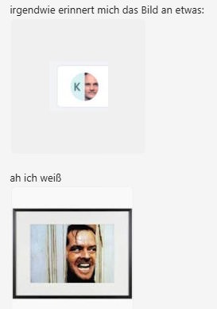

We try to have as much fun as possible in the department, because everyday life is hard enough. A quick-witted and funny response not only immediately lights up conversations, it also helps to create a good working atmosphere in general. Laughter is medicine for everything.

I usually can't write about funny business anecdotes in public, because on the one hand, it often requires context that I can't provide, and on the other hand, it's up to each person involved to decide whether something like that should be made public.

In this screenshot of a chat following a Teams call in which I and another colleague participated, whose first name also begins with K but who, unlike me, has not configured an avatar, I am making an exception because it is **too good** and only affects me:

> Somehow, this picture reminds me of something.
> ...
> Ah, I know.

🤣 Bull's-eye! Where the hell is my axe ...
