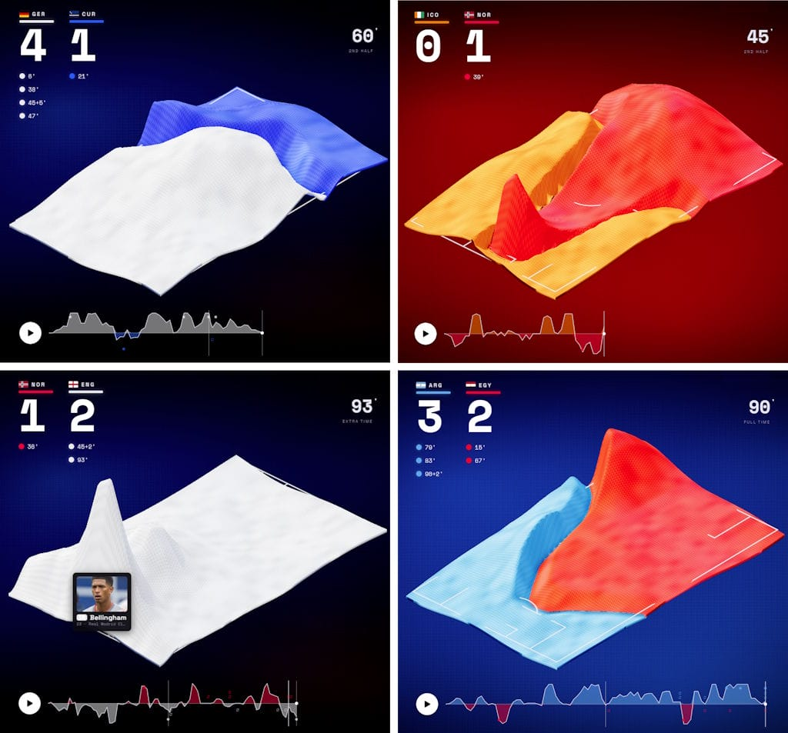

Football today is an incredibly data-driven sport. Everything is analysed, measured and weighted, and every now and then the fans get to see a little bit of this data, such as on-screen graphics showing ball possession or similar statistics.

Alexander Bogachev's project Football Data Portraits demonstrates what can be done with this data, which are often freely available. He processes the data from all the matches in the current FIFA World Cup, transforming it into highly visual waves – coloured to match each team – on a virtual football pitch, shown in fast motion over the entire duration of the match. It's great fun to watch, especially if you've seen the match on TV or even live.



#Data #Analytics #Football

```cardlink
url: https://wc26.bogachev.fr
title: "FIFA World Cup 2026 Data Portraits"
description: "Every 2026 World Cup match as a living data-portrait — two territory blankets, a momentum pulse, honest football made beautiful."
host: wc26.bogachev.fr
favicon: https://wc26.bogachev.fr/favicon.svg
image: https://wc26.bogachev.fr/og-cover.png?v=3
```
