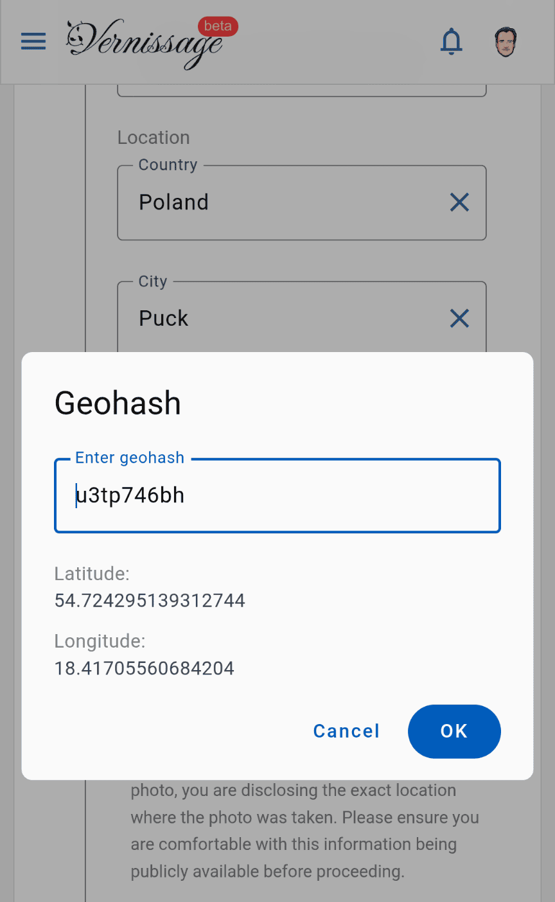

Three days ago, I wrote the post [Geohashes for my photos](/post/Geohashes-for-my-photos/) about my recent use of Geohashes as a short alternative to long GPS coordinates and expressed my hope that my favorite platform, Vernissage, would support them... and I created a GitHub issue for [Marcin](https://mczachurski.dev), the developer. Three days ago...

Marcin released a new version today that now supports Geohashes! \o/



My sincere thanks and deepest respect for such a quick implemention.

#Vernissage #Geohash

```cardlink
url: https://github.com/VernissageApp/VernissageWeb/issues/569
title: "Geohash Support (alongside GPS coordinates) · Issue #569 · VernissageApp/VernissageWeb"
description: "As Google/Android makes it harder to provide GPS coordinates on uploading photos to Vernissage, it could be a relief if it would support Geohash short codes that are based on math. See https://kiko..."
host: github.com
favicon: https://github.githubassets.com/favicons/favicon.svg
image: https://opengraph.githubassets.com/471b96e0419d533177f3b05cf881c7a578b6fbbe9c0ba7d0e82b57c5882700d9/VernissageApp/VernissageWeb/issues/569
```
