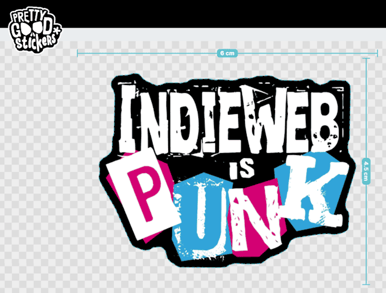

I really like the [**IndieWeb Is Punk**](https://indiewebispunk.net/) initiative by [Jim Mitchell](https://indieweb.social/@jimmitchell), because the eight points in his manifesto express exactly what I think about the IndieWeb too. "*Own your domain. Own your data. Own your identity.*" ... "*Have fun, or what's the point?*" ... "*We don't need major platforms.*"

Along with the website [indiewebispunk.net](https://indiewebispunk.net/), Jim has also released a punk-style logo that seemed predestined to be turned into stickers. As his sticker shop unfortunately only delivers to the US, he provided me with the [logo as a hi-res PNG file](https://indiewebispunk.net/resources/indieweb-logo-hirez.png) over Mastodon and I placed an order to my trusted European sticker supplier (PrettyGoodStickers by Ride All Day AB, Gothenburg, Sweden).

I'd like to share the link here so that you can reorder them if you're from Europe and would like to have some ... [https://www.prettygoodstickers.com/sticker?id=e80f227a-6e71-479d-8d9d-a691404d1c89](https://www.prettygoodstickers.com/sticker?id=e80f227a-6e71-479d-8d9d-a691404d1c89)



INDIEWEB IS PUNK. OI !

```cardlink
url: https://jimmitchell.org/2025/06/19/indieweb-is-punk/
title: "IndieWeb is Punk — Jim Mitchell"
description: "We don't need major platforms. We have the Web, keyboards, tools, and community. IndieWeb is Punk! Is it time to bring the Mohawks back? - @jthingelstad"
host: jimmitchell.org
favicon: https://jimmitchell.org/media/avatar-gradient_287d67d8.png
image: https://jimmitchell.org/2025/06/19/indieweb-is-punk/og.png
```
