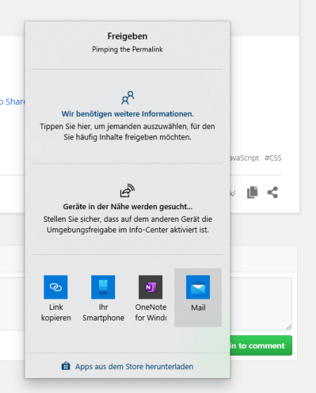

Until now I did not show the permalink under my posts in this blog, but in the past I had sometimes the need to pass one of the links and it was not very user-friendly, on desktop as well as on mobile. Not the One-Click experience I prefer.

My goal was to show the permalink and, even more important, provide a simple way to copy and to share. JavaScript to the rescue...

<!-- more -->

## Display
As I run my blog with [Hexo](https://hexo.io), I deal with ``EJS`` files. To show the permalink in my ``article.ejs``, was quite simple. First step was to create a new partial file named ``permalink.ejs``, to be called every time when the complete article has to be rendered:

```js
<% if (!index){ %>
  <%- partial('post/permalink', { class_name: 'article-permalink' }) %>
<% } %>
```

The partial file looked like this in this step:

```html
<div class="<%= class_name %>"">
    <a id="article-permalink" href="<%- post.permalink %>"><%- post.permalink %></a>
</div>
```

## Copy

As I read a little bit about the possibilities to copy text into the clipboard via JavaScript on [MDN](https://developer.mozilla.org/en-US/docs/Mozilla/Add-ons/WebExtensions/Interact_with_the_clipboard), it became obvious that a link is not the best solution, because using the ``exeCommand`` needs to have something selected and this is difficult on anchors. Then ... do it with an input:

```html
<div class="<%= class_name %>"">
    <input id="article-permalink" value="<%- post.permalink %>" />
    <a id="action-copy" class="article-action" href="javascript:copyPermalink();"></a>
</div>
<script>
  var copyText = document.querySelector("#article-permalink");
  
  //Disable Input by default
  copyText.disabled = true;

  function copyPermalink() {
    //Enable Input
    copyText.disabled = false;

    //Select permalink text
    copyText.select();

    //Copy to clipboard
    document.execCommand("copy");

    //Remove selection again
    copyText.blur();

    //Disable Input again
    copyText.disabled = true;
  }
</script>
```

Nice, but a user feedback, that the text has been copied to the clipboard, was advisable, because nothing is more annoying, when you click somewhere and nothing seems to happen. As I hate default browser confirmations and other distracting messaging methods, I wanted to use the input itself, by fading out the link text, replace it with a message and fade in the text again:


I extended my ``animation.styl`` (Hexo works with [Stylus](https://stylus-lang.com/)) with two keyframe animations ... one for fading in, one for fading out...

```styl
@keyframes fadeIn {
  0% {
    opacity:0;
  }
  100% {
    opacity:1;
  }
}
.fade-in-500
  animation: fadeIn ease 0.5s;
.fade-in-1000
  animation: fadeIn ease 1s;

@keyframes fadeOut {
  0% {
    opacity:1;
  }
  100% {
    opacity:0;
  }
}
.fade-out-500
  animation: fadeOut ease 0.5s;
.fade-out-1000
  animation: fadeOut ease 1s;
```

... and wrote a setTimeout cascade to achive the effect:

```html
<div class="<%= class_name %>"">
    <input id="article-permalink" value="<%- post.permalink %>" />
    <a class="article-action action-copy" href="javascript:copyPermalink();"></a>
</div>
<script>
  var copyText = document.querySelector("#article-permalink");
  copyText.disabled = true;
  function copyPermalink() {
      copyText.disabled = false;
      copyText.select();
      document.execCommand("copy");
      copyText.blur();
      copyText.disabled = true;

    //Store original text
    var permalink = copyText.value;

    //Start fading out
    copyText.classList.add("fade-out-500");

    //Wait until animation is done
    setTimeout(function(){

        //Set message, remove fadout class and add start fading in
        copyText.value = "copied to clipboard";
        copyText.classList.remove("fade-out-500");
        copyText.classList.add("fade-in-1000");

        //Wait 2 seconds to show the message
        setTimeout(function() {

            //Start to fade out message
            copyText.classList.add("fade-out-500");

            //Wait until animation is done
            setTimeout(function() {

                //Set original text again and remove fadout class
                copyText.value = permalink;
                copyText.classList.remove("fade-out-500");

                //Wait until animation is done
                setTimeout(function() {

                    //Remove fadeout class
                    copyText.classList.remove("fade-in-1000");
                }, 500);
            }, 500);
        }, 2000);
    }, 500);
  }
</script>
```

## Share

The second permalink feature was a little bit trickier, because I didn't want to use one of the sharing libraries out there, whose business model is based on my readers data (always keep conservative on implementing third party stuff, because you never know what they are doing with the data). But a couple of months ago I read about a new native browser API for WebApps on the rise: **Web Share API**.

Since 2019 [W3C](https://www.w3.org/) is working on this API, *for sharing text, links and other content to an arbitrary destination of the user's choice*. On 27 August 2020 the published a [Working Draft](https://www.w3.org/TR/web-share/) and on 16 September 2020 the latest [Editors Draft](https://w3c.github.io/web-share/).


Brand new stuff. The browser support is not the best yet, but it will be getting better in the near feature, especially as Edge Chrome is one of the early adopters.



[web.dev](https://web.dev/web-share/) lists important requirements on using this new feature in JavaScript:

* It can only be used on a site that supports HTTPS
* It must be invoked in response to a user action such as a click

But it can share URL's, text and even files! 

A raw implementation can be:

```js
if (navigator.share === undefined) {
  navigator.share({
    title: 'My Post',
    url: 'https://my-domain.com/my-url',
  })
  .then(() => console.log('Successful share'))
  .catch((error) => console.log('Error sharing', error));
} else {
  // fallback
}
```

I refrain to implement a fallback, rather I would like to show the appropriate button only to those users, whose browser supports it:

```html
<div class="<%= class_name %>"">
    <input id="article-permalink" value="<%- post.permalink %>" data-id="<%= post._id %>" />
    <a id="action-copy" class="article-action" href="javascript:copyPermalink();"></a>
    <a id="action-share" class="article-action" href="javascript:sharePermalink();"></a>
</div>
<script>
    function copyPermalink() {
      -- SEE ABOVE
    }

    if (navigator.share === undefined) {
        var shareLink = document.querySelector("#action-share");
        shareLink.style.display = "none";
    }

    function sharePermalink() {
        navigator.share({
            title: "<%- post.title %>",
            url: "<%- post.permalink %>",
        })
    }
</script>
```

## More Info


