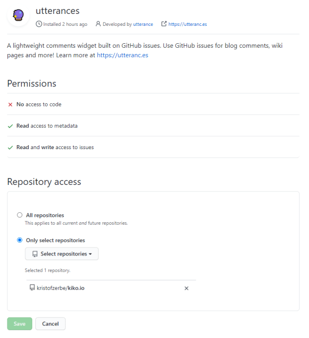

If you run a blog, it is always advisable to integrate a commenting system, in order to get feedback on your posts from your readers.

So did I, when I start this blog and I decided to use the [Disqus platform](https://disqus.com), as it was very easy to integrate ... but I always had a bad feeling about a third-party platform collecting data from my readers. Disqus is probably not without reason under criticism by many people in the community.

As I host this blog at GitHub (see [A New Blog (Part One): VS Code, Hexo and GitHub Pages](/post/A-New-Blog-VS-Code-Hexo-and-GitHub-Pages/)) I was looking for a solution to host the comments also on my prefered platform. There were some solutions, which uses GitHub Issues for this and wanted to implement something like that someday.

<!-- more -->

As I read a post from on [Thomas Lavesques' blog](https://thomaslevesque.com), to solve another problem, his commenting section came to my attention: **[utteranc.es](https://utteranc.es/)** ... exactly the solution I needed! Thanx guys...

On their website is a small configurator for a script to implement in each post, which needs only few information:

* Name of the Repo
* How the mapping of the post to the Issues should work
* Name of the Theme, in order to fit to the colors of the blog

The script had to be included to my Hexo ``article.js``:

```ejs
<% if (!index && post.comments){ %>
  <script src="https://utteranc.es/client.js"
    repo="kristofzerbe/kiko.io"
    issue-term="pathname"
    theme="github-light"
    crossorigin="anonymous"
    async>
  </script>
<% } %>
```

That's pretty much it. On entering the first comment, Utterances told me to install the needed GitHub App to my repo, in order to make it work ... and done.



The result you see below ...

## UPDATE...

The utterances script tag has the attribute ``theme``, to tell utterances  which style should be delivered. There are several themes available, but if users are able to switch between light or dark mode on the page (see [Hexo and the Dark Mode](/post/Hexo-and-the-Dark-Mode)), the comment block should change to an suitable theme also.

On order to respond on a mode change, it is necessary to write a more dynamic script loading.

First we define a function in a global script file to load the utterances script via JS:

```js
function insertUtterancesCommentBlock() {
    var commentTheme = "github-light";
    if(localStorage.getItem("theme") === "dark"){
      commentTheme = "github-dark";
    }
    const scriptId = "comment-theme-script";
    const existingScript = document.getElementById(scriptId);
    if (!existingScript) {
      const commentScript = document.createElement("script");
      commentScript.id = scriptId;
      commentScript.src = "https://utteranc.es/client.js";
      commentScript.setAttribute("repo", "kristofzerbe/kiko.io");
      commentScript.setAttribute("issue-term", "pathname");
      commentScript.setAttribute("theme", commentTheme);
      commentScript.setAttribute("crossorigin", "anonymous");
      const placeholder = document.getElementById("comment-placeholder");
      placeholder.innerHTML = "";
      placeholder.appendChild(commentScript);
    }
}
```

Then we change the placement in the EJS file, by defining a placeholder  and ensuring that the script above is loaded, before we call it:

```ejs
<div id="comment-placeholder"></div>
<script>
  window.addEventListener('load', function () {
    insertUtterancesCommentBlock();
  })
</script>
```

On my blog, everytime the user switches between light/dark mode the ``body`` tag will be decorated with the data tag ``data-theme`` and the value of the mode. To keep the loading of the utterances script independent from this functionality, we just have to listen to this change via ``MutationObserver``:

```js
//observe theme change, to adjust comment block theme
var target = document.documentElement,
    observer = new MutationObserver(function(mutations) {
        mutations.forEach(function(mutation) {
            if (mutation.attributionName === "data-theme" );
                insertUtterancesCommentBlock();
            });        
    }),
    config = { attributes: true };
observer.observe(target, config);
```