I'm collecting interesting One-Page-Tools on the web on a Trello board. To add a new card, I use a simple little script on my Android smartphone, I wrote about here: .

On processing the page to store on a card, Trello scrapes the page and takes the ``<meta>`` tag ``og:image`` out of the HTML to generate an image attachment and take it as cover for the card. This sometimes works, but most of the time it doesn't, because website owners often don't pay attention to reasonable ``<meta>`` tags.

Because it is easier to find a card with visual support, I create my own screenshots for the cards in a manual, but streamlined, process, I want to show you here.

<!-- more -->

## Prerequisites

OS:
* **Android** 5 and above 

Apps:
  * **Trello**  
  [https://play.google.com/store/apps/details?id=com.trello](https://play.google.com/store/apps/details?id=com.trello)  

  * **Screenshot Touch**  
  [https://play.google.com/store/apps/details?id=com.mdiwebma.screenshot](https://play.google.com/store/apps/details?id=com.mdiwebma.screenshot)

---

## Step 1
- Open up **Screenshot Touch** and set under ``Shaking and Delay`` the option ``Caption by shaking`` **[1]**.
- Set the ``Shake sensitivity`` option to ``Hard`` **[2]**.
- Set the ``Resize`` option to ``50%`` **[3]**.
- Start the capture monitoring service **[4]**.  

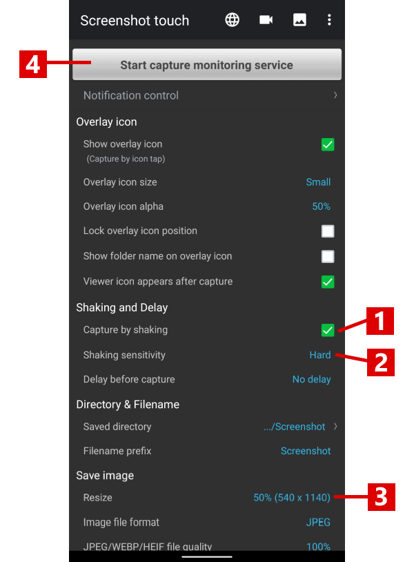

---

## Step 2
- Open up **Trello** and got to the card, where you want to add an screenshot for use as an cover.
- Click on the URL attachment to open it in your browser **[1]**.

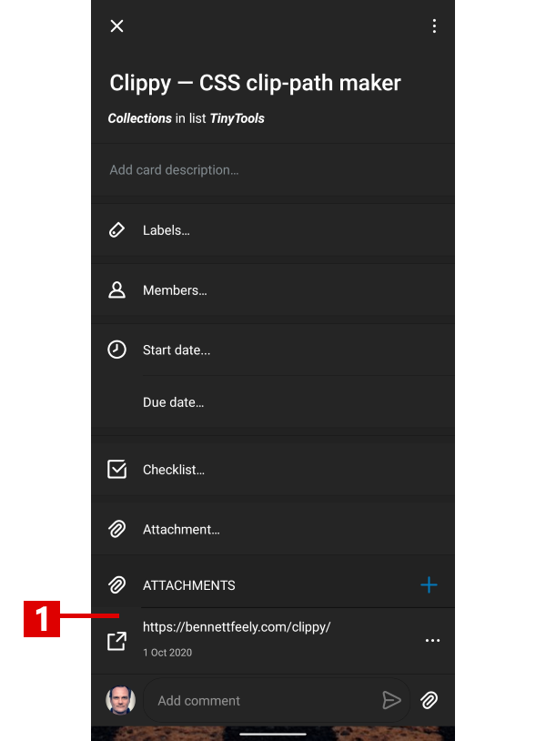

---

## Step 3
- Shake you smartphone to capture the current website.

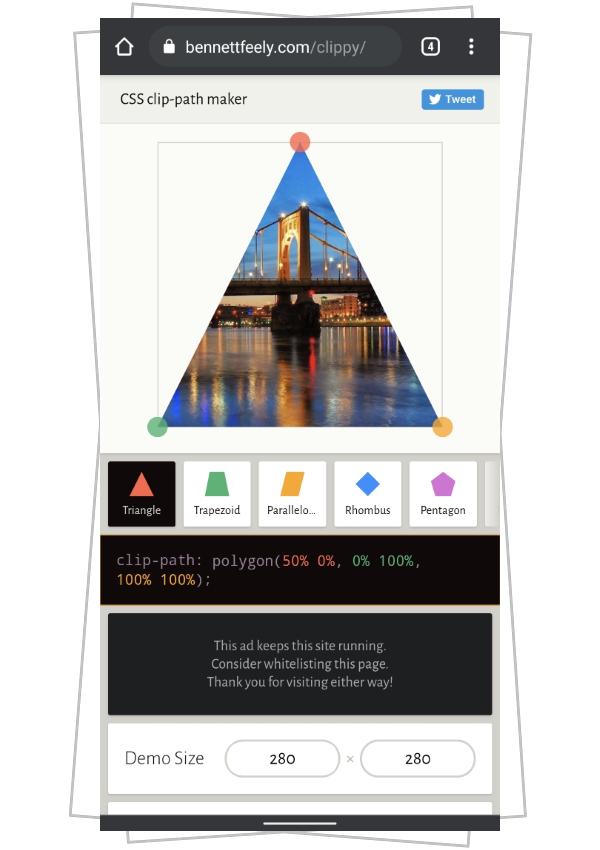

---

## Step 4
- Switch to **Screenshot Touch** and open the ``Photo Viewer`` **[1]**

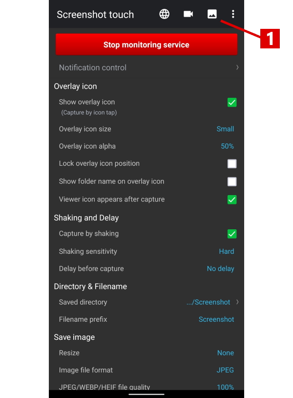

---

## Step 5
- Open the ``Crop Image`` dialog.

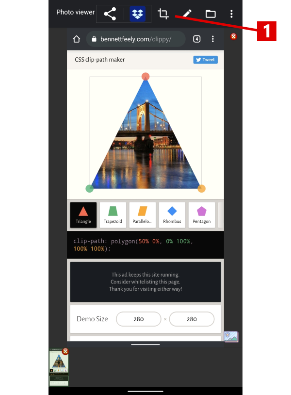

---

## Step 6
- Set the ``Crop Mode`` to ``1:1`` to get a squared image. It will be persisted in the apps settings for further use.

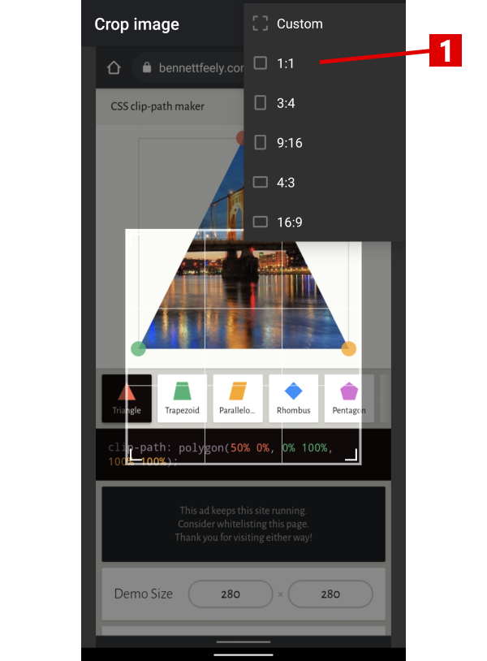

---

## Step 7
- Place the overlay to select you preferred part of the image **[1]**.
- Save the image **[2]**.

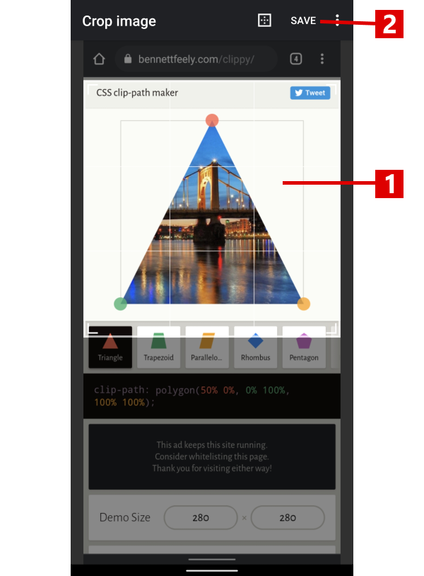

---

## Step 8
- Switch back to **Trello** and click to add a new attachment **[1]**.

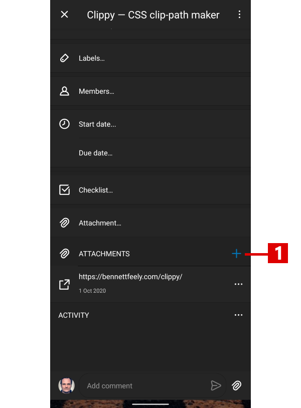

---

## Step 9
- Choose to add from file **[1]**.

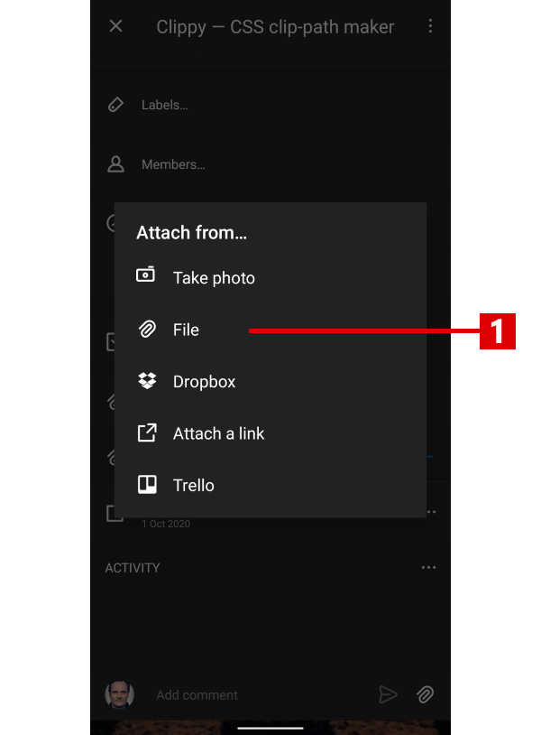

---

## Step 10
- In Androids file dialog, head up to ``Recent Files`` **[1]**.
- Select the new image **[2]**.

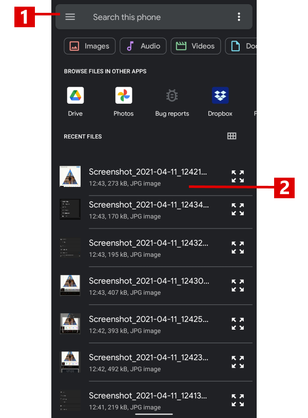

---

## Step 11
- In the context menu of the added attachment, select ``Make Card Cover`` **[1]**, if Trello has not done it yet.

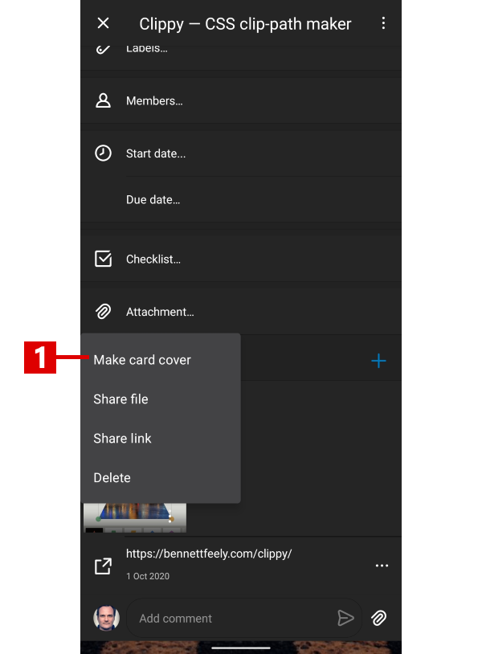

---

## Result
Once you have done this two or three times, the process takes less than 30 seconds.

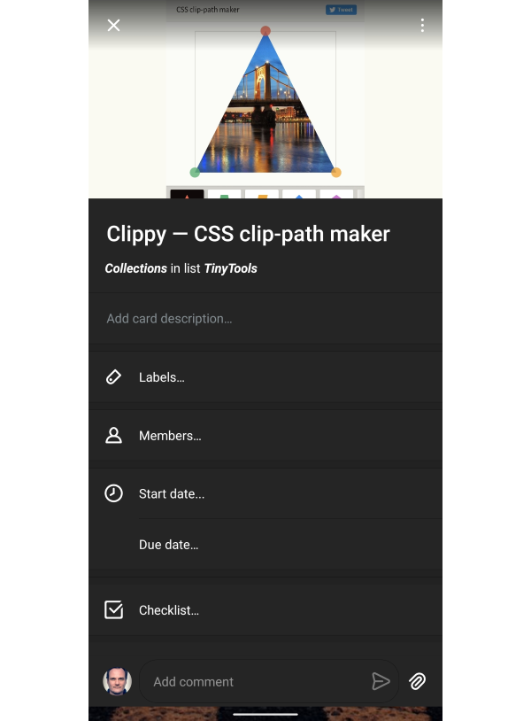