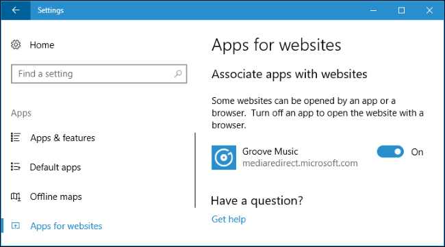
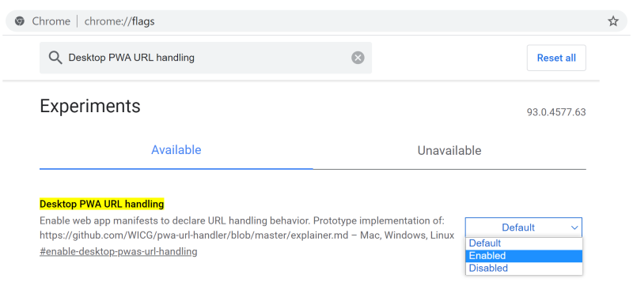

While reading the Chris Coyier's post [Application-Specific Links](https://css-tricks.com/application-specific-links/) the other day, I realized what has been bugging me for a long time now: a proper solution for openening a certain URL in a modern Web App.

Since the beginning of the digital age (feels like that), we have files associated to a certain application, installed on our machine, regardless if its running Windows, iOS, OS/2 or whatever. We have learned that well and no one questions it ... but ... the IT world keeps on turning and today we are not only talking about files, but about links.

Many modern applications are written with Web technologies, thanks to cross platform frameworks like [Electron](https://www.electronjs.org/). Some of them are real apps for working on things, like the famous editor [Visual Studio Code](https://code.visualstudio.com/), and some are mirroring their online services in a desktop app only, like [Slack](https://slack.com/intl/en-de/downloads/windows) or [Notion](https://www.notion.so/desktop). However, the latter have the problem how to deal with links to their online services. When a user is sent a link and has become accustomed to using the desktop app, it won't open in the app as he clicks on it, but in his default browser. The question is, how to associate not only files, but links with certain desktop apps?

<!-- more -->

---

## Executables and URL Schemes

Triggered by [Notions announcement](https://thomasjfrank.com/how-to-share-notion-links-that-open-directly-in-the-app/) of using a dedicated link protocol ``notion://`` to open up Notion links directly in the Notion App, Chris wrote about the possibilities an a Mac to associate certain URL schemes with a Web App in general. His choice fell on [Choosy](https://www.choosyosx.com/), an app which hooks into to the process on opening links by beeing the systems default browser and forwarding the URL to configured applications.

Fair enough, but it's a tool for Mac. However, it was not particularly difficult to find equivalent programs for Windows 10, my preferred OS:

* [Browser Selector](https://github.com/DanTup/BrowserSelector)
* [Browser Select](https://github.com/zumoshi/BrowserSelect)
* [Browser Picker](https://github.com/mortenn/BrowserPicker)
* [Browser Choose 2](https://browserchooser2.com/#about)
* ... name yours

Interestingly, Microsoft already has something similar built into Windows, but prevents users from messing with it:



The feature is targeted from [UWP](https://de.wikipedia.org/wiki/Universal_Windows_Platform) applications only, therefore the developer has to implement it by extending the app manifest: [Web-to-App Linking with AppUriHandlers](https://blogs.windows.com/windowsdeveloper/2016/10/14/web-to-app-linking-with-appurihandlers/).

What Chris' approach and all similar Windows programs have in common is, that they are based on executables, EXE files and yes, the cross-platform apps mentioned above are executables, but for me this is too short. What about Chromium based Progressive Web Apps (PWA)?

Since the Chromium team has introduced the possibility to add a website as desktop shortcut and start it in a new window, without any browser specific toolbars and other stuff, it became very popular, especially if this website was implemented by the developer as a [PWA](https://web.dev/progressive-web-apps/).It does not matter whether all PWA features, such as offline mode or similar, are available. The mere fact of being able to use an online service in its own window is a gain.

But such an app has no specific executable! It will be executed by the browser with some parameters itself. The question is, how to associate a certain URL scheme or a custom protocol with these web apps?

---

## PWA's on Windows

Some basics about how Chromium based browsers are dealing with this feature:

As you click on **Create Shortcut...** in the **More Tools** menu in Chrome or Edge and confirm the following dialog (or install the PWA), a new folder in ``%LOCALAPPDATA%\Google\Chrome\User Data\Default\Web Applications`` will be created. Its name starts with ``_crx_`` and is followed by a random string (so called **app-id**), f.e. **``ffokdlainpppngbbhdcobaocmbobgdii``**. In this folder the [Favicon](https://en.wikipedia.org/wiki/Favicon) of the website is stored.

If it is a real PWA and has a [Web App Manifest](https://developer.mozilla.org/de/docs/Web/Manifest), you will find all resources defined there in another subfolder named by the app-id below ``%LOCALAPPDATA%\Google\Chrome\User Data\Default\Web Applications\Manifest Resources``.


The paths differ depending on which browser profile is active. In this case **'default'**.


The desktop shortcut, which will be created, points to an executable named ``chrome_proxy.exe`` or ``msedge_proxy.exe``. These files are scaled-down versions of the browser executable itself. Its main purpose is to bypass a Windows error as described in its [source code](https://chromium.googlesource.com/chromium/src/+/refs/heads/main/chrome/chrome_proxy/chrome_proxy_main_win.cc), in order to create a correct shortcut.

The important part of the shortcut are the calling parameters:

* ``--app-id`` - the random ID generated by the browser
* ``--profile-directory`` - the browser profile to use; mostly 'default'

If you are interested, Chromium has dozens of parameters, some to change the behaviour and others only for debugging purposes. Peter Beverloo provides an automatic generated [List of all Chromium Command Line Switches](https://peter.sh/experiments/chromium-command-line-switches/).

### ... a bit deeper, just for fun

The following has nothing to do with the actual problem and doesn't help in any way, but it was interesting to dig a bit deeper into the operating principles of Chromium.

As we saw that the browser creates a unique ID for the new shortcut, we find all needed data referenced in the file ``%LOCALAPPDATA%\Google\Chrome\User Data\Default\preferences``. It has no extension, but it is a JSON file.

Two sections are relevant in this file:

**browser.app_window_placement.\_crx\_&lt;app-id&gt;**

Holds the information how the window is displayed on the desktop (metrics).

```json preferences > browser.app_window_placement
"_crx_ffokdlainpppngbbhdcobaocmbobgdii": {
    "bottom": 889,
    "left": 161,
    "maximized": false,
    "right": 1610,
    "top": 56,
    "work_area_bottom": 920,
    "work_area_left": 0,
    "work_area_right": 1707,
    "work_area_top": 0
}
```

**extensions.settings.&lt;app-id&gt;**

Holds every other information about the app, including the complete manifest und the URL to show.

```JSON preferences > extensions.settings (shortened)
"ffokdlainpppngbbhdcobaocmbobgdii": {
    "active_bit": false,
    "active_permissions": {
        "api": [],
        "manifest_permissions": []
    },
    "app_launcher_ordinal": "zzo",
    "commands": {},
    "content_settings": [],
    "creation_flags": 17,
    "events": [],
    "from_bookmark": true,
    "from_webstore": false,
    "granted_permissions": {
        "api": [],
        "manifest_permissions": []
    },
    "incognito_content_settings": [],
    "incognito_preferences": {},
    "install_time": "13266055455495996",
    "launchType": 3,
    "locallyInstalled": true,
    "location": 1,
    "manifest": {
        "app": {
            "display_mode": "browser",
            "icon_color": "#186AA5",
            "launch": {
                "web_url": "https://trello.com"
            },
            "linked_icons": [ ... ]
        },
        "description": "Organize anything, together. Trello is a collaboration tool that organizes your projects into boards. In one glance, know what's being worked on, who's working on what, and where something is in a process.",
        "icons": { ... },
        "key": "",
        "name": "Trello",
        "version": "2021.5.21.20218"
    },
    "page_ordinal": "y",
    "path": "ffokdlainpppngbbhdcobaocmbobgdii\\2021.5.21.20218_0",
    "preferences": {},
    "regular_only_preferences": {},
    "state": 1,
    "was_installed_by_default": false,
    "was_installed_by_oem": false
},
```


It is possible to edit the ``preferences`` manually, but not advisable, because its the backbone of your browser profile and you have to restart all browser instances after changes.


---

## Registering Protocol Handlers via JavaScript

There are native protocol handlers in every OS. The most famous is ``mailto:``. A click on such a link opens the default mail editor. Since 2006 the W3C discusses an extension called ``registerProtocolHandler``, every web app could implement to tell the OS, that it is responsible for a certain protocol.

```js
navigator.registerProtocolHandler("web+myfancyapp",
  "https://my-fancy-web-app.com/?url=%s",
  "My Fancy App Handler");
```

If this registrations as the user enters the site for the first time, he will be asked by the browser for allowance, he has to confirm to make it work.

As the developer implements the links, he has to write it like that:

```html
<a href="web+myfancyapp:settings">Go To Settings</a>
```

The registration and a click on such a link causes the browser to request ``https://my-fancy-web-app.com/?url=settings``.

For understandable reasons some protocols are blacklisted, like *mailto*, *irc*, *tel* and others. Custom protocol schemes has to have the prefix ``web+``, in order to avoid interference with the standardized protocols. As of May 2021, it is part of the [capabilities project](https://developers.google.com/web/updates/capabilities) and is in development currently.

Nice ... but doesn't helps in solving our problem in the first place, because we can't yet break out of the browser with it. We need something to tell the browser that an installed PWA is responsible for this protocol...

---

## Manifest Protocol Handlers

There is no official W3C proposal, but experiments around the Chromium team to extend the **PWA's manifest file** like that:

```json web.manifest
"protocol_handlers": [
  {
    "protocol": "web+myfancyapp",
    "url": "/?url=%s"
  }
]
```

This could be the bridge we need to bind a PWA to a certain protocol, in order to open up the registered browser app, instead of a new tab. But its is just an experiment.

---

## Manifest URL Handlers

Another approach on connecting certain links to a PWA is similar to the manifests ``protocol_handlers`` but for URL schemes. No need for registering a protocol ... browser just parse the URL and show up my app:

```json web.manifest
"url_handlers" : [
  {
    "origin": "https://my-fancy-app.com"
  },
  {
    "origin": "https://*.my-fancy-app.com"
  }
]
```

Simple and straightforward. There is a [Chrome Platform Page](https://www.chromestatus.com/feature/5739732661174272) for this feature and the current status is *Origin Trial* for version 93!

To try it out, you can enable ``#enable-desktop-pwas-url-handling`` in Edge and Chrome:



But ... it is also not even on the way to an official proposal :|

---

## Conclusion

As of today there is no solution for Windows users to associate links with the bunch of different applicationson windows, as we are used to from the files. But there is a special technique regarding web apps at the horizon, zo ease this pain, even if it depends on the app developers. 

Maybe Microsoft should think about their approach of **Apps for Websites**, in order to make it possible for users to extend that. The cherry on top would be then, if they decide to integrate the upcoming Protocol and URL Handlers, defined by the developers, right into this tool.

---

## More Info

{% moreinfo '{ "list": [
  [ "whatwg.org", "HTML - Living Standard",
  "https://html.spec.whatwg.org/multipage/system-state.html#custom-handlers" ],
  [ "MDB Web Docs", "Web-based protocol handlers",
  "https://developer.mozilla.org/en-US/docs/Web/API/Navigator/registerProtocolHandler/Web-based_protocol_handlers" ],
  [ "Thomas Steiner (web.dev)", "URL protocol handler registration for PWAs",
  "https://web.dev/url-protocol-handler/" ],
  [ "Matt West", "Registering Protocol Handlers to Intercept Special Links",
  "https://mattwest.design/registering-protocol-handlers-to-intercept-special-links" ],
  [ "Gyuyoung", "What is navigator.registerProtocolHandler?",
  "https://blogs.igalia.com/gyuyoung/2017/12/13/what-is-navigator-registerprotocolhandler/" ],
  [ "GitHub Issue on W3C/Manifest", "Add manifest option for PWAs to be registered as scheme/protocol handlers",
  "https://github.com/w3c/manifest/issues/846" ],
  [ "MDN Web Docs", "protocol_handlers",
  "https://developer.mozilla.org/en-US/docs/Web/Manifest/protocol_handlers" ],
  [ "Microsoft Docs", "Experimental features in Progressive Web Apps (PWAs)",
  "https://docs.microsoft.com/en-us/microsoft-edge/progressive-web-apps-chromium/experimental-features" ],
  [ "GitHub MicrosoftEdge/MSEdgeExplainers", "URL Protocol Handler Registration for PWAs",
  "https://github.com/MicrosoftEdge/MSEdgeExplainers/blob/main/URLProtocolHandler/explainer.md" ]
]}' %}
