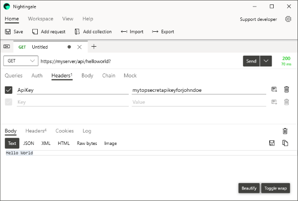

Developing micro services with Microsoft ASP.NET Core 5.0 Web API is powerful and fun, but the fun stops, if your data are accesses unauthorized. It is absolutely fundamental to have a protection layer, which filters out unwanted data requests.  

A common way is to limit the service access by providing API Keys to well known clients. In this post I will show you how to implement such a filter in terms of API keys and IP addresses. 

<!-- more -->

## The Settings

Lets start with the list of clients, who should be able to access the data. The most useful place for this is in the **appsettings.json** of the Core 5.0 Web API project:

```json appsettings.json
...

"Callers": [
    {
      "Name": "localhost",
      "ApiKey": null,
      "IPAddress": "::1"
    },
    {
      "Name": "John Doe",
      "ApiKey": "mytopsecretapikeyforjohndoe",
      "IPAddress":  "*"
    }
  ]
...
```

This list has two entries: one for the server itself ("localhost"), which is restricted to the local IP address ``"::1"``, and one for the test user ``"John Doe"``, who can access from any IP address (``"*"``), but must supply his personal API key with his requests.

In order to handle this setting, we have to introduce it to the system at startup as a class:

```c# CallerSetting.cs
  public class CallerSetting
  {
      public string Name { get; set; }
      public string ApiKey { get; set; }
      public string IPAddress { get; set; }
  }
```

```c# Startup.cs
...

public void ConfigureServices(IServiceCollection services) 
{
  ...

  IConfigurationSection configSection = Configuration.GetSection("Callers");
  services.Configure<List<CallerSetting>>(configSection);

}
...
```

## The Controller

Let's assume we have a controller, which handles the API requests, like this:

```c# MyFancyController.cs
using Microsoft.AspNetCore.Mvc;

namespace MyAPIProject
{
    [Route("api/helloworld")]
    [ApiController]
    public class MyFancyAPIController : ControllerBase
    {
        [HttpGet]
        public string Get()
        {
            return "Hello World";
        }
    }
}
```

To prevent to write a request check against our new settings in each action method, we can decorate the whole controller class by introducing an new custom ``Attribute``, which will do the work:

```c# MyFancyController.cs
...

[Route("api/helloworld")]
[ApiController]
[AuthenticateApiRequest]
public class MyFancyAPIController : ControllerBase
...
```

## The Attribute
Here is the code for the new attribute. It uses the ``IActionFilter``. These filters run within the ASP.NET Core action invocation pipeline, in our case BEFORE the action is entered (``OnActionExecutionAsync``).

```c# AuthenticateApiRequestAttribute.cs
using Microsoft.AspNetCore.Mvc;
using Microsoft.AspNetCore.Mvc.Filters;
using Microsoft.Extensions.Configuration;
using Microsoft.Extensions.DependencyInjection;
using System;
using System.Collections.Generic;
using System.Threading.Tasks;
using System.Linq;

namespace MyAPIProject
{
  [AttributeUsage(AttributeTargets.Class)]
  public class AuthenticateApiRequestAttribute : Attribute, IAsyncActionFilter
  {
    public async Task OnActionExecutionAsync
    (
      ActionExecutingContext context, 
      ActionExecutionDelegate next
    )
    {
      // Get an Api Key from Request Header
      context.HttpContext.Request.Headers.TryGetValue(
        "ApiKey", out var requestApiKey
      );

      // Get the remote IP Address
      var requestIpAddress = 
        context.HttpContext.Connection.RemoteIpAddress.ToString();

      // Get access to 'appsettings.json'
      var appSettings = 
        context.HttpContext.RequestServices.GetRequiredService<IConfiguration>();

      // Get 'Callers' list from settings
      var callers = appSettings.GetSection("Callers")
        .Get<List<CallerSetting>>();

      // Get all Callers with matching IP Adress and/or API Key via LINQ
      var current = callers.Where(c => 
        (c.IPAddress == requestIpAddress) || 
        (c.IPAddress == "*" && c.ApiKey == requestApiKey) ||
        (c.IPAddress == requestIpAddress && c.ApiKey == requestApiKey));
      
      // Do we have a match?
      if (current.Count() == 0)
      {
        // No, then return with an error 
        context.Result = new ContentResult()
        {
          StatusCode = 401,
          Content = "Unauthorized Access"
        };
        return;
      } 

      await next(); 
    }
  }
}
```

## The Result



