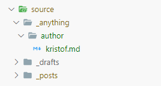

As I started with this blog 2 years ago, I wanted to document the customization of Hexo to my needs in a series of articles. To group these articles I considered using the build-in ``categories``, but I already used them to group articles by the underlying tech stack or area, like ´JavaScript´, ´C#´ or ´Tools´ and I didn't want to mix it, as the category was also used in the Url of a post.

I was researching another grouping solution for Hexo and stumbled upon [hexo-index-anything](https://github.com/leviwheatcroft/hexo-index-anything), a very clever Hexo plugin to generate index pages for almost every [FrontMatter](https://hexo.io/docs/front-matter.html) variable in a post.

As it was freely available under a MIT license on Github, I forked it in July 2020 and made some bug fixes and drop a pull request to Levi ... but he  unfortunately never answered my pull or issue requests and has set the status of the project to DEPRECATED.

Ok then ... make a successor on your own, fella...

<!-- more -->

## Basic Functionality

Let me describe how the original plugin and my successor are working in general:

Assume, you have several posts from different authors and you want a list of all posts for every author. The only thing you have to do (after installation and configuration of the plugin), is to add a custom variable called ``author`` to the FrontMatter of each post, with the name of the author as value.

```yml /source/_posts/my-fancy-post.md
title: My Fancy Post
date: 2021-04-25 13:41:46
author: Kristof
...
```

Next time you run ``hexo generate``, several new files will be available in your output folder:

**One INDEX page**

... for the **author index**, with a list of all available authors and the number of the posts:
* /authors/index.html

**Many POSTS pages**

..., one for each author for the **author index**, with all of the authors posts:

* /authors/kristof/index.html
* /authors/ ... /index.html

## New Plugin Name

In order to avoid confusion (and be able to provide the plugin on Github/NPM) I needed a new name for the plugin and due to the fact that it is a generator, I named it simply **hexo-generator-anything**.

## New Features

The original code was really hard to read, because every second variable was named 'index', therefore I started with some refactorings, before I continued implementing new features.

### Configuration

The original, one-dimensional variable to index mapping, wasn't meaningful enough for me. The new mapping is now a dictionary and has unique identifiers:

```yml /_config.yml
anything:
  layout_index: anything-index
  layout_posts: anything-posts
  index_mappings:
    - variable: author
      path: authors
```

The ``template*`` setting names has changed into ``layout_*``, to make more clear what they are meant for. They are pointing to an existing EJS file in your Hexo themes layout folder to render the particular page.

* ``layout_index``   
EJS file (without extension) to render the INDEX page

* ``layout_Posts``   
EJS file (without extension) to render each POSTS page

On [Github](https://github.com/kristofzerbe/hexo-generator-anything) and in the [NPM package](https://www.npmjs.com/package/hexo-generator-anything) you will find sample EJS files and some partials, to take the SoC pattern into account.

The original ``titleSeparator`` setting is not longer available, because it is not necessary anymore. By providing a data structure for ``index`` with the attributes ``name`` and ``caption``, a title can be put together in the EJS file itself.

### Introducing linked Markdown files

One of my needs was, to provide more information on the INDEX page and the POSTS pages for each entry or, to stay with the example, for each author. As the ``_posts`` folder is used for storing the post data files, I introduced a **``_anything``** folder for dropping MD files, which are linked to the index and its values.



The subfolders of **``_anything``** are representing the index and the files in it each possible value of the index.

The file is structured like any other post file: the FrontMatter data at the top and below some content to show along with the the entry to describe it:

```yml /source/_anything/authors/kristof.md
---
title: Kristof
github: https://github.com/kristofzerbe
avatar: kristof.png
---

... some smart things to say about Kristof, or links or images, whatever ...
```

The INDEX file itself may have its own Markdown file, to provide addition text or data to it, like describing the list.

The variable ``title`` is a requirement in the Markdown files, but you can add as many variables as you need and use it in the EJS files. All data will be passed through to the template.

## Conclusion

The new plugin runs very well and it is heavy in use on generating the sections [Series](https://kiko.io/series) and [Projects](https://kiko.io/projects) of this blog. Give it a try ...