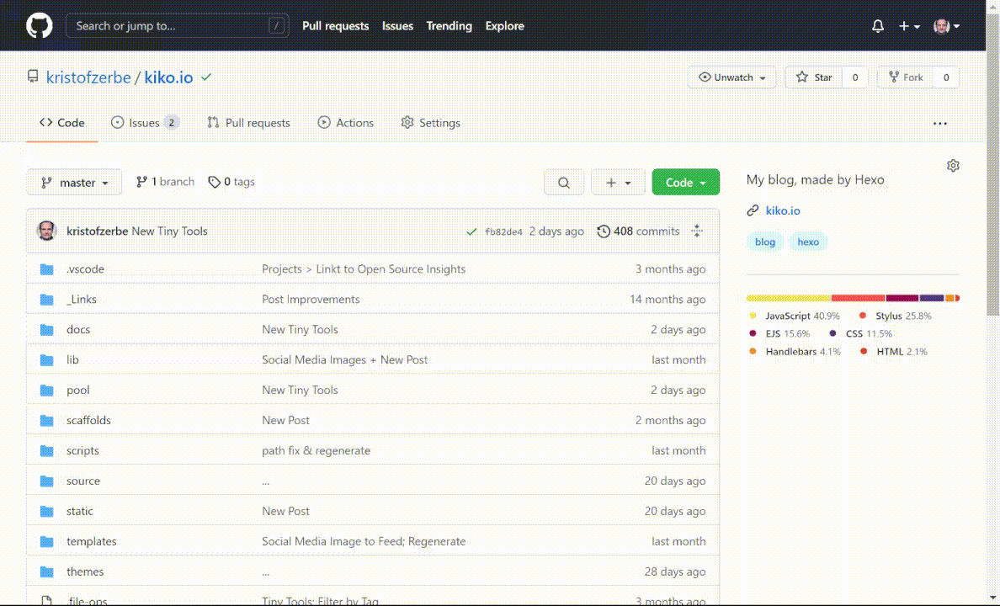
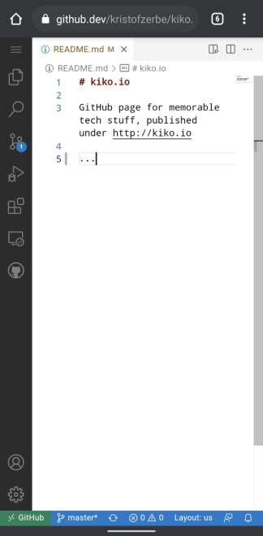

GitHub has released the long awaited solution für code editing in the web today, or more precisely, the two new solutions: [**CodeSpaces** and **github.dev**](https://github.com/features/codespaces).

As Brigit Murtaugh and Allison Weins pointed out in their presentation at the live stream on Youtube ([VS Code anywhere: GitHub Codespaces and github.dev](https://www.youtube.com/watch?v=c3hHhRME_XI)), both solutions are based on the codebase of Visual Studio Code, but have different approaches and target groups.

Where **Codespaces** is an online editor with computing capabilities (realized by running a VM in the backend) and is only available für paid plans, **github.dev** is a free online editor to change files in your GitHub repo as you do it in your local VSCode, but without running and debugging capabilities.

<!-- more -->

Features like extensions, code completion, references, creating pull requests and other things we need all day in our VSCode, works also in these web editors, including settings sync!

## github.dev

The non-computing web editor is fully integrated in GitHub itself. There is no URL ``github.dev``, where you can load your repo. Instead, if the URL to your repo is f.e. ``https://github.com/myname/myrepo``, just replace ``.com`` with ``.dev`` and your code is available in the editor! For people who like it even more comfortable: go to your repo and just **press the DOT key**. Really smart.

This even works on mobile, which will definitely change my workflow...

