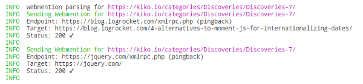


This is part two of a blog post that turned out to be a bit too long. Don't miss Part 1:  ...


---

After you have created your new Hexo post with ``hexo new post "My Fancy Post"`` and spend a couple of minutes/hours/days on writing meaningful text, you publish it by running ``hexo generate`` and copying the generated HTML to your server.

Next step would be to inform all the blogs you linked to in your now published post, that you have done just that. You want to send **Webmentions**.

Good news: you don't have to write your own solution to scan your article for external URL's and sending Webmentions to their creators: [Remy Sharp has done that](https://remysharp.com/2019/06/18/send-outgoing-webmentions) already with his service [**webmention.app**](https://webmention.app/). It supports the long existing [Pingbacks](http://www.hixie.ch/specs/pingback/pingback) too and offers several ways to achieve your goal:

<!-- more -->

**(1)** *Use the service at [https://webmention.app/test](https://webmention.app/test) manually with your newly published article URL*   
Very time consuming approach and actually only intended for tests. You rely on Remy's service and need a token to avoid existing rate limits.

**(2)** *Perform a POST of your new article URL or the URL of your RSS feed to his service endpoint using CURL or any other HTTP requesting method*   
Can be integrated at the end of your build & deploy process. Rely on Remy's service and needs a token.

**(3)** *Use IFTTT to do the job described in (2) using your feed*   
Seems best way for 'set up and forget', but you rely not only on Remy's service, but on IFTTT also. Not really controllable.

**(4)** ***Use his Command line tool independently***   
Use the executable behind Remy's service on your own, without tokens and stuff. Integrable into your build & deploy process and the [source code is available on Github](https://github.com/remy/wm), in case you want to change it to your needs.

```bat
REM Install
npm install @remy/webmention

REM Run test locally
npx webmention https://localhost:4000/my-fancy-post --debug

REM Run send with your published URL
npx webmention https://my-blog.com/my-fancy-post --send --limit 0
```


Whatever method you use: If you use your **RSS feed** for scanning, you have to ensure, that your feeds content contains the complete text of your article and **not only the excerpt**, in case you work with Hexo's ``<!-- more -->`` feature.


## Sending Hexo-Style

To avoid having to look up the published URL each time, I wrote a [Hexo console command](https://hexo.io/api/console.html) that either processes a post by its filename (slug) or simply the last ones. It is based on and uses Remy's [NPM package](https://www.npmjs.com/package/@remy/webmention).

You can install **hexo-console-webmention** by executing:

```npm install hexo-console-webmention --save```

The command has 3 options:

| Parameter | Type | Description |
| --- | --- | --- |
| **slug** | string | Parse a particular post by its filename (slug) |
| **count** | int | Parse a number of latest posts (not considered when --slug is used)>; default = 1 |
| **send** | bool | Parse and send Webmentions (without, only the endpoints found are displayed) |

### Examples

Parse and show endpoints for the latest post:

```cmd
hexo webmention
```

Parse and show endpoints for the latest 20 posts:

```cmd
hexo webmention --count 20
```

Parse and send Webmentions for the latest post:

```cmd
hexo webmention --send true
```

Parse and send Webmentions for the post "My Fancy Blogpost":

```cmd
hexo webmention --slug my-fancy-blogpost --send true
```

### Sample Output



The source code is available at: [https://github.com/kristofzerbe/hexo-console-webmention](https://github.com/kristofzerbe/hexo-console-webmention).

---


Do not linger ... this way to Part 3:  ...


---

## More Info


