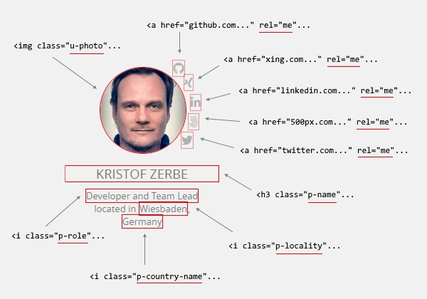
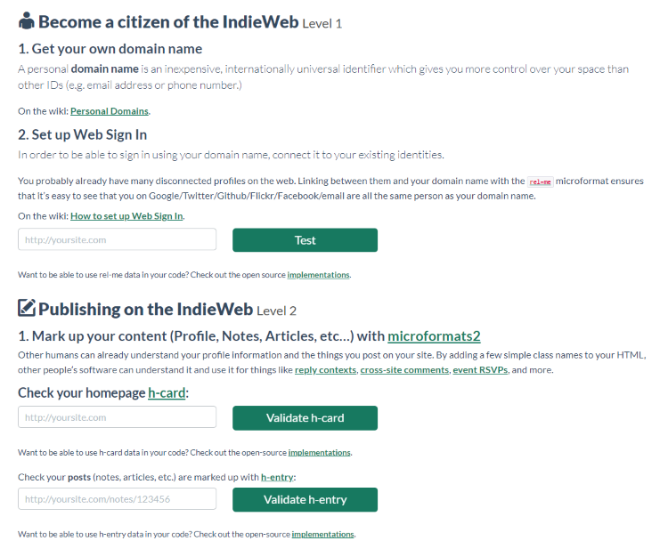



It is cool to publish your thoughts on your own blog under your only domain and not only on big social media platforms, because that way you keep control over your content. But what makes Facebook, Twitter and others "social" is the interaction between the people. Likes, Retweets, Mentions, Replies are the fuel which drives them. But most of the blogging solutions offers only rudimentary interactions, in form of article comments. The comment hurdle is high because interacting on someone else's site is different from interacting on what is supposed to be your own, such as your Twitter or Facebook feed.

The project [**IndieWeb**](https://indieweb.org/) and their approach of [**Webmentions**](https://indieweb.org/Webmention), has the goal to fill this gap. As a [W3C recommendation](https://www.w3.org/TR/webmention/), it defines standards how the social interaction of independent blogging solutions can be technically implemented without the need of manual intervention. Let software do the job...

In this article I will only briefly go into the basics and then show an implementation solution for the SSG [**Hexo**](https://hexo.io).

<!-- more -->

---

## Basic Concepts

Nothing describes the flow of Webmentions better than this:


1. Frankie posts a blog entry.
2. Alex has thoughts in response, so also posts a blog entry linking to Frankie’s.
3. Alex’s publishing software finds the link and fetches Frankie’s post, finding the URL of Frankie’s Webmention endpoint in the document.
4. Alex’s software sends a notification to the endpoint.
5. Frankie’s software then fetches Alex’s post to verify that it really does link back, and then chooses how to display the reaction alongside Frankie’s post.


Basically Webmentions allow notifications between **web addresses**, therefore every post, which is part of the interaction, has to have a unique [permalink](https://en.wikipedia.org/wiki/Permalink).

A blog software that wants to support webmentions must cover 4 main points:

1. The HTML has to tell others who you are
2. The HTML has to give dedicated informations about your posts
3. Sending a message to another blog, in case you mentioned one of its posts
4. Reveiving messages from other blogs, in case they mentioned one of your posts

Point 4 is probably the most interesting for all of us, because it pats our own ego on the back, since we usually don't write for ourselves, but for others, and reactions to it, show us that it wasn't pointless.

---

## Step 1: The Personal & Profile HTML

As you want to interact with other blogs participating in the IndieWeb with your posts, they have to know something about you and your articles in a machine-readable form.

### Personal Information

HTML is machine-readable per se, but you have to tell others what to look for by adding defined classes to the tags which holds the information, in order to enable them to get specific information about you, like your name, your mail-address or links to other profiles f.e. Github, Twitter and so on.

It is necessary to have this information not only in an ABOUT page, but also on each post page. You can achieve this either by having an ABOUT block like here on kiko.io or providing the information in hidden HTML tags elsewhere in your HTML.

It does not matter which tags you use, you only have to add the defined class to the tag of a particular information in your Hexo EJS file. The information will be extracted out of the tag's inner text.

<!-- more -->

The most used classes for personal blogs as follows:

|Class|Information|
|---|---|
|[**h-card**](http://microformats.org/wiki/h-card)|Wrapper for all personal information.<br> *All other classes below has to be used on child tags*|
|**p-name**|Full name|
|**u-email**|Email address|
|**u-photo**|Photo|
|**p-role**|Role|
|**u-url**|URL representing the person|
|**p-locality**|City or Town|
|**p-region**|State or province|
|**p-country-name**|Country name|


Please keep in mind not to give too much information about you to the public. It could get unpleasant...


### Profile Information

For providing links to other profiles, anchor (``A``) tags with the special attribute [``rel="me"``](http://microformats.org/wiki/rel-me) will be used, which indicates profile equivalence and can be used for [identity-consolidation](http://microformats.org/wiki/identity-consolidation).

With this extension of your blog HTML, you are able to sign in using your domain at sites which supports **Web Sign-In** over the concept of **RelMeAuth**, for example those who use [**IndieAuth.net - OAuth for the open web**](https://indieauth.net/). You only have to make sure, that the endpoints of your profile links have **backlinks to your blog** with a ``rel="me``". Unfortunately, not many services offer the definition of such a backlink. Github, for example, is an exception. You can give it a try at [IndieAuth.com](https://indieauth.com/).

#### Example



---

## Step 2: The Article HTML

Tagging articles with meta information for the IndieWeb is similarly simple, by adding following classes in your article.ejs file:

|Class|Information|
|---|---|
|[**h-entry**](http://microformats.org/wiki/h-entry)|Wrapper for all article related information|
|**p-name**|Title|
|**p-summary**|Short summary|
|**e-content**|Content| 
|**dt-published**|Publish date|
|**dt-updated**|Update date|
|**u-url**|Permalink|

In case you work with the default Hexo theme 'landscape', I advise you to split your ``article.ejs`` in two files, because it is used for the article itself and for the excerpts on the start page and archive pages also. I have made an ``excerpt.ejs`` with all the information needed for listing the posts and cut back my ``article.ejs`` to the bare minimum, but with the IndieWeb related classes above (or in the linked partials if necessary), because only the article page itself should have these informations, respectively an ``h-entry`` class, to indicate that there are IndieWeb data!

```html layout/_partial/article.ejs

<article id="<%= post.layout %>-<%= post.slug %>" 
         class="article article-type-<%= post.layout %> h-entry" itemscope itemprop="blogPost">
  
  <div class="article-meta">

    <div class="h-card p-author" style="display:none">
      " alt="<%- config.author %>" />
      <a class="p-name u-url" href="<%- config.url %>" rel="author"><%- config.author %></a>
    </div>

    <%- partial('post/date', { class_name: 'article-date dt-published', date_format: 'DD MMM YYYY' }) %>
    <%- partial('post/category', { class_name: 'article-category p-category' }) %>
  </div>
  
  <div class="article-inner">
    <header class="article-header">
      <%- partial('post/title', { class_name: 'article-title p-name', show_link: false }) %>
      <%- partial('post/subtitle', { class_name: 'article-subtitle p-summary' }) %>
    </header>
    
    <div class="article-entry e-content" itemprop="articleBody">
      <%- post.content %>
    </div>
    
    <footer class="article-footer">      
      <%- partial('post/tag', { class_name: 'article-tags' }) %>
      <%- partial('post/permalink', { class_name: 'article-permalink u-url' }) %>
    </footer>
  </div>

  <%- partial('post/comments') %>
  <%- partial('post/related') %>
  <%- partial('post/nav') %>

</article>
```

### External Links

The Interaction with other blogs takes place through linking to those external sources in the content of your article.

Lets say you want to write about a specific topic and to mention the work of another developer, then you just place a link to his post in your Markdown, as you have been doing all along:

```md /source/_posts/my-fancy-post.md
# My Fancy Post
...
Jack has done a wonderful job with his [Awesome Work](https://jacks-blog.com/awesome-work)
...
```

It will be transformed while generating into something like that:

```html /output/.../my-fancy-post/index.html
<body>
  ...
  <article class="h-entry">
    ...
    <div class="article-inner">
      <header class="article-header">
        <h1 class="p-name">My Fancy Post</h1>
      </header>
      <div class="article-entry e-content">
        ...
        <p>
          Jack has done a wonderful job with his <a href="https://jacks-blog.com/awesome-work">Awesome Work</a>.
        </p>
        ...
      </div>
      ...
    </div>
    ...
  </article>
  ...
</body>
```

In the terms of the IndieWeb concept, your post will a be an [article](https://indieweb.org/article), which mentions other posts, as the old-fashioned pingbacks do.

---

## Special Post Formats

A true interaction takes place, when you are posting in a certain syndication context ... with a [note](https://indieweb.org/note) as a [response](https://indieweb.org/responses) to the work of others, mainly by adding additional classes to the external link:

* [u-in-reply-to](https://indieweb.org/reply) ... to indicate that your post is a **reply** to a post as part of a conversation
* [u-like-of](https://indieweb.org/like) ... to indicate that your post is a **like**
* [u-repost-of](https://indieweb.org/repost) ... to indicate that your post is a **repost** (100% re-publication)
* [u-bookmark-of](https://indieweb.org/bookmark) ... to indicate that your post is a **bookmark**

Every response type can have additional information about your post and the syndication of it.

### Example REPLY

```html
<body>
  ...
  <div class="h-entry">
    <p>
      In reply to: <a class="u-in-reply-to" href="https://jacks-blog.com/awesome-work">Jacks Blog: Awesome Work</a>
    </p>
    <p class="p-name e-content">
      Jack, you have done a wonderful job!
    </p>
    ...
  </div>
  ...
</body>
```

### Example LIKE

```html
<body>
  ...
  <div class="h-entry">
    <p class="p-summary">
      Kristof liked <a class="u-like-of" href="https://jacks-blog.com/awesome-work">Jacks Awesome Work at https://jacks-blog.com/awesome-work</a>
    </p>
    ...
  </div>
  ...
</body>
```


Currently, I would not recommend writing responses as a normal post in Hexo, as it is based on structured text, that best describes the IndieWeb concept of an ARTICLE.<br>**As this post is part of a new series called [IndieWeb](/series/indieweb/), I will post a solution for responses is the near future.**


---

## Verification

To check all your changes, you can use [IndieWebify.Me (Level 1 & 2)](https://indiewebify.me/):



---


This was supposed to be just one post, but it got longer and longer and so I split it into 3 parts. Don't miss Part 2:  ...


---

## Terminology
There are a lot of posts out there which explains the basic concepts of the IndieWeb and Webmentions in particular and you will stumble upon some terms, which has to be explained:


... is a domain name that you personally own, control, and use to represent yourself on the internet. Getting a personal domain is the first step towards getting on the indieweb, and is therefore a requirement for IndieMark Level 1



... are small patterns of HTML to represent commonly published things like people, events, blog posts, reviews and tags in web pages. They are the quickest & simplest way to provide an API to the information on your website.



... is an abbreviation for Publish (on your) Own Site, Syndicate Elsewhere, the practice of posting content on your own site first, then publishing copies or sharing links to third parties (like social media silos) with original post links to provide viewers a path to directly interacting with your content.



... is the process of syndicating interactions on your POSSE copies back (AKA reverse syndicating) to your original posts.



... is signing in to websites using your personal web address (without having to use your e-mail address). Web sign-in supersedes OpenID.



... is a proposed open standard for using rel="me" links to profiles on oauth supporting services to authenticate via either those profiles or your own site. RelMeAuth is the technology behind Web sign-in.



... is a federated login protocol for Web sign-in, enabling users to use their own domain to sign in to other sites and services.


---

## More Info

{% moreinfo '{ "list": [
  [ "A List Apart", "Webmentions: Enabling Better Communication on the Internet",
  "https://alistapart.com/article/webmentions-enabling-better-communication-on-the-internet/"],
  [ "indieweb.org", "Getting Started",
  "https://indieweb.org/Getting_Started"],
  [ "indieweb.org", "How to set up web sign-in on your own domain",
  "https://indieweb.org/How_to_set_up_web_sign-in_on_your_own_domain"],
  [ "indieweb.org", "IndieWeb Examples",
  "https://indieweb.org/Webmention-developer#IndieWeb_Examples"],
  [ "Bryce Wray", "Webmentions in three SSGs: Part 1",
  "https://brycewray.com/posts/2020/04/webmentions-three-ssgs-1" ],
  [ "Keith J. Grant", "Adding Webmention Support to a Static Site",
  "https://keithjgrant.com/posts/2019/02/adding-webmention-support-to-a-static-site/"],
  [ "Alessio Caiazza", "Articles tagged ´indieweb´",
  "https://abisso.org/stream/tags/indieweb/" ],
  [ "* (Forum)", "Anyone for Webmention?",
  "https://discourse.gohugo.io/t/anyone-for-webmention/10411" ]
]}' %}