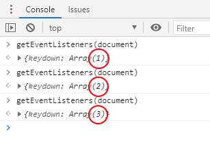
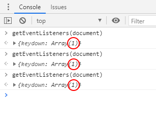

I'm working on a new web app that contains a sliding out panel with some additional information on the selected element. This panel can be closed by the user via the ESC key. The implementation on initializing the panel seems very straight forward:

```js
class Panel() {
  init() {

    document.addEventListener("keydown", function(event) {
      if(event.key === "Escape"){
        //close the panel
      }
    });
    
  }
}
```

Problem is: the panel, which is part of the basic HTML, will be initialized with its content and functionality in a ES6 class. So ... on every init, another event listener is added.

You can easily figure that out, by calling `getEventListeners(document)` in the Chrome DevTools:



<!-- more -->

As there is no way in JS to find and replace the event which was previously added, we have to remove the existing event by using ``removeEventListener`` and add it again. Most important parameter on removing is the instance of the event handler, which was used the add the event previously.

```js
class Panel() {
  init() {

    function onEscapeKey (event) {
      if(event.key === "Escape"){
        //close the panel
      }
    }
    document.removeEventListener("keydown", onEscapeKey);
    document.addEventListener("keydown", onEscapeKey);
    
  }
}
```

But ... as the handler ``onEscapeKey`` is defined in a class, every time a new instance of the class is created, the handler will be not the same as the previous one! We have to store the event handler globally...

```js
class Panel() {
  init() {

    document.removeEventListener("keydown", window.panelEscapeKeyHandler);
    window.panelEscapeKeyHandler = function onEscapeKey(event) {
      if(event.key === "Escape"){
        //close the panel
      }
    };
    document.addEventListener("keydown", window.panelEscapeKeyHandler);
    
  }
}
```

Works!


