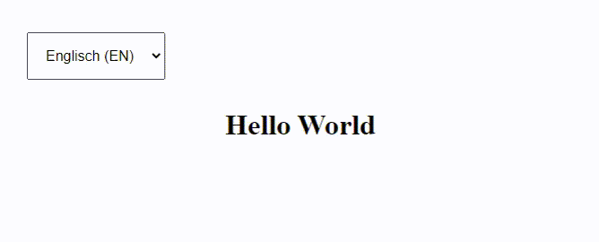

In the project I'm currently working on, I faced the "problem" to integrate multilanguage support, but due to the fact that the new app should be written in vanilla JS, without any plugins, libraries or other dependencies, I had to develop my own localization layer. In this article I want to show you my approach on this...

<!-- more -->

My solution is based on a template system that I implemented into my project at an earlier stage. If you are interested in how this works, I recommend you read my article **[Utilize a repository of reusable ES6 template literals](https://kiko.io/categories/JavaScript/Utilize-a-repository-of-reusable-ES6-template-literals/)**.

Let's start with the standard scaffold of an HTML5 app, extended with some ``style``'s, an initialization ``script`` and a lonely ``main`` element, we want to fill with some localized content:

```html index.html
<!DOCTYPE html>
<html lang="en">
    <head>
        <meta charset="utf-8" />
        <meta http-equiv="language" content="en">

        <title>Native JavaScript Multilanguage Templating</title>

        <style>
            body { padding: 2rem; }
            main { text-align: center; }
        </style>

        <script type="module">
            import { App } from './app.js';
            window.app = new App(); 
            app.init();
        </script>

    </head>

    <body>
        <main></main>
    </body>

</html>
```

The ``script`` points to the following ES6 module class in the file **app.js**:

```js app.js
class App {

  constructor() { 
    // do something when the class is instantiated
  }

  init() {
    // do something to initialize the app
  }
}
export { App };
```

Nothing uncommon so far, if you are familiar with [ES6 classes](https://developer.mozilla.org/en-US/docs/Web/JavaScript/Reference/Classes) and [imports](https://developer.mozilla.org/en-US/docs/Web/JavaScript/Reference/Statements/import)/[exports](https://developer.mozilla.org/en-US/docs/Web/JavaScript/Reference/Statements/export). 

Now let's create a **localizations.js** file, to store the needed localized strings in all wanted languages. Every language will have its own branch in a ``Localizations`` object, represented by its two-letter [ISO-639-1 language code](https://en.wikipedia.org/wiki/List_of_ISO_639-1_codes). All translations are accessible via an unique english key word:

```js localizations.js
export function Localizations() {
    return {
        "EN": {
            "helloWorld": "Hello World"
        },
        "DE": {
            "helloWorld": "Hallo Welt"
        },
        "ES": {
            "helloWorld": "Hola, mundo"
        },
        "FR": {
            "helloWorld": "Bonjour le monde"
        },
        "RU": {
            "helloWorld": "Здравствуйте, мир"
        },
        "JP": {
            "helloWorld": "ハローワールド"
        }
    }
}
```

As we import the **localizations.js** in our **app.js**, we can initialize the localizations in the constructor of the app class with the language code of the users browser:

```js app.js
import { Localizations } from './localizations.js';

class App {

  constructor() { 
    
    // Get browser language
    this.langCode = 
      window.navigator.language.split("-")[0].toUpperCase();

    // Init localization to access via 'app.localization' globally
    this.localization = Localizations()[this.langCode];

  }

  ...
```

``app.localization`` now holds the key/value list of the current language.

Now we implement the templating class, as described in [Utilize a repository of reusable ES6 template literals](https://kiko.io/categories/JavaScript/Utilize-a-repository-of-reusable-ES6-template-literals/) and define a first template called ``helloWorld`` ...

```js templates.js
class Templates {

    helloWorld(data) {
        return this.fillTemplate(`
            <h1>${app.localization.helloWorld}</h1>
        `, data);
    }

    fillTemplate(templateString, templateVars){
        var func = new Function(...Object.keys(templateVars),  
          "return `" + templateString + "`;");
        return func(...Object.values(templateVars));
    }
}
export { Templates };
```

The inner text of the ``h1`` element in the ``helloWorld`` template refers to the globally available variable ``app.localization``, we initialized in the last step, and points to the translation ``helloWorld``.

In **app.js** we import the **templates.js** and implement some code in the ``init`` method, to get the template and bring it to the DOM:

```js app.js
import { Localizations } from './localizations.js';
import { Templates } from './templates.js';

class App {

  ...

  init() { 

    // Get "Hello World" H1 element in current language
    let helloWorld = app.templates.helloWorld({});

    //Insert H1 element into MAIN element
    document.querySelector("main")
      .insertAdjacentHTML("beforeend", helloWorld);

  }
```

This is it ...

In the following **Github** repository you will find a solution based on this example, extented with a language selector, cookie support and some helper methods to keep the code nice and clean:

  [https://github.com/kristofzerbe/Native-JavaScript-Multilanguage-Templating](https://github.com/kristofzerbe/Native-JavaScript-Multilanguage-Templating)

