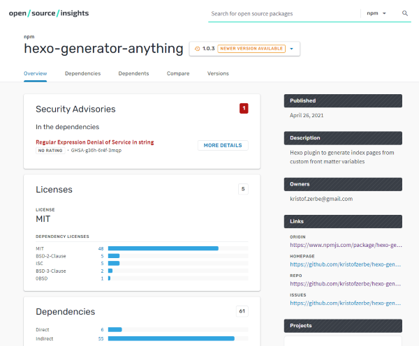
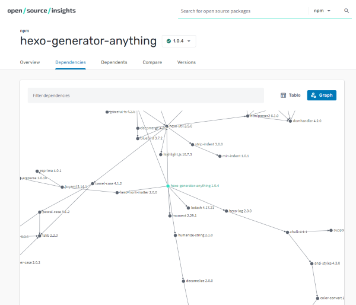

A while ago I needed some functionality regarding database access in one of my spare time projects and I decided to use a library from NPM. Typed ``npm install`` and the hell was breaking loose ... 186 direct dependencies and nearly 200K of files were flooding my harddrive!

The mental basis of IT is lazyness, which means that we produce software to make our and others life easier. This also applies to the building process. Don't reinvent the wheel, but reuse the work of other developers. But ... we have to recognize the limits and prevent to fall into the dependency hell.

To get a better overview over dependencies, regarding NPM and other repositories, some Google engineers have published a project called **[Open Source Insights](https://deps.dev/)** a couple of days ago.

<!-- more -->

If you look at a library on NPM, you immediately see the direct dependencies, but that could just be the tip of the iceberg. Insights shows you the big picture in form of an interactive graph or a complete list with many additional information of the complete dependency chain.

As Google says:

> Your software and your users rely not only on the code you write, but also on the code your code depends on, the code that code depends on, and so on. An accurate view of the complete dependency graph is critical to understanding the state of your project.

Next time, before you type ``npm install ...`` take a quick look at the Insights page of the library, because it won't give you an overview over the dependecies only, but also some security advisories to let you decide if it is a good idea to use it.

Very valueable for the authors of exisiting NPM projects also, because it shows the consequences of dependency decisions very clearly and gives hints to make the own library less sensitive to vulnerabilities.

Let us hope, that Google removes the describing adjective *experimental* from the project some day and adds more and more functionality to it (like a working responsiveness ;) in order to establish **Open Source Insights** as a main source of information about reusable Open Source software.

 

