To be honest: many of my posts here on kiko.io are written just for me. To internalize things by writing them down and to give my future me the chance to look up something I did in the past. So is this post. Future me: Don't forget the following!

I while ago I was on a trip, shooting a lot of photographs and on my way back home I had three 32GB SD cards full with great photos. I was working with my old Nikon D7000, which has 2 card slots and I just took them out, when one of the cards was full. Worked fine for several years ... but after this trip, one of the cards, full with RAW files and wonderful photos, **w-a-s&nbsp;&nbsp;&nbsp;N-O-T&nbsp;&nbsp;&nbsp;r-e-a-d-a-b-l-e&nbsp;&nbsp;&nbsp;a-n-y-m-o-r-e** ... f***! I saved myself the backup and now had to suffer over my carelessness.

I thought about some fancy and expensive backup solutions for professional photographers, but realized after a while, that I already had the equipment to achieve everything I needed and I could even use it to improve my general workflow.

In this post, I want to show you, what my workflow looks like today and how yours might benefit from my mistake.

<!-- more -->

---

## Prerequisites

### Hardware

* **Nikon D500**
  [amazon.com](https://www.amazon.com/Nikon-D500-DX-Format-Digital-16-80mm/dp/B01A7Q0KZ6)

* **Sony Professional XQD G Series 64GB Memory Card**
  [amazon.com](https://www.amazon.com/Sony-Professional-64GB-Memory-QD-G64F/dp/B081B4X9TG)

* **Prograde Digital SD UHS-II 64GB Card**
  [amazon.com](https://www.amazon.com/Professional-Vloggers-Filmmakers-Photographers-Curators/dp/B07TCL222B)

  
  The Nikon D500 has 2 different card slots: XQD and SD, where the SD is configured in the camera as backup medium. It is important to use a SD card that is as big and as fast, in terms if writing speed, as the used XQD card!
  

* **Lenovo Yoga Smart Tab (Android)**
  [amazon.com](https://www.amazon.com/Lenovo-Android-Octa-Core-Processor-ZA3V0005US/dp/B0881HDRTH)

  
  This tablet has a Micro SD card slot for extending the internal memory up to 128 GB (inofficially up to 2TB) and a USB type C socket.
  

* **Rocketek Type C XQD/SD Card Reader**
  [amazon.com](https://www.amazon.com/Reader-Rocketek-Memory-Compatible-Windows/dp/B07YDR57HP)

  
  This card reader has two slots for XQD and SD and a USB Type C connector with a short cable.
  

* ... and any Windows 10 machine
  
### Services

* **Dropbox**
  [dropbox.com](https://www.dropbox.com/)

### Apps for Android (Tablet)

* **Solid Explorer File Manager**
  [play.google.com](https://play.google.com/store/apps/details?id=pl.solidexplorer2)

* **Photo Mate R3**
  [play.google.com](https://play.google.com/store/apps/details?id=com.tssystems.photomate3)

* **Autosync for Dropbox - Dropsync**
  [play.google.com](https://play.google.com/store/apps/details?id=com.ttxapps.dropsync)

### Apps for Windows 10

* **Adobe Lightroom Classic (CC)**
  [adobe.com](https://www.adobe.com/products/photoshop-lightroom-classic.html)

---

## The Workflow In General

The aim of the workflow is to transfer the photos from the camera to other hardware on the one hand and to cloud-based storage on the other, from where they can then be easily moved to the actual storage medium at home. In the end, always 2 different backups will exist on different media.

When traveling, it is important to always have the tablet and the card reader with you, in addition to the camera and some spare SD cards.

---

## Step 1

Whenever it is necessary or advisable, take both cards out of the camera and put the **XQD card** into the card reader and connect the latter to the tablet. Just put the **SD card** away, as we will use a spare card afterwards.

Open up **Solid Explorer** on the tablet...

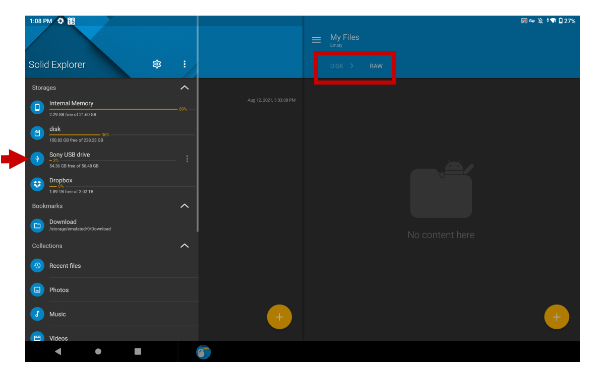

Copy the complete folder ``DCIM/101ND500`` (where the photos are stored) to a separate folder called ``RAW`` on the ``disk`` (SD card extension) of the tablet.

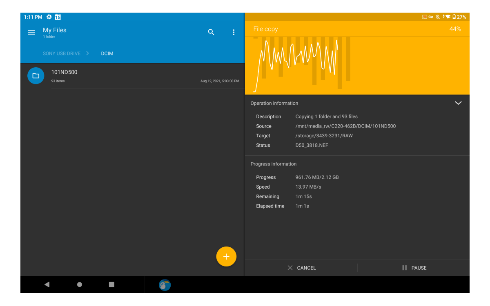

---

## Step 2

Rename the new folder on the ``disk`` to something appropriate:  
(Screenshot says *Rename a file*, but that's a bug in the app)

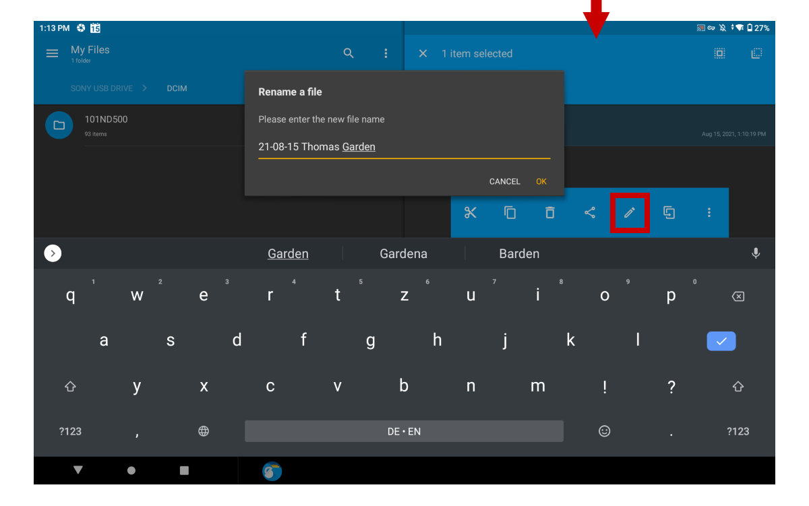

---

## Step 3

Insert the **XQD card** and a **spare SD card** back into the camera and wipe them both via the built-in menu.

**Your backup is now on the orginal SD cards and your tablet.**

---

## Step 4 (optional)

If you have time and leisure, you can use **Photo Mate R3** to review and rate your images.

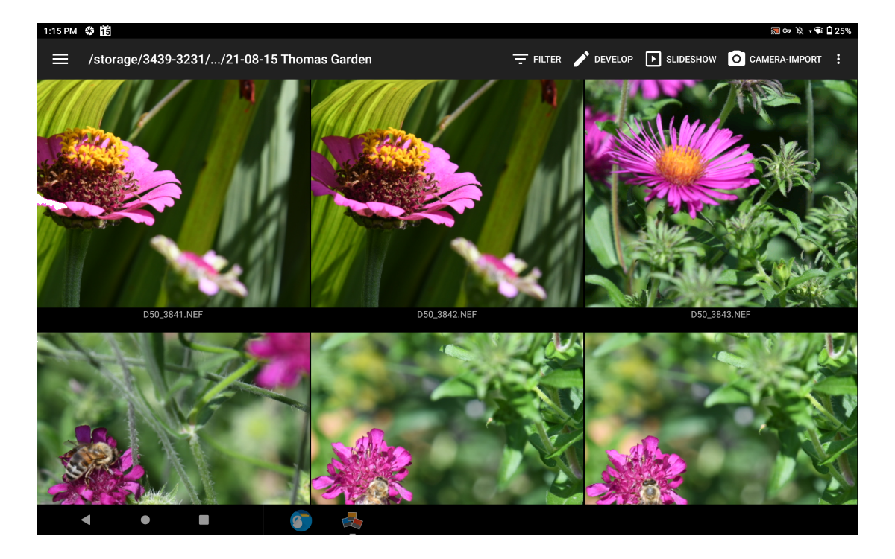


**Don't delete any photos in this step!**  
Just mark photos with RED, which can be removed afterwards, because the app is sometimes not fast enough to delete the right photo, when you has opened the next one!


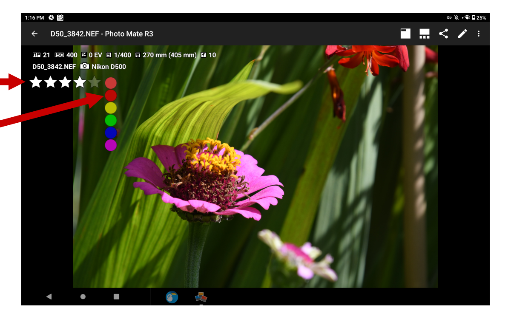

---

## Step 5

Open up **Dropsync** on the tablet and set up a new sync profile, if you haven't done so already:

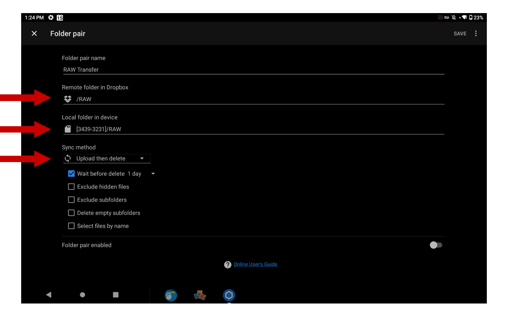

The *``remote folder``* is a folder called ``RAW`` in your **Dropbox** and the *``local folder``* is the ``RAW`` folder on your disk. *``Sync method``* should be ``Upload then delete``, because you don't need the second backup on your tablet, after the photos are transfered to Dropbox.

Run the synchronization:

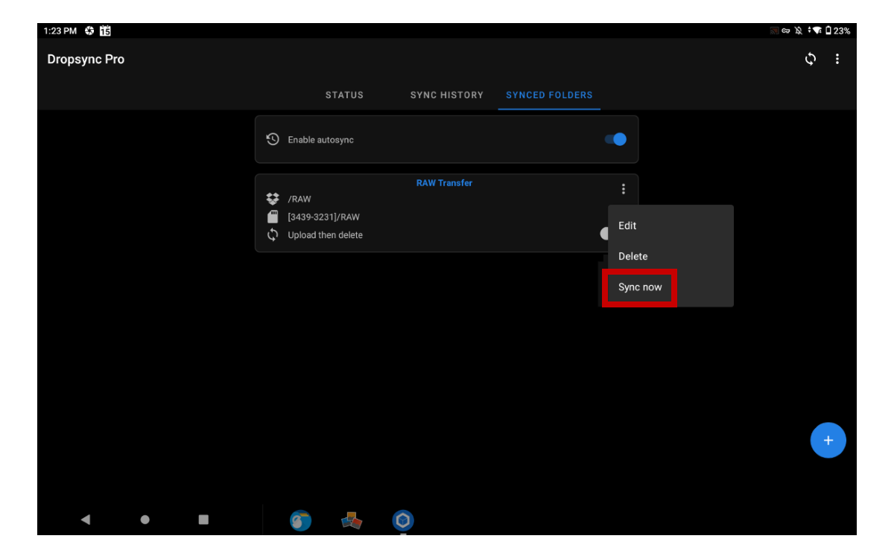

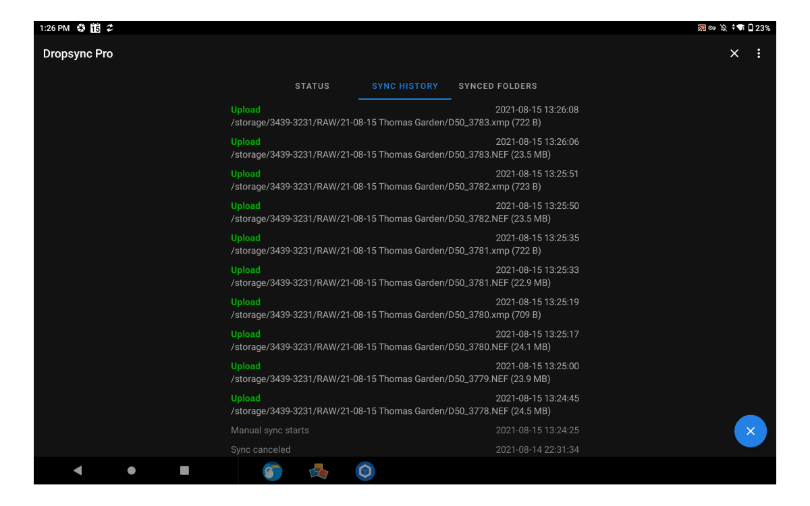

**Your backup is now on the original SD cards and Dropbox.**

---

## Step 6

After you have enjoyed your trip and be back home, move the photo folder from your **Dropbox** to your **local storage**, which of course should also have a backup of some kind:

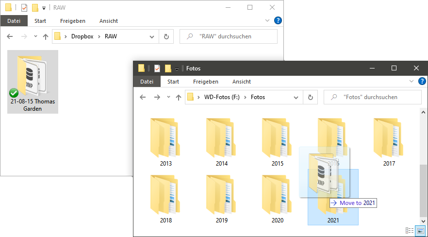

**Your backup is now on the original SD cards and your local storage.**

---

## Step 7

If you've already rated your images along the way, **Photo Mate R3** has already stored that metadata in an XMP sidecar file, that is compatible with Lightroom:

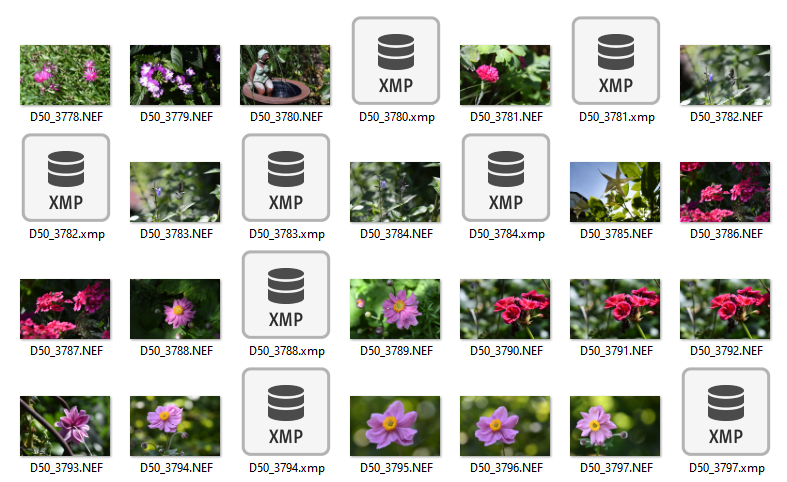

Open up **Lightroom** and import the folder from your **local storage**:

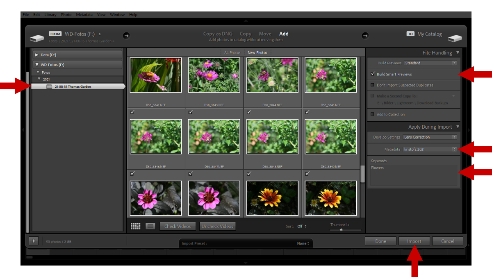

---

## Step 8

In the **Lightroom** library, filter all photos with the RED flag and set them as REJECTED:

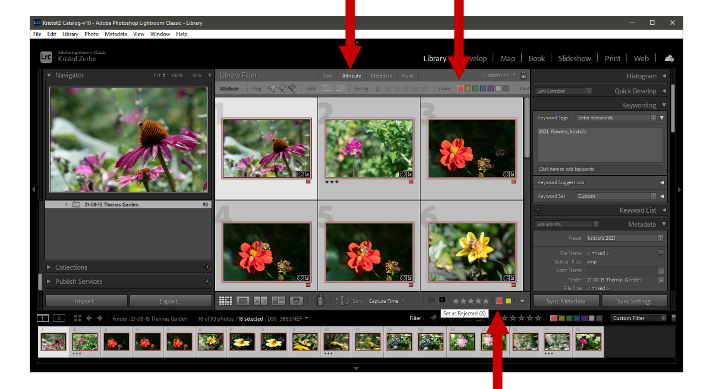

---

## Step 9

Delete all photos marked as REJECTED:

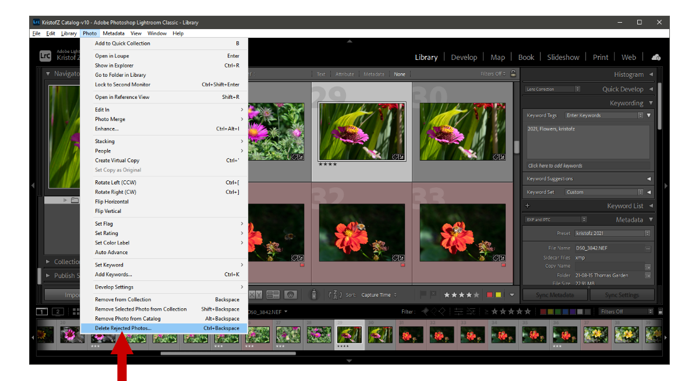

---

## Step 10

If you are sure that your local backup was done once, you can safely wipe the original SD cards, in order to use them for the next time.
