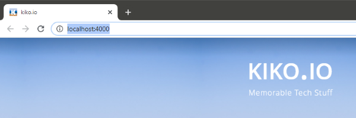
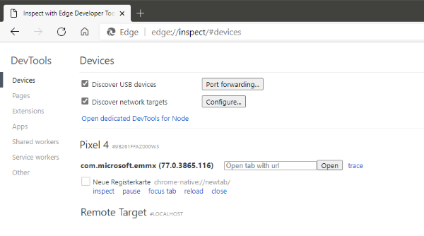
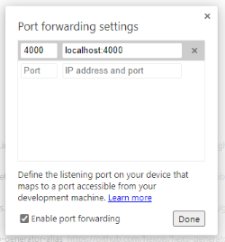
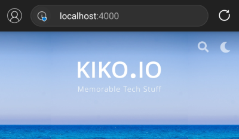
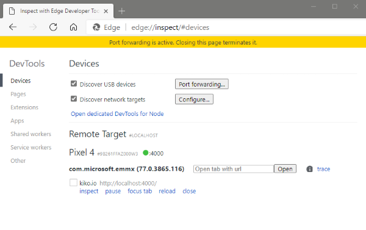
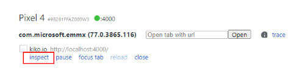
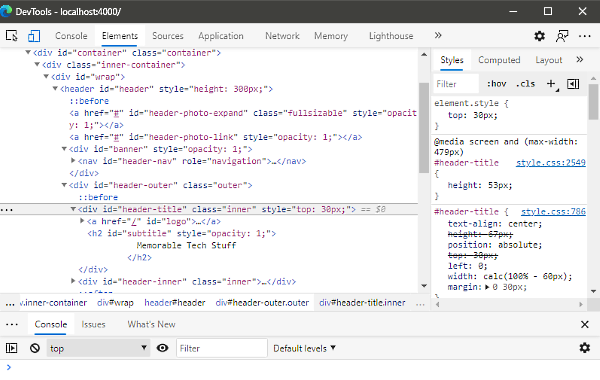
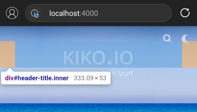

Developing a website or web app means, you have installed an editor locally on your computer, writing your code locally and start a tiny, built-in web server for debugging locally in your preferred browser. In most browsers, there are some features to mimic a smartphone, to see if your solution is working on such a device too, but you only get a hint if it's running properly. Some mobile features like ``navigator.canShare`` do not work at all. Better is to see it live on your device.

This article will show you firstly, how to test your local solution on a smartphone and secondly, how to debug it locally, when it runs on the smartphone after releasing.

<!-- more -->

I will use following setup:

* Editor: **Visual Studio Code**
* Smartphone: **Android**
* Browser for Desktop & Mobile: **Microsoft Edge** (any other Chromium based browser will work also)

Before we start, we have to enable the Android smartphone to connect to other devices, by switching on **USB Debugging**:

### Enable the Developer Options 
1. Go to ``Settings``
2. &nbsp;&gt; ``About Phone``  
3. Tap 7 times on ``Build Number``

### Enable USB Debugging  
1. Go to ``Settings``
2. &nbsp;&gt; ``System``
3. &nbsp;&gt; ``Advanced``
4. &nbsp;&gt; ``Developer Options``
5. Switch ``USB debugging`` to ``ON``

---

## 1. Test your local site on a mobile device

When you start your local web server from VS Code, your solution can be accessed by a ``localhost`` address at a specific port:

Even if you are in the same network with all your devices, this address is only available locally. You need to "announce" this address to your mobile device by using the mechanism called **Port Forwarding**. This is a job for the browser...

1. Connect you mobile device via USB with your local machine

2. Open up **[chrome://inspect/#devices](chrome://inspect/#devices)** in your Chromium based browser (works in all Chromium browsers)

3. Your mobile device will ask you to allow USB-Debugging ... say ``ALLOW``

4. Under ``Devices``, your mobile device will appear after a few seconds ... my is here the ``Pixel 4``
  

5. Click on ``Port Forwarding``

6. Enter your local, to be forwarded address (``'localhost:' and port number``) and check ``Enable port forwarding``

7. Open your Chromium based browser on your mobile device

8. Enter the URL ``localhost:4000``

Your local solution will now be loaded on your mobile device and you will see this in your local DevTools:

---

## 2. Debug a site running on your mobile device locally

This step is now very easy, because we are connected to the mobile device and a remote site is loaded. Just click ``inspect`` at the appropriate item:

.

This works now also on the released version of your solution, you want to debug. Just enter the URL in a new tab on your mobile device, find the item in DevTools-Devices and click on ``inspect``.

The window, which will be opened on ``inspect``, are the Chrome Developer Tools and every interaction with it, will be reflected on your mobile device, as you are used to when debugging locally: 

---

## More Info

