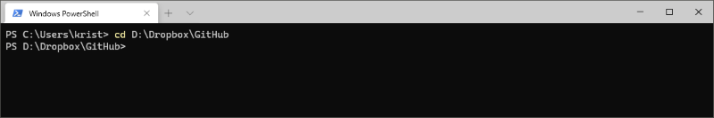
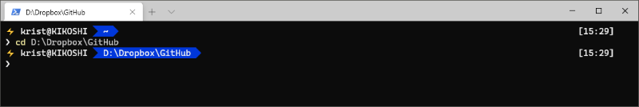
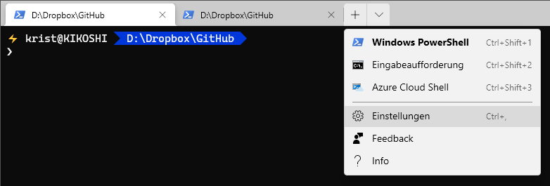
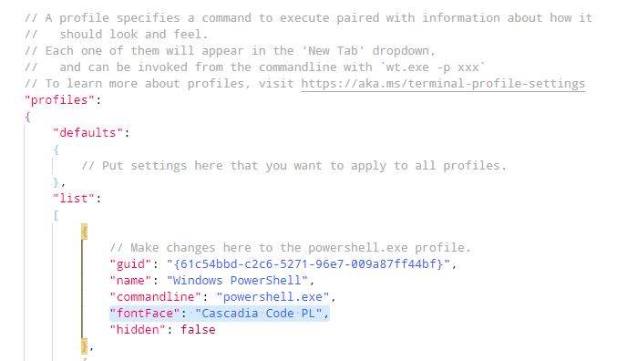
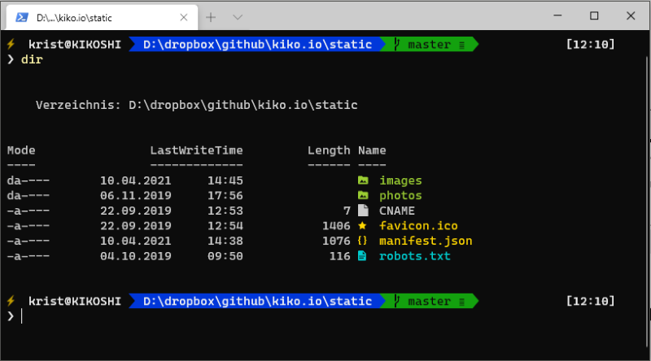

Working with the PowerShell in 2020 means fun, because of the new [**Windows Terminal** (get it from Windows Store)](https://www.microsoft.com/en-us/p/windows-terminal/9n0dx20hk701). It has more power as the old Powershell Console and it is visually adaptable to your personal taste, by installing the wonderful theming engine [**oh-my-posh** from Jan De Dobbeleer](https://github.com/JanDeDobbeleer/oh-my-posh).





To get Oh-My-Posh properly run, there are several steps to do I want to show here in a nutshell...

<!-- more -->

## Step 1 -  Install a suitable font
As the theming engine uses Powerline glyphs, you need to install a font which support them, for example the new [**Cascadia Code PL** from Microsoft](https://github.com/microsoft/cascadia-code/releases). Download, unzip and install the OTF and/or TTF font files via context menu in your Windows Explorer.

## Step 2 - Set new font in your settings
Open up you Terminal settings...



... and add following new line to the PowerShell section:

``` JSON
"fontFace": "Cascadia Code PL",
```



## Step 3 - Install oh-my-posh
Following PowerShell command installs the theming engine itself:

```ps
Install-Module oh-my-posh -Scope CurrentUser
```

If you want to display **Git status information** also, run this command:

```ps
Install-Module posh-git -Scope CurrentUser
```

To let the command-line editing environment to be customized install **PSReadline**:

```ps
Install-Module -Name PSReadLine -Scope CurrentUser -Force -SkipPublisherCheck
```

## Step 4 - Load on startup
In order to load the theming engine in every new terminal window, edit your PowerShell profile by opening it up with the command ...

```ps
notepad $PROFILE
```

and add following lines in the upcoming text file:

```txt
Import-Module oh-my-posh
Import-Module posh-git
Set-Theme Paradox
```

*Paradox* is one of 27 themes available. You will find all themes in your DOCUMENTS folder under ``..\WindowsPowerShell\Modules\oh-my-posh\<version>\Themes`` and some visual representations at [https://github.com/JanDeDobbeleer/oh-my-posh?#themes](https://github.com/JanDeDobbeleer/oh-my-posh?#themes).

## #Update, April 2021

Scott Hanselman has mentioned a new improvement recently: Show suitable icons on listing files:

1. Download and install **CaskaydiaCove Nerd Font** at [https://www.nerdfonts.com/font-downloads](https://www.nerdfonts.com/font-downloads)
2. Open Terminal Settings (like in Step 2)
3. Replace the ``fontface`` with ``"CaskaydiaCove Nerd Font"``
4. Run ``Install-Module -Name Terminal-Icons -Repository PSGallery`` in Terminal, opened as administrator
5. Add ``Import-Module -Name Terminal-Icons`` in your profile (like in Step 4)

You will get this on calling ``dir``, for example:



{% moreinfo '{ "list": [
  [
    "Windows Store", "Windows Terminal",
    "https://www.microsoft.com/en-us/p/windows-terminal/9n0dx20hk701"
  ],
  [
    "Microsoft", "Cascadia Code PL",
    "https://github.com/microsoft/cascadia-code"
  ],
  [
    "GitHub", "JanDeDobbeleer/oh-my-posh",
    "https://github.com/JanDeDobbeleer/oh-my-posh"
  ],
  [
    "Microsoft Docs", "Set up Powerline in Windows Terminal",
    "https://docs.microsoft.com/de-de/windows/terminal/tutorials/powerline-setup"
  ],
  [
    "Scott Hanselman", "How to make a pretty prompt in Windows Terminal with Powerline, Nerd Fonts, Cascadia Code, WSL, and oh-my-posh",
    "https://www.hanselman.com/blog/how-to-make-a-pretty-prompt-in-windows-terminal-with-powerline-nerd-fonts-cascadia-code-wsl-and-ohmyposh"
  ],
  [
    "Scott Hanselman", "Taking your PowerShell prompt to the next level with Windows Terminal and Oh my Posh 3",
    "https://www.hanselman.com/blog/taking-your-powershell-prompt-to-the-next-level-with-windows-terminal-and-oh-my-posh-3"
  ],
  [
    "Scott Hanselman", "Take your Windows Terminal and PowerShell to the next level with Terminal Icons",
    "https://www.hanselman.com/blog/take-your-windows-terminal-and-powershell-to-the-next-level-with-terminal-icons"
  ]
]}' %}

