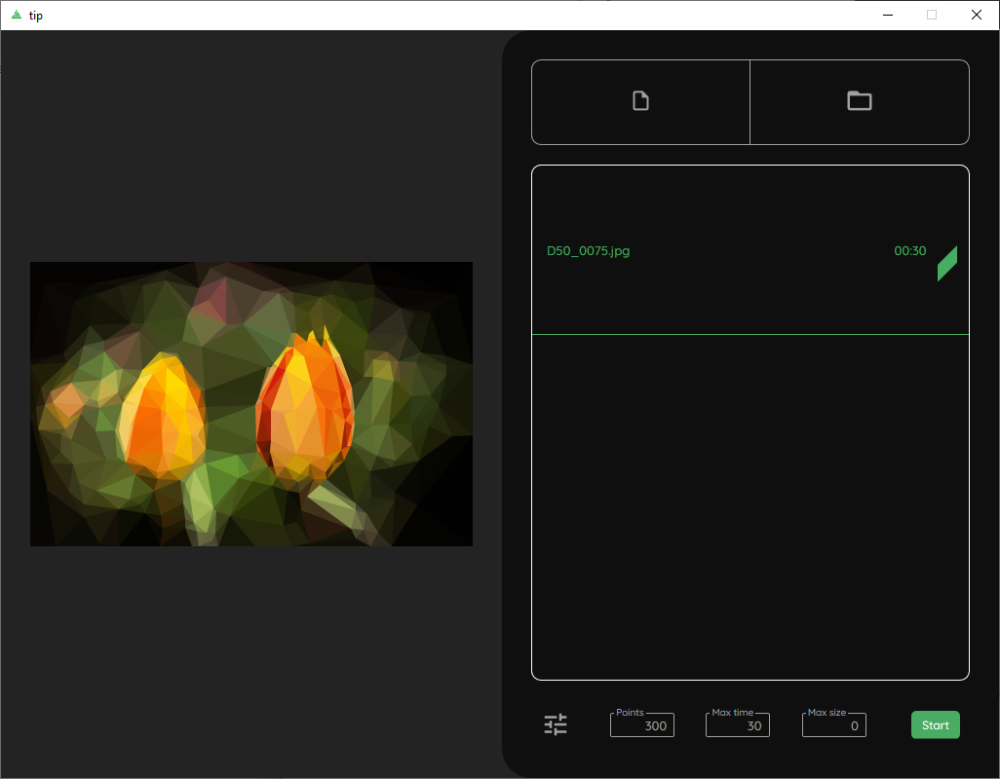


This post is a new version of  and the first in a series of articles published on the German news site [golem.de](https://golem.de).


When talking about triangulation, non-mathematicians generally understand it as a geometric method for measuring distances. Roughly speaking, two known points in space can be used to calculate a third via the angles to it. In one or the other Hollywood flick of the genres war or spy movie you have surely come across this.

However, triangulation also refers to the division of a surface into triangles or, more generally, the description of an object by means of polygons. It is used in topology and land surveying, but also in imaging methods of modeling.

How wonderfully this field of mathematics can be applied to photos is shown by the GitHub user [**RyanH**](https://github.com/RH12503) with his program [**Triangula**](https://github.com/RH12503/triangula) written in Go, which first roughly splits a given JPG or PNG image into triangles and then refines it further and further via mutations. Among other things, you can specify how many points you want to start with and how many mutations the program should perform. It is also possible to calculate the new image using hexagons instead of classic triangles.

<!-- more -->



The result is stylized images of the original, which can be used as a chic desktop background, for example. Due to the abstraction of the actual motif, such images are also very suitable as header images on websites, such as blogs, if the image should not distract from the actual content. Such an image has a great closeness to the original, but looks more like art.

Besides PNG, SVG (Scalable Vector Graphics) is also available as output format, which makes sense because SVG is an XML format and the polygons calculated by the program can also be written away directly as corresponding ``polygon`` entries as text. The generated SVG files are thereby smaller by a factor of 30, depending on the original, and thus fit in many places much better with tight bandwidths or used-up consumption limits on the Internet.

---

## Using Triangula on the command line

Ryan offers his program Triangula also as [CLI version](https://github.com/RH12503/Triangula-CLI/), which is called via the command line. The process of triangulating is separated into two parts: First you create the desired abstraction of an original image via the parameter ``run``, which is stored in a JSON file on the hard disk and in a second step you create either a PNG or an SVG as output file via ``render`` and the specification of the JSON file.

Since the command line tool has the same options as the UI version, it is great for automating the processing of the images used when building a website, for example. It also makes it much easier to turn an entire folder of images into such artistic abstractions.

---

## Using triangulated images as placeholders on websites

Depending on how good the Internet connection is and how well the developers brain of a website has worked, it can take a while until the browser of the smartphone has loaded the x-megabyte header or illustration image to finally be able to display it. It gets really annoying when no space has been reserved on the website for the image beforehand and the text that you have started to read suddenly jumps away.

In any case, the solution is to always use images that are as small as possible and adapted to the device, but they still have a certain file size if they are to look good. To prevent text jumping, nowadays one usually uses gray placeholders with or without loading bars to signal to the user that something will be displayed at this point shortly.

Ryan has found an amazingly effective solution for this as well: [tip - Triagulated Placeholders](https://github.com/RH12503/tip) - creating the smallest possible triangulated images and blending them using JavaScript.

The basis is a frontend, also written in Go, which uses the same algorithms as Triangula and with which the user can process several original images or an entire folder of photos at once via the interface.

The output format from **tip** is not PNG or SVG, but a binary file, which consumes the least amount of memory of all technical possibilities.

For comparison the generated file sizes of the example image with resolution 1024 x 660:

|Image|Size|
|---|---|
|Original|386 KB|
|Triangula PNG|223 KB|
|Triangula SVG|40,3 KB|
|tip TRI|3,03 KB|

These files, with the extension TRI, are referenced by the web developer in the IMG tag of an image on a page in the ``data-src`` attribute, and a **JavaScript**, only 200 lines long, which is also included and delivered with the web page, takes care of immediately displaying this TRI file when the page is loaded and smoothly fading to the original image once it has been loaded. You can hardly make it more beautiful.