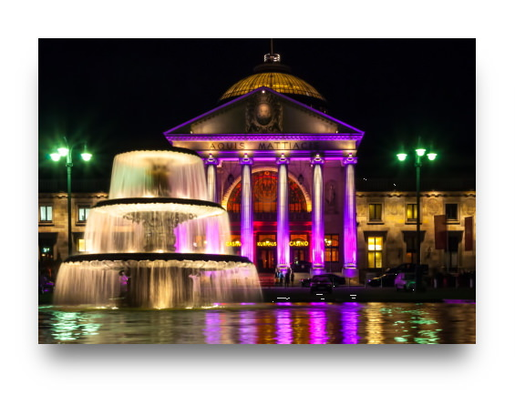
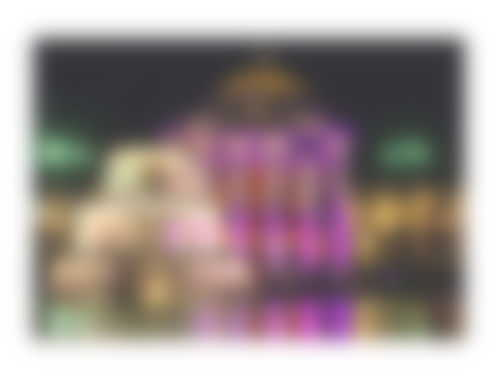

Depending on your design, sometimes it is nice to drop a shadow on an image to highlight it:

```html
  
```

```css
img {
  box-shadow: 0px 25px 25px -10px #666;
}
```


But ... it looks like a paper print of the image, with a light bulb in the first third above it. The shade is grey, boring and has been used and seen many times before...

An design related [Instagram post](https://www.instagram.com/p/CIXUIXkBHMk/) from Muhammad Abdull of [thewilsonthings](https://www.instagram.com/thewilsonwings), inspired me to **use the image itself as the shadow** in order to make the image look a bit translucent. Should be the same technique as that of a reflection. Here is the HTML/CSS code for it, as the people asking for it in the comments.

<!-- more -->

What we want to achieve is this:


Basically, we use a duplicate of the image and position it below the actual image, but slightly offset and blurred. It won't be a performance issue, as some might think, because it is the very same file and will be loaded only once by the browser.

For showing two images in the nearly same place in different layers, we need a wrapper...

```html
<div class="image-wrapper">
  
  
</div>
```

... and some CSS for positioning the images on top of each other first. Here are the defaults for both ``image`` elements:

```css
div.image-wrapper {
  position: relative;
}

div.image-wrapper img {
  position: absolute;
  display: block;
  top: 0;
  left: 0;
  width: 100%;
  z-index: 1;
}
```

Now we have to style the duplicate image that it looks similar to the shadow. We washing it out using the [blur filter](https://developer.mozilla.org/en-US/docs/Web/CSS/filter-function/blur) and the opacity.

```css
div.image-wrapper img.shadow {
  filter: blur(10px);
  opacity: 0.8;
}
```



Last step is to change the duplicates dimensions and the positioning below the original image. We squeeze it by 10% and shift it from left with half of the value back to the center, shift it from top to make it standout at the bottom and send it to the back by taking a lower z-index than the original image.

```css
div.image-wrapper img.shadow {
  filter: blur(10px);
  opacity: 0.8;

  width: 90%;
  left: 5%;
  top: 40px;
  z-index: 0;
}
```

Thats it. Here's a pen to play around with the solution:


