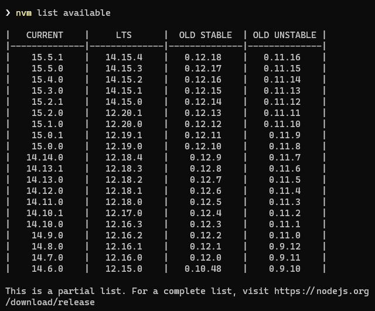
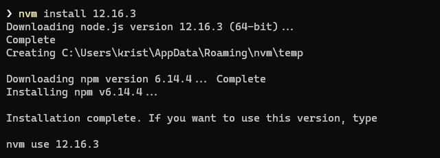
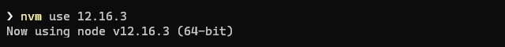
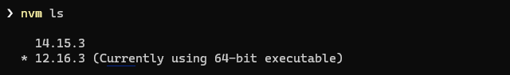

For a new project I needed to have Node 14 running on my Windows 10 machine, so installation was done quickly via downloading and running the setup file.

A short time later I wanted to write a new blog post here on kiko.io, which depends on the Node.js based static site generator [Hexo](https://hexo.io) ... and ran into several problems.

First of all my hero image processing script (see ) returned an exception. The script uses [hexo-fs](https://github.com/hexojs/hexo-fs) and the problem is known quite some time, according to this [Github issue](https://github.com/hexojs/hexo/issues/4263). The guys recommend to downgrade to an older version of Node.js ... :(

Ok ... I needed a solution to install multiple Node.js versions and switch between them, depending on which project I want to work on ... and there is one: **[nvm-windows](https://github.com/coreybutler/nvm-windows)** by Corey Butler!

<!-- more -->

This **Node.js Version Manager for Windows** is working similar to the often mentioned [n](https://github.com/tj/n) and [nvm](https://github.com/nvm-sh/nvm), which support Linux and Mac only. The latest release of **nvm-windows** can be downloaded [here](https://github.com/coreybutler/nvm-windows/releases).

The setup is pretty straight forward and asks you at the very end, if the currently installed Node.js version should be managed by it. Confirmed...

There are just a few commands to know and to run in the command line:

**List available Node.js versions**
```ps
  nvm list available
```


**Install needed Node.js version**
```ps
  nvm install <version>
```


***Switch to particular Node.js version***
```ps
  nvm use <version>
```


***List all installed Node.js versions***
```ps
  nvm ls
```



  In case you have Node.js version dependend utilities installed globally, you need to run ``npm install -g`` after switch.


