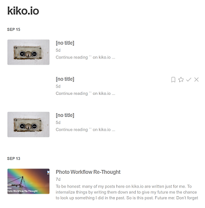

A while ago I wrote about  and used [indiepen](https://indiepen.tech/) for showing the result of my efforts.


**[indiepen](https://indiepen.tech/)** is a solution for showing code samples without the need of a code sharing platform, like [codepen](https://codepen.io/). Just reference a ``index.html``, ``main.js`` and ``styles.css`` from wherever you want and indiepen is wrapping it with a neat viewer inside an IFrame.


I did it quick and dirty first (sample files in a static folder) and now it was the time to do it right: place the sample files in a subfolder of the post in my Hexo-driven blog solution, in order to reference it from there AND have the possibility to call it directly via ``./post/my-post/sample``.

The key to achive that in Hexo is the configuration option ``post_asset_folder: true``, which generates a subfolder for all assets with the same name as the post.

```txt
|- _posts
   |- my-blog-post
      |- my-first-asset.jpg
      |- my-second-asset.jpg
   |- my-blog-post.md
```

My idea regarding the indiepen files was having a subfolder for each indiepen in the post asset folder:

```txt
|- _posts
   |- my-blog-post
      |- my-first-asset.jpg
      |- my-second-asset.jpg
NEW   |- sample
NEW      |- index.html
NEW      |- main.js
NEW      |- styles.css
   |- my-blog-post.md
```

Run ``hexo generate``, check that the indiepen was showing up properly and I thought I was done. Wrong ... after commiting my changes to Github, where my blog is living, and checking my RSS feed a while after, I saw this:



Three empty posts...!?

<!-- more -->

---

**The indiepen files in the asset subfolder were treated like posts by Hexo by no obvious reason!** A short research on the web lead me to a Github issue called [asset files were rendered when post_asset_folder set to true](https://github.com/hexojs/hexo/issues/1490) from 2015, with several requests to fix the bug.

Since I'm little familiar with Hexo's processors, I saw two ways to fix the problem:

1. Write a plugin like [Hexo Hide Posts](https://github.com/printempw/hexo-hide-posts) to filter out unwanted "posts" after processing
2. Try to find the problem in Hexo's source code, to avoid these files to be treated as posts a priori

After a little searching around in Hexo's source code, I was able to identify the location where the problem was. In the post processor:

```js ./node_modules/hexo/lib/plugins/processor/post.js (shortened)
module.exports = ctx => {
  ...

  return {
    pattern: new Pattern(path => {
      if (isTmpFile(path)) return;

      let result;

      if (path.startsWith(postDir)) {
        result = {
          published: true,
          path: path.substring(postDir.length)
        };
      } else if (path.startsWith(draftDir)) {
        result = {
          published: false,
          path: path.substring(draftDir.length)
        };
      }

      if (!result || isHiddenFile(result.path)) return;

      result.renderable = ctx.render.isRenderable(path) && !isMatch(path, ctx.config.skip_render);

      return result;
    }),
    process: function postProcessor(file) {
      if (file.params.renderable) {
        return processPost(file);
      } else if (ctx.config.post_asset_folder) {
        return processAsset(file);
      }
    }

  };
};
...
```

In the very beginning of processing posts, the code iterates over all files and folders in the ``_posts`` folder and creates a ``param`` object for each by using the ``pattern``. This object has an attribute named ``renderable``, which is used by the ``process`` method later on, to decide if it has to be rendered or not.

But ... the determination of ``renderable`` is based solely on wether a file has a renderer (*isRenderable*) or if it is listed in the ``skip_render`` configuration. See line 24 in the sample code. As HTML, JS and CSS files naturally have a renderer in Hexo, they will treated as posts!

---

## Alleviation Of The Problem

In this early stage of code execution, only files and folders are listed. There is no reference to a post or something like that, in order to find out if a certain file belongs to a post as an asset. Examination of the path will fail, because it is possible in Hexo to have a folder hierarchy under ``_posts``.

The only way to approach the problem solution is by making assumptions:

1. If the user has activated the configuration ``post_asset_folder``, he wants to have asset files in a folder named after the post
2. If the user has configured a certain file name for new posts in ``new_post_name`` (for example *:title.md*), it is not to be assumed, that he will create asset files with the same file extension.

Important here is, that it is not an option to hide the files in some way, because then they won't appear in the website. They have to be marked as *process it, but don't render it*, by bending the ``renderable`` attribute.

These considerations led to a small extension of the above code below line 24:

```js ./node_modules/hexo/lib/plugins/processor/post.js (shortened)
  ...

  result.renderable = ctx.render.isRenderable(path) && !isMatch(path, ctx.config.skip_render);
  
  //if post_asset_folder is set, restrict renderable files to default file extension 
  if (result.renderable && ctx.config.post_asset_folder) {
    result.renderable = (extname(ctx.config.new_post_name) === extname(path));
  }

  ...
```

This is what I pushed as a [Pull Request](https://github.com/hexojs/hexo/pull/4781) to the Hexo team today. I know, it not ideal, but maybe they accept my approach and ship the fix with the next version.