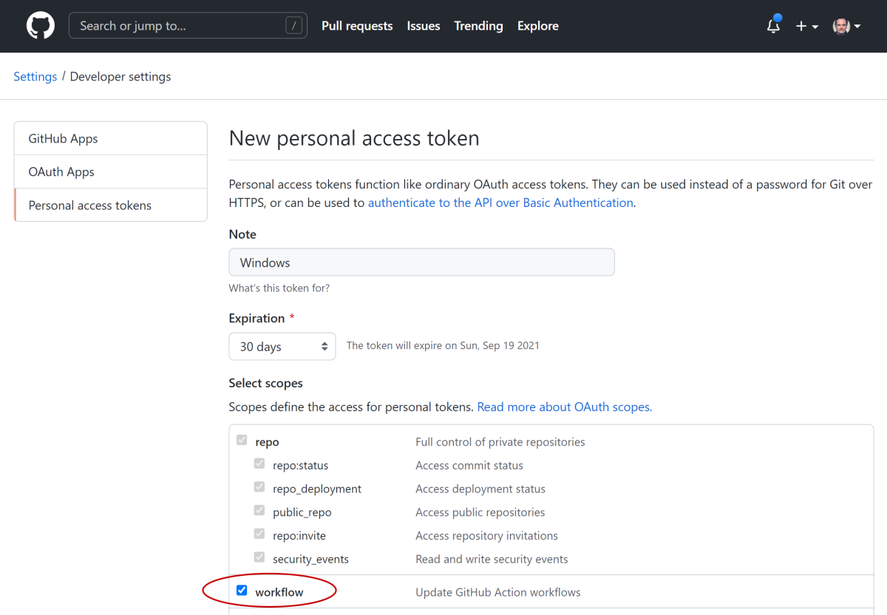
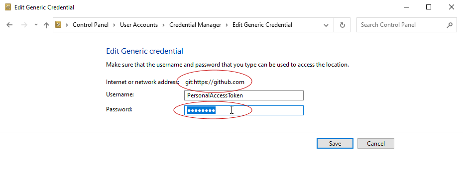
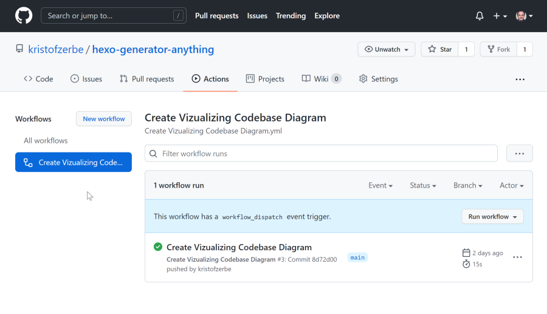
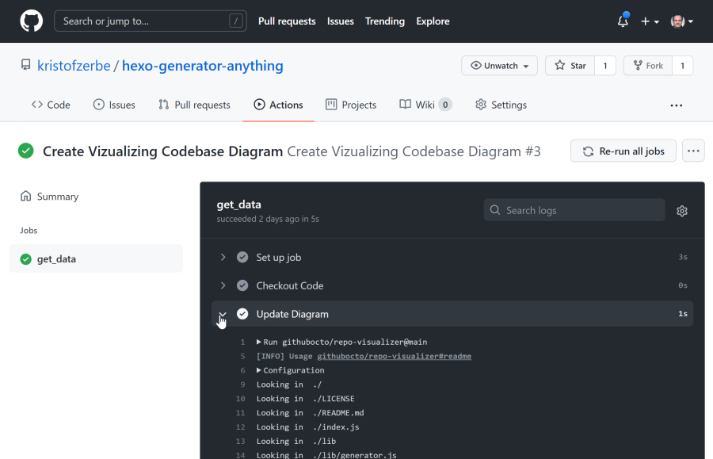
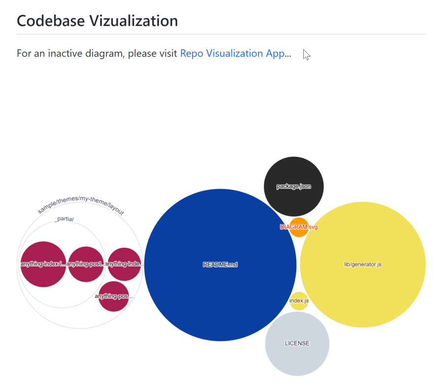

Beginning of the month, [Amelia Wattenberger](https://twitter.com/Wattenberger) of [GitHub Next](https://next.github.com/) has published a project to create a SVG visualization of a GitHub repository's codebase.

On the project page **[Visualizing a codebase](https://next.github.com/projects/repo-visualization)**, she talks about the advantages of code vizualization in terms of a better overview and comparability of code ...  and I loved it at first sight, because I'm an absolute visual person.


But her attempt was not only to show us what's possible (static SVG files and even interactive apps for code browsing, filtering and comparing), but give us the possibility to create our own codebase diagrams as SVG automatically, whenever we commit our code, by running a [GitHub Action](https://docs.github.com/en/actions), she and her team has developed ... the [**Repo Vizualizer**](https://github.com/githubocto/repo-visualizer)

<!-- more -->

Actually, her instructions are quite simple to implement, but the devil is in the details and I would like to show you what you may need for this. The goal is to prepare every project hosted on GitHub with instructions to run the Repo Visualizer after every commit to create or update a SVG file in the project, we can use in the README or via hotlinking in every other web page.

Let's start with my setup:

* Windows 10
* Visual Studio Code
* a bunch of tiny projects hosted on GitHub

---

## Project Integration

GitHub actions are configured via YAML files in the folder ``.github\workflows``. Therefore, just take Amelias demo file ``diagram.yaml`` and copy it to this folder.

```yaml .github\workflows\diagram.yml
name: Create Vizualizing Codebase Diagram
on:
  workflow_dispatch: {}
  push:
    branches:
      - main
jobs:
  get_data:
    runs-on: ubuntu-latest
    steps:
      - name: Checkout code
        uses: actions/checkout@master
      - name: Update diagram
        uses: githubocto/repo-visualizer@main
        with:
          excluded_paths: "ignore,.github"
```

You don't have to change anything in this file, except the name if you want to. It is clear to run correctly.

---

## Prepare Windows

In case you get the following error message on pushing the new file in your project to GitHub ...

```txt
refusing to allow an OAuth App to create or update workflow .github/workflows/diagram.yml without workflow scope
```

... you have a problem with your OAuth Token the Git Credential Manager created for you, while installing Git for Windows. This token doesn't include the permission to update GitHub action workflows.

A workaround is, to create a **Personal Access Token** on Github WITH this permission ...



... and replace the existing token in the **Windows Credential Manager** (in German the wonderful word "Anmeldeinformationsverwaltung"):



---

## Parameters

There are a few interesting parameters to place within the ``with`` section, that allow you to customize the output of the graph to your needs:

* ``output_file`` - The name and relative path to the SVG file to generate. Default is *./diagram.svg*
* ``root_path`` - The root path of the code to be vizualized
* ``excluded_paths`` - Folders to exclude from visualizing (as in the demo YAML)
* ``excluded_globs`` - Files to exclude from visualizing in micromatch syntax
* ``commit_message`` - After the action has created the diagram, it will be commited with this custom message

After pushing your changes, you can watch the action run in the ACTIONS tab in GitHub:





---

## The README

As the SVG is part of yor project, you can use it easily in your repos README:

```md README.md
## Codebase Vizualization
For an inactive diagram, please visit [Repo Visualization App](https://octo-repo-visualization.vercel.app/?repo=kristofzerbe%2Fhexo-generator-anything)...

```



This SVG is not interactive as Amelias Repo Visualization React app is, but it is a good overview of a repos codebase und it looks really good.
