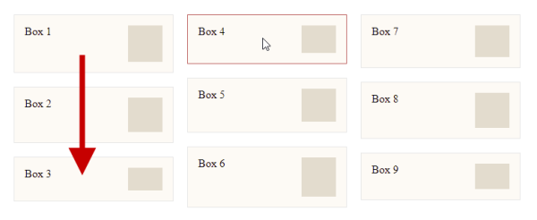
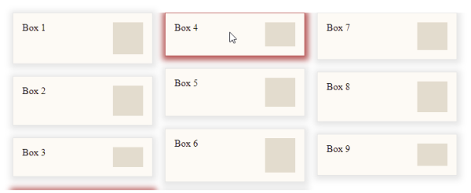
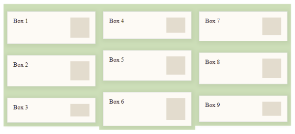
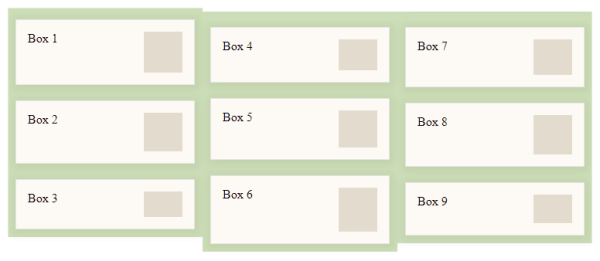

As of today, there is no true **Masonry Layout** technique in web development that can be implemented exclusively with CSS and is not based on JavaScript. True in the meaning, that the reading direction should be from left to right and not in the form of columns from top to bottom. For the latter, also called *Fake Masonry*, there are even two implementation options in CSS: Columns or Flex, whereas the [Columns](https://developer.mozilla.org/en-US/docs/Web/CSS/columns) variant is the much simpler one.

Lets say you have a list of boxes you want to show in a grid-like list, but the height of every box is defined by its content, which results in different heights. Here is an example with a base64 encoded 1px image with an individually defined height:

```html
<div class="wrapper">
  <div class="item">
    Box 1
    
  </div>
  <div class="item">
    Box 2
    
  </div>
  <div class="item">
    Box 3
    
  </div>
  <!-- ... 6 more items with different heights -->
</div>
```

By applying ``column-count`` and ``column-gap`` to the wrapper and a ``margin-bottom`` with the same value as the gap to each item, you will achieve this:



The order of the boxes is from top to bottom and then from left to right ... Fake Masonry, but is works as expected. Here is the most important CSS:

```CSS
:root {
  --gap: 20px;
  --gap-half: calc(var(--gap) / 2);
}
.wrapper {
  /* LAYOUT STYLES */
  width: max-content;
  margin: 0;
  padding: var(--gap-half);

  /* COLUMN STYLES */
  column-count: 3;
  column-gap: var(--gap);
}
.item {
  /* BASIC STYLES */
  background-color: #fffaf5;

  /* LAYOUT STYLES */
  width: 200px;
  margin-bottom: var(--gap);
  padding: 15px;
  overflow: auto;

  /* COLUMN STYLES */
  break-inside: avoid-column;
}
```

<!-- more -->

See the pen for the complete HTML and CSS:



---

## Drop Shadow and the Chromium Bug

To make the list visually a little bit more interesting, we now add a shadow, which is half as thick as the gap, to the boxes, like this:

```CSS
:root {
  /* ... more variables */
  --color-border: hsl(0 0% 90%);
}
.item {
  /* ... more styles */
  border: 1px var(--color-border) solid;
  box-shadow: 1px 2px var(--gap-half) 5px var(--color-border);
}
```

In case you work with a Chromium based browser (Version 97.x as of today), you will be confronted with a bug. The "break" from one column to the next doesn't respect the full 10px high shadow of the next item. It breaks too early. You will get this:



I added a red shadow on hover to make the bug more obvious. See following pen to inspect the CSS. In case you use Firefox (Version 96.x as of today), you won't see the bug, because Mozilla did it right.



---

## Workaround

### Step 1

In order to achieve a proper result, we have to hack the HTML and the CSS a bit. First of all we have to wrap the content of an item with a new element called `ìtem-inner``:

```html
<div class="item">
  <div class="item-inner">
    Box 1
    
  </div>
</div>
```

### Step 2

Next, we move the width, the border and the shadow from the item itself to the new inner element. Important here is to set the background of the ``item`` element to transparent in order to prevent interfering with the shadow.

```CSS
:root {
  --gap: 20px;
  --gap-half: calc(var(--gap) / 2);
  --color-border: hsl(0 0% 90%);
}
.item {
  /* BASIC STYLES */
  background-color: transparent;
}
.item-inner {
  /* BASIC STYLES */
  background-color: #fffaf5;
  border: 1px var(--color-border) solid;
  box-shadow: 1px 2px var(--gap-half) 5px var(--color-border);
  transition: all ease-out 0.3s;

  /* LAYOUT STYLES */
  width: 200px;
  padding: 15px;
  overflow: hidden;
}
```

### Step 3

Now we have to set the ``wrapper``'s gap to 0, because we will implement the spacing if the items by applying different paddings to the ``item`` element: **half of the gap** to be reached to the ``left``, the ``right`` and the ``bottom`` padding and the **full gap** to the ``top``. The latter, to achieve pushing the previous element far enough away so as not to see anything of the shadow.

But because this would mean that the horizontal gap would be too large by half, we have to use a negative margin to pull the element up by that amount.  



This in turn would mean that the first ``item`` element in the list would be too high by the now defined negative top margin, which we correct again by using ``item:first-child``.



```CSS
:root {
  --gap: 20px;
  --gap-half: calc(var(--gap) / 2);
  /* ... more variables */
}
.wrapper {
  /* ...more styles */
  column-gap: 0;
}
.item {
  /* ... BASIC STYLES */
  
  /* LAYOUT STYLES */
  width: auto; 
  margin: var(--gap-half-negative) 0 0;
  padding: var(--gap) var(--gap-half) var(--gap-half);

  /* COLUMN STYLES */
  break-inside: avoid-column;
}
.item:first-child {
    margin-top: 0;
}
```

Here is the complete solution as a pen:



---

## Conclusion

Maybe the Chromium team will fix the bug as soon as possible, to no longer have to rely on this hack, but the really best solution would be, to finish the work already started on the [**true grid masonry solution**](https://developer.mozilla.org/en-US/docs/Web/CSS/CSS_Grid_Layout/Masonry_Layout), which currently only Firefox offers behind a flag.

---

## More Info

{% moreinfo '{ "list": [
  [ "caniuse.com", "Can I Use: CSS property: grid-template-rows",
  "https://caniuse.com/?search=grid-template-rows" ],
  [ "Ryan (dev.to)", "Creating A Responsive Masonry Layout Using The CSS column-count Property",
  "https://dev.to/ryandsouza13/creating-a-responsive-masonry-layout-using-the-css-column-count-property-4kf7" ],
  [ "MDN WebDocs", "Masonry Layout",
  "https://developer.mozilla.org/en-US/docs/Web/CSS/CSS_Grid_Layout/Masonry_Layout" ],
  [ "Rachel Andrew (Smashing Magazine)", "Native CSS Masonry Layout In CSS Grid",
  "https://www.smashingmagazine.com/native-css-masonry-layout-css-grid/" ],
  [ "Syed Umar Anis", "Create Masonry Layout with CSS",
  "https://umaranis.com/2020/09/01/create-masonry-layout-with-css-grid-with-variable-sized-contents-arranged-in-columns/" ],
  [ "Chris Coyier (CSS-Tricks)", "Approaches for a CSS Masonry Layout",
  "https://css-tricks.com/piecing-together-approaches-for-a-css-masonry-layout" ],
  [ "Jonas (Kulturbanause)", "Responsive Masonry Layouts mit CSS erstellen (German)",
  "https://kulturbanause.de/blog/responsive-masonry-layout-mit-css/" ]
]}' %}