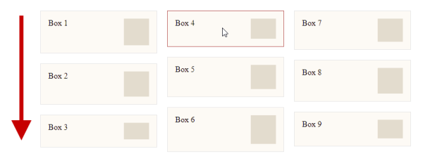

As of today, there is no true **Masonry Layout** technique in web development that can be implemented exclusively with CSS and is not based on JavaScript. True in the meaning, that the reading direction should be from left to right and not in the form of columns from top to bottom. For the latter, also called *Fake Masonry*, there are even two implementation options in CSS: Columns or Flex, whereas the [Columns](https://developer.mozilla.org/en-US/docs/Web/CSS/columns) variant is the much simpler one.

Lets say you have a list of boxes you want to show in a grid-like list, but the height of every box is defined by its content, which results in different heights. Here is an example with a 1px image (base64 encoded) with an individually defined height:

```html
<div class="wrapper">
  <div class="item">
    Box 1
    
  </div>
  <div class="item">
    Box 2
    
  </div>
  <div class="item">
    Box 3
    
  </div>
  <!-- ... 6 more items with different heights -->
</div>
```

By applying ``column-count`` and ``column-gap`` to the wrapper and a ``margin-bottom`` with the same value as the gap to each item, you will achieve this:



The order of the boxes is from top to bottom and then from left to right ... Fake Masonry, but is works as expected. See the pen for the complete HTML and CSS:



<!-- more -->

---
## More Info

{% moreinfo '{ "list": [
  [ "caniuse.com", "Can I Use: CSS property: grid-template-rows",
  "https://caniuse.com/?search=grid-template-rows" ],
  [ "Ryan (dev.to)", "Creating A Responsive Masonry Layout Using The CSS column-count Property",
  "https://dev.to/ryandsouza13/creating-a-responsive-masonry-layout-using-the-css-column-count-property-4kf7" ],
  [ "MDN WebDocs", "Masonry Layout",
  "https://developer.mozilla.org/en-US/docs/Web/CSS/CSS_Grid_Layout/Masonry_Layout" ],
  [ "Rachel Andrew (Smashing Magazine)", "Native CSS Masonry Layout In CSS Grid",
  "https://www.smashingmagazine.com/native-css-masonry-layout-css-grid/" ],
  [ "Syed Umar Anis", "Create Masonry Layout with CSS",
  "https://umaranis.com/2020/09/01/create-masonry-layout-with-css-grid-with-variable-sized-contents-arranged-in-columns/" ],
  [ "Chris Coyier (CSS-Tricks)", "Approaches for a CSS Masonry Layout",
  "https://css-tricks.com/piecing-together-approaches-for-a-css-masonry-layout" ],
  [ "Jonas (Kulturbanause)", "Responsive Masonry Layouts mit CSS erstellen (German)",
  "https://kulturbanause.de/blog/responsive-masonry-layout-mit-css/" ]
]}' %}