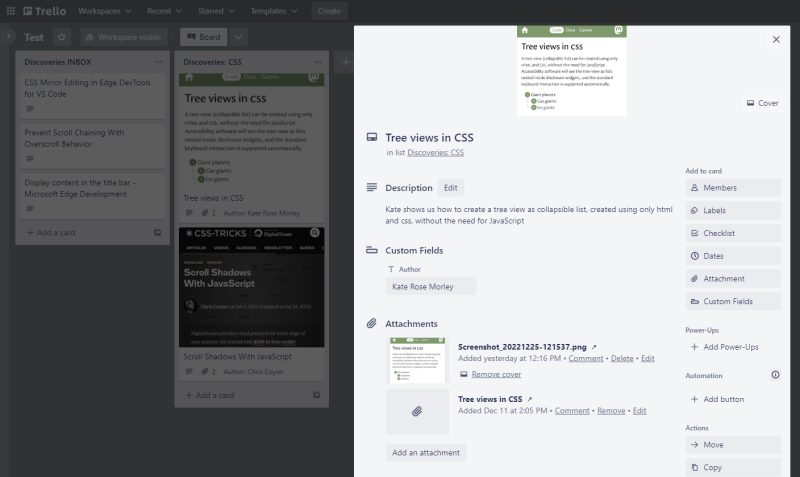

I'm collecting/bookmarking links to interesting website post on a public Trello board and aggregating them from time to time in a special post series called *Discoveries*, where I present 10 of them in one post on a specific topic.

Writing these summaries is currently still a bit time-consuming, because in addition to the link, the name of the author and a small description, I would also like to display a screenshot of the page in each case ... and it is still a completely manual process.

After selecting the 10 links I want to talk about, I first create a new post for my Hexo blog and then process the links as follows:

1. Creating, resizing and saving the screenshot
2. Creating a new section in the post
3. Setting a key for the post based on the title
4. Setting the title
5. Setting the author
6. Setting the screenshot file

I do use two tag plugins ([tag-anchorlist](https://github.com/kristofzerbe/kiko.io/blob/2c80a548e188c05879039a15e67419b548bfbfcd/themes/landscape/scripts/tag-anchorlist.js) and [tag-discovery](https://github.com/kristofzerbe/kiko.io/blob/2c80a548e188c05879039a15e67419b548bfbfcd/themes/landscape/scripts/tag-discovery.js)) for this in the post draft, but despite that, it's quite time-consuming and always the same procedure that can be wonderfully automated... and here I'd like to write about how I approached this task, while I'm working on it.

<!-- more -->

---

## The Trello List

How easy it is to save a link as a card in a Trello board via Chrome, I described recently in my post . As this works also in Chrome on Android, I store interesting links on the go mostly. In order to get all information I need later on, I have extended my collections board with a custom field called 'Author'. For adding the screenshot to the card as an attachment, I use actually the build-in feature of Android 6.

As I have a long, long list if incoming links, I sort them by topic into an appropriate list, for example, "Discoveries: JS Libraries" and this lists should then be automatically turned into new blog posts as I want to publish one.



---

## The Data

Now, to get the raw data of a Trello list, I could use to the Atlassian API, but that's not even necessary, because each board can be accessed machine-readable per se via adding ``.JSON`` to the board url. **Prerequisite is that the board is set to PUBLIC**. The URL is structured according to the following scheme:

``https://trello.com/b/<WORKPLACE-ID>/<BOARD-NAME>.json``

The URL accepts following parameters (as far as I found out), to filter out some not needed content:

- **fields** (string)
- **lists** (string)
- **list_fields** (string)
- **cards** (string)
- **card_fields** (string)
- **card_attachments** (bool)
- **card_attachment_fields** (string)
- **customFields** (bool)
- **card_customFieldItems** (bool)
- members (bool)
- member_fields (string)
- organization (bool)
- checklists (string)
- checklist_fields (string)
- labels (string)
- actions (string)
- action_fields (string)
- actions_limit (number)

All boolean parameters can assume ``true`` or ``false`` and the string parameters either ``all``, ``none`` or (some) a comma-separated value list of fields to show. For example:

``https://trello.com/b/o2tmzJAw/test.json?fields=none&lists=all&list_fields=name&cards=all&card_fields=desc,idList,name``

... shows up like this:

```json Trello JSON (shortened)
{
  "id": "63a871b59e3b200022455381",
  "cards": [
    { ... },
    {
      "id": "63a8586e7de45d0fc54d0d39",
      "desc": "Kate shows us how to create a tree view as collapsible list, created using only html and css, without the need for JavaScript",
      "idList": "63a8585dc0c10c020ca9ea03",
      "name": "Tree views in CSS"
    },
    { ... }
  ],
  "lists": [
    {
      "id": "63a997ab23684f02303a0525",
      "name": "Discoveries INBOX"
    },
    {
      "id": "63a8585dc0c10c020ca9ea03",
      "name": "Discoveries: CSS"
    }
  ]
}
```

Important to now here is, that most of the data are NOT hierarchially structured, like Board > List > Cards, but in parallel. You have to pick the id of a list to filter the cards array by it. The same with custom fields inside a card: it holds a reference to the custom field list only.

For the attachments of a card, Trello distinguishes between URL's and files. The attribute ``bytes`` is null for URLs and the URL itself is in name. Files, on the other hand, have ``bytes`` greater than 0 and a specific ``mimeType``, while images additionally have up to seven different ``previews`` in the widths 70, 150, 250, 300, 600 and original. Very handy for my case, since I always scale down my screenshots to 600 pixels.

``https://trello.com/b/o2tmzJAw/test.json?fields=none&lists=all&list_fields=name&cards=all&card_fields=desc,idList,name&card_attachments=true&card_attachment_fields=bytes,mimeType,name,previews&customFields=true&card_customFieldItems=true``

```json ... card item in Trello JSON (shortened)
{
  "id": "63a8586e7de45d0fc54d0d39",
  "desc": "Kate shows us how to create a tree view as collapsible list, created using only html and css, without the need for JavaScript",
  "idList": "63a8585dc0c10c020ca9ea03",
  "name": "Tree views in CSS",
  "attachments": [
  {
    "bytes": null,
    "mimeType": "",
    "name": "https://iamkate.com/code/tree-views/",
    "previews": [],
    "id": "63a8586e7de45d0fc54d0d5b"
  },
  {
    "bytes": 225271,
    "mimeType": "image/png",
    "name": "Screenshot_20221225-121537.png",
    "previews": [
      { ... },
      {
        "_id": "63a8586e7de45d0fc54d0d58",
        "id": "63a8586e7de45d0fc54d0d58",
        "scaled": true,
        "url": "https://trello.com/1/cards/63a8586e7de45d0fc54d0d39/attachments/63a8586e7de45d0fc54d0d52/previews/63a8586e7de45d0fc54d0d58/download/Screenshot_20221225-121537.png",
        "bytes": 111574,
        "height": 499,
        "width": 600
      },
      { ... },
    ],
    "id": "63a8586e7de45d0fc54d0d52"
  }
}
```

---

## The Generator

First of all: This generator has NOTHING to do with Hexo's build-in [generators](https://hexo.io/api/generator.html). It's just a Node script, which produces MD files that later on will be processed by Hexo into posts!

What should he do:

1. Download Board JSON from Trello
2. Iterate through ``lists`` to find the one to process
3. Iterate through ``cards`` to find all referencing the chosen list
4. Create new POST object to store all needed information
5. Process all found cards...
   1. Create new ITEM object to store all needed information
   2. Store TITLE, generated KEY out of TITLE, DESCRIPTION in ITEM
   3. Resolve AUTHOR from ``customfields`` for ITEM
   4. Iterate through card ``attachments``
   5. Store URL in ITEM, when its a link
   6. Generate IMAGENAME out of KEY and store in ITEM, when its an image
   7. Create new POST.FOLDER for the images
   8. Download image from attachment URL into POST.FOLDER as IMAGENAME
   9. Add ITEM to POST.ITEMS
6. Get photograph for new post (kiko.io special, see )
   1. Store PHOTOGRAPH information in POST
7. Generate new post via Handlebars template
8. Store new post

The goal is that I only need to write an introduction and adjust a few frontmatter variables before generating and publishing the post.

### Settings

First task is to save the possible settings in Hexo's default configuration file:

```yaml
# Trello Discoveries Generator Script
discoveries:
  board:
    url: https://trello.com/b/D6zIhLus/collections.json
    parameters:
    - key: fields
      value: name
    - key: lists
      value: all
    - key: list_fields
      value: name
    - key: cards
      value: all
    - key: card_fields
      value: closed,desc,idList,name
    - key: card_attachments
      value: true
    - key: card_attachment_fields
      value: bytes,mimeType,name,previews
    - key: customFields
      value: true
    - key: card_customFieldItems
      value: true
  template: discoveries.handlebars
```

### Template

Next step is creating a [Handlebars](https://handlebarsjs.com/) template out of my scaffold file I used so far:

```hbs
---
slug: {{{key}}}
title: '{{{title}}}'
subtitle:
date: {{{date}}}
photograph:
  file: {{{photograph.file}}}
  name: {{{photograph.name}}}
  link: {{{photograph.link}}}
  socialmedia: /static/images/social-media/{{{key}}}.png
series: Discoveries
categories:
  - Misc
tags:
  - Collection
related:
  - Discoveries-xx
  - Discoveries-yy
  - Discoveries-zz
syndication:
  - host: Mastodon
    url: 
---

INTRODUCTION...



<!-- more -->

{{#each items}}

{{{description}}}

{{/each}}
```

### Generator Script

Next, the generator itself, which lives in ``/lib/scripts/``. It is implemented as a class with CommonJS and takes two parameters in the constructor for defining the number of the Discoveries post to create and the name of the Trello list, where the data for this should come from. It's main function is ``generate``, which starts the generation. Here's the skeleton:

```js discoveries-generator.js
const fs = require("fs");
const yaml = require('js-yaml');
const path = require("path");
const axios = require("axios");
const handlebars = require("handlebars");
const { marked } = require('marked');

class Generator { 

  let _config;
  let _trelloUrl;
  let _templateFile;

  // Init new post object
  let _post = {
    board: null,
    list: null
  };

  constructor(discoveryNo, listName) {
    // Init the generator and gather all necessary data for running it
  }

  generate() { 
    // Run the generator
  }

  async downloadImage(url, item) {
    // Helper for downloading the images asynchronously  
  }

  createPostFromTemplate() {
    // Helper for creating the post's MD file out of the template
  }

}
```

**At this point I will refrain from reproducing the complete code here. Just follow this [link](https://github.com/kristofzerbe/kiko.io/blob/cb9ba3f9157771231258834b156bb6aead2cd229/lib/discoveries-generator.cjs) ...**

However, a few points in the implementation are important to consider:

1. The downloads are performed by means of the promise based HTTP client [axios](https://axios-http.com/). I can only recommend this thing...

2. The image downloads are initially collected in a Promise list for subsequent execution, while iterating through the cards of the selected Trello list

The script is actually really straight forward, but I have some improvements in mind, which will find their way into the code later on:

A. If an image is missing, create a proper screenshot via Puppeteer

B. Introduce a top most card(s) for the INTRODUCTION, a SUBTITLE and some additional TAGS, to avoid having to rework the new post before publishing

C. Automated insertion of the RELATED posts, based on the last three Discoveries issues

### Run it ...

The easiest way to get the generator running, is to create a simple runner script:

```js _run_discoveries-generator.cjs
const Generator = require("./discoveries-generator.cjs").Generator;

const discoveryNo = process.argv[2].toString();
const listName = process.argv[3].toString();

const generator = new Generator(discoveryNo, listName);
generator.generate();
```

The execution in the console then is just a one-liner:

``node "./lib/_run_discoveries-generator.cjs" "<NUMBER>" "<TRELLO-LISTNAME>"``

---

It was fun to write this automation during Christmas. Also kept me from stuffing too many cookies inside me ;)