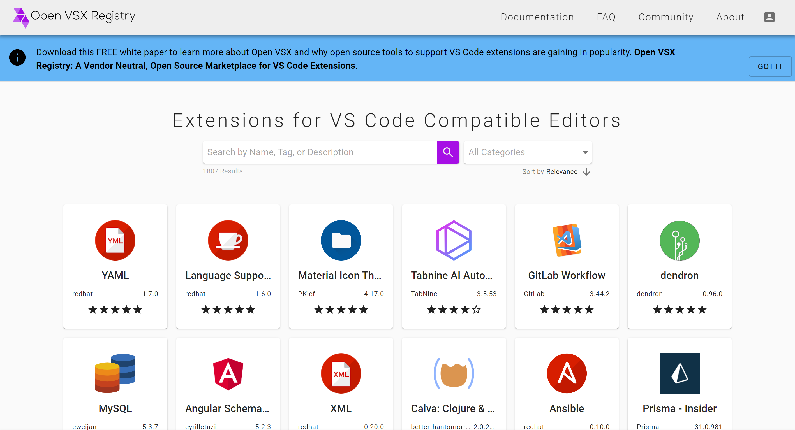
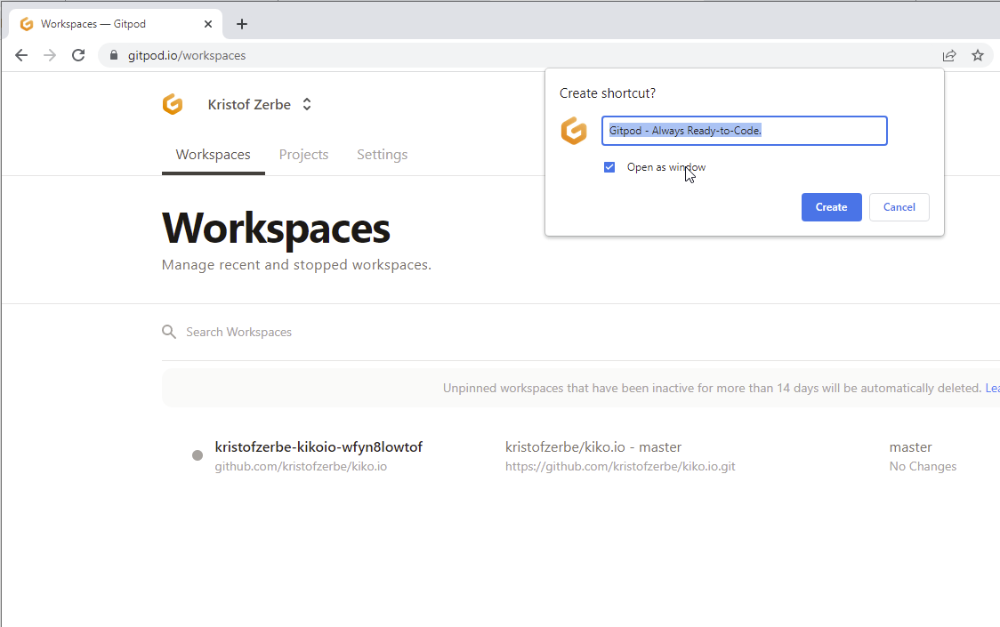
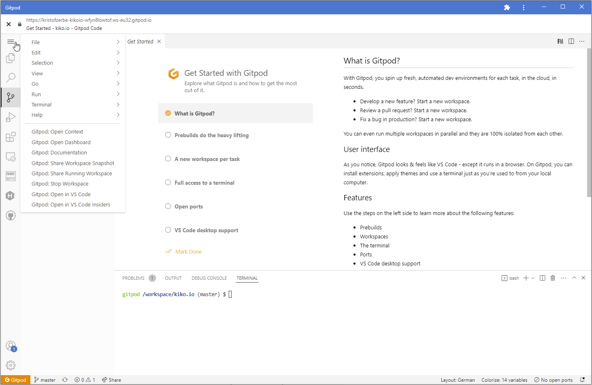

It's amazing how quickly the editor **[Visual Studio Code](https://code.visualstudio.com/)** (VS Code) has conquered the developer community (#1 in the Stack Overflow Developer Survey Ranking 2021) and even those from the Linux faction, who are historically rather critical of Microsoft, but for good reason. The company from Redmond has done quite a lot right with the tool and has gathered a large group of open source developers around it (currently 1,640 contributors), who contribute to the fact that the Swiss Microsoft team around Erich Gamma can bring out a new release for Windows, Linux and macOS every few weeks.

It all started with the [Monaco Editor](https://microsoft.github.io/monaco-editor/), the core around which VS Code is built and which was first released on April 14, 2016. The exciting thing about Monaco and VS Code is, that it is consistently written using web technologies, i.e. HTML, CSS and Javascript, packaged and executed using the framework [Electron](https://www.electronjs.org/) developed by GitHub, which in turn is based on [Node.js](https://nodejs.org/en/) and the open source browser engine [Chromium](https://www.chromium.org/Home/) from Google.

<!-- more -->

It is not really surprising that the developers have built a really good editor from the start, which could directly defy the first Chromium-based tool [Brackets](https://brackets.io/) from Adobe at that time, because Erich Gamma was the head of the development environment [Eclipse](https://www.eclipse.org/eclipse/) for many years and therefore knows about the needs of the worldwide developer community. Surprisingly however is already, that although VS Code is based on Web technologies, it took some years, until the editor made it out of its Electron cardboard, directly into the Browser. For example, it wasn't until 2020, 2 years after Microsoft acquired GitHub, that they announced [github.dev](https://github.dev/), which is just a call target for the newly introduced **Magic Dot** and opens a project hosted on GitHub in the browser. For those who like to try it out, just go to any GitHub repository and hit the DOT key and the project will open in a VS Code browser window. A variant of this is [vscode.dev](https://vscode.dev/), which can open not only GitHub projects, but any from your own hard drive.

However, both browser editors have one thing in common: you can code wonderfully on the go, but you cannot start the projects and thus also not validate your own code for executability. The substructure is missing and is therefore not a real IDE. No pre-processing via Grunt or Gulp, no starting web server or similar, simply because there is no console that could communicate with the operating system. However, Microsoft has also announced another tool in 2020 that is supposed to bring exactly this substructure via cloud container: [GitHub Codespaces](https://github.com/features/codespaces). Beta access has been expanding for a few weeks now, and it should be available for team and enterprise cloud plans starting in August.

## Cloud-based development environment from Kiel, Germany: Gitpod

A team around Sven Efftinge and Anton Kosyakov from the beautiful city of Kiel, asked themselves the question why not build an online development environment back in 2017 and launched the project Theia under the umbrella of the Eclipse Foundation. The idea was to develop a remote-first IDE that runs both locally and in the browser and fully supports the numerous VS Code extensions already available. They named the actual product around Theia **Gitpod** ([gitpod.io](https://gitpod.io/)). Although there are still numerous Theia solutions available today, such as Eclipse Che, Stackblitz or the Google Cloud Shell Editor, Gitpod decided to move to the VS Code platform in late 2020 after Erich Gamma and his team provided [Remote Support in VS Code](https://code.visualstudio.com/docs/remote/remote-overview), on which github.dev is based, among others.

However, since Microsoft had decided not to open source the server component for the time being (the commercial GitHub CodeSpaces sends its regards), Anton, by his own account, created a first working version of the [Open VSCode Server](https://github.com/gitpod-io/openvscode-server/) in 4 days, which was released in [September 2021](https://www.gitpod.io/blog/openvscode-server-launch). Not a month later, Microsoft also made its own server solution freely available, but with a few restrictions, among other things, regarding the extensions that can be obtained from Gitpod via the [Open VSX Registry](https://open-vsx.org/) portal, since the [Microsoft Extension Marketplace](https://marketplace.visualstudio.com/vscode) is reserved for Microsoft's own products.



## The name and the technology behind it

The name **gitpod** already tells us something about the technology behind the service. 'git' stands for the file management system behind the editor and 'pod' for the server technology under the editor.

### git...

Nowadays, source code is (hopefully) no longer just stored locally on a hard disk, but centrally and managed by source code management software. The current gold standard in this area is the free [Git](https://de.wikipedia.org/wiki/Git) initiated by Linus Torvalds in 2005, a distributed version management that forms the basis of popular developer platforms such as GitHub, GitLab or Bitbucket.

### ...pod

A short step back in time: It's not so long ago that IT'ers called an environment on which they published a server application *machines*, because it first needed hardware with processor, main memory, hard disks and an operating system of choice, which was then installed and on that in turn the said application.

However, if the server application was only used sporadically, the expensive hardware was underutilized, i.e. resources were wasted. To solve this problem, work began in the 1970s on virtualizing hardware so that several logically separate systems could share the hardware to increase its utilization. Any operating system and the required server applications can be installed and operated in each of the [virtual machines (VM's)](https://de.wikipedia.org/wiki/Virtuelle_Maschine) created in this way.

In this concept, however, there are redundancies in the form of the operating system. If, for example, you want to run 5 Linux-based web servers, you will also have to loop along 5 possibly identical Ubuntu installations that want to be maintained.

[Docker](https://de.wikipedia.org/wiki/Docker_(Software)) is not the only, but most well-known software that addressed this problem in 2013 by abstracting another layer, in this case the operating system. Here we are now no longer talking about a machine or VM, but a container in which the server application runs. For the orchestration of these containers, the software [Kubernetes](https://de.wikipedia.org/wiki/Kubernetes) initiated by Google has been available since 2015, in which the smallest deployable unit is called a **pod**, which contains one or more containers that share the allocated resources.

Such a pod with a ready installed and configured Open VSCode Server is launched on Google Cloud Platform when a user opens a Gidpod Workspace.

## Let's go ... Starting a Gitpod Workspace

In Gitpod, you launch a project hosted on Github, Gitlab or Bitbucket into a so-called workspace. To do this, simply prepend the url of your repository with the string **gitpod.io/#**.

Those who prefer buttons, can either use a provided [bookmarklet](https://www.gitpod.io/docs/browser-bookmarklet) and resort to a [browser extension](https://www.gitpod.io/docs/browser-extension) that adds a Gitpod button to the Github interface.


Once the workspace has been started and you have closed the browser window, it will be available for a while on the dashboard under **Workspaces**. If you work frequently with the same project, it is advisable to create a permanent shortcut there under **Projects** if you are not into manual url changes or buttons. Last but not least, the icing on the cake is to install one of these Gitpod projects as a Chrome App and drop it in the toolbar. That way, the code is just a click away and the whole thing almost feels like a local VS Code due to the reduced browser window.





## Configuration of the workspace of a project

In addition to the general setting options, Gitpod offers an individual configuration per project. For this the file **.gitpod.yml** is searched in the root of the project folder and used. All setting options are well documented in the [gitpod Docs](https://www.gitpod.io/docs/references/gitpod-yml).

### Using a custom container

The default container that Gitpod boots up when starting a workspace is based on Debian/Ubuntu and already includes a lot of frameworks and languages like Node, Java, Go, Python and some more. However, if you want to use a different image, you can set this via the **image** entry, either by referencing a public image or by specifying the name of a Dockerfile in the project. The possibilities here are numerous and can be found in the section [Custom Docker Image](https://www.gitpod.io/docs/config-docker).

### Tasks at startup

To get a project running in Visual Studio Code, especially in the Node environment, there are a few things that need to be set up, such as installing the correct Node.js version and dependent packages using NPM or another package manager. The same is true for Gitpod, of course, although these actions need to be done again and again after the working environment has been started, for example, if the pod has been discarded after a while. For these recurring tasks, the software provides the [Tasks section](https://www.gitpod.io/docs/config-start-tasks) in the **.gitpod.yml** and there, in the forefront, the **init** entry. In the following example, Node 14.17, all local packages and one global package are installed as a multi-line task:

```
tasks:
  - init: |
      nvm install 14.17.2
      npm install
      npm install -g grunt-cli
```

With the grouping and naming of tasks, the terminal display settings and the total of three execution levels **before**, **init** and **command** it is easy to create a configuration that starts up the workspace in a fixed way while keeping an overview.


If you like it even a bit faster, you can use so-called [Prebuilds](https://www.gitpod.io/docs/prebuilds), which serve as a snapshot for creating a new workspace. These prebuilds use the **.gitpod.yml** of the project and are closely linked to the source code management used (currently GitHub, GitLab and Bitbucket). Thus, a prebuild is recreated each time modified code is checked into the project. It doesn't get much faster and more convenient to code from anywhere in the browser.


### Include extensions automatically

When creating the gitpod workspace, the configuration file **.gitpod.yml** can also be used to include the Visual Studio code extensions that are needed for working. The easiest way to do this is if the extension is represented on the open platform [Open VSX Registry](https://open-vsx.org), because gitpod looks for the pattern ``${publisher}.${name}`` there by default.

Example:

```
vscode:
  extensions:
    - HookyQR.beautify
    - kamikillerto.vscode-colorize
```

However, VSIX files from other sources can also be included via the full url. Microsoft offers with the [Visual Studio Marketplace](https://marketplace.visualstudio.com/) the primary and largest source of extensions, but unfortunately omits the specification of a complete download path of the VSIX file. However, it is very easy to build this using the following pattern:

``https://${publisher}.gallery.vsassets.io/_apis/public/gallery/publisher/${publisher}/extension/${extension}/${version}/assetbyname/Microsoft.VisualStudio.Services.VSIXPackage``

The necessary information about the variables *Publisher*, *Extension* and *Version* in this pattern can be obtained from the details page of an extension in Visual Studio Code.


Output:

```
Name: vscode-hexo-utils
Id: fantasy.vscode-hexo-utils
Description: vscode extension for hexo
Version: 0.2.1
Publisher: fantasy
VS Marketplace Link: https://marketplace.visualstudio.com/items?itemName=fantasy.vscode-hexo-utils
```

This will result in the following entry in **.gitpod.yml**:

```
vscode:
  extensions:
    - https://fantasy.gallery.vsassets.io/_apis/public/gallery/publisher/fantasy/extension/vscode-hexo-utils/0.2.1/assetbyname/Microsoft.VisualStudio.Services.VSIXPackage
```

## Synchronize settings

Every IDE looks different, depending on the tastes and preferences of the developer sitting in front of it, and so relatively quickly after the first release of VS Code, there were the first extensions that could synchronize the IDE's settings across multiple machines (mostly via Gists), until Microsoft took on the feature and integrated it directly into the IDE. Now, with Gitpod, we have a new but slightly different instance of Visual Studio Code, but the Kielers thought of that, too. They couldn't access the data of the integrated synchronization, but they created a by-pass with their own extension that works just as well.

After the installation in VS Code and a restart of the same, one logs in to the extension with the same account under which one has registered with Gitpod and can thereafter synchronize tasks, code snippets extensions and keyboard shortcuts in addition to the settings.


## Prices and Services

Gitpod is a company and has to look like all others, how it can work cost-covering. Therefore, as is often the case, there are different plans that can be booked. There are four of them at Gidpod in the Saas area, whereby Free differs from the other plans only in the possible computing time, the timeout and the parallel running workspaces. Thus, in the Free plan, there are 50 hours that you can work with 4 WorkSpaces and in case of inactivity, the pods are shut down again after 30 minutes. A fair free offer for all those who want to code on the go, but most of the time have a computer and a locally installed VS Code.

You can also host Gitpod yourself on an existing managed Kubernetes environment, for example if you are already a customer of cloud service providers like Amazon, Azure or Google.

## Conclusion

It will be exciting to see to what extent Microsoft's own GitHub CodeSpaces will be able to hold its own against this really very manageable opponent once it has been launched en masse. The team from Kiel has at least already set the bar very high, also because it is fantastically documented and structured. A real gain for every tool collection.
