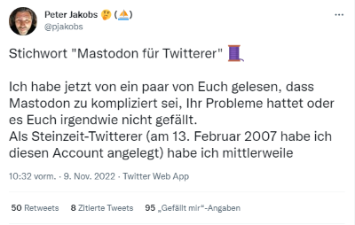

This weekend I had a revival experience. I got myself a [**Mastodon**](https://joinmastodon.org/) account, after many years of staying away from social media as far as I could and at most tweeting a new blog post. Since my active Twitter days, things have taken such a turn for the worse, that I've preferred to stay away completely.

I don't know what made me join Mastodon on Sunday, but it sparked something in me: The love for the good old internet of the late 90s, early 2000s. These guys gave me a warm welcome and made me feel that Internet communities, away from sleazy influencers and banner ads, could actually still work. I got a taste of it, when I let this blog become part of IndieWeb over a year ago, but didn't quite believe in it because of the low traffic and mentions.

Now the richest man on the planet has to come along and buy the bird site, and a niche product called Mastodon, well known but underestimated in tech circles, almost explodes under the onslaught of disappointed commercial users. And that's what we are on Twitter, Facebook and Co ... a commercial object.

The problem now will be how the community can integrate these many users for whom it was not mentally prepared. What now adapts to whom? The most important thing, however, will be to teach the newcomers (and I count myself among them) that Mastodon is not Twitter in new clothes!

I was going to write a few things about this, but this morning I read a Twitter thread from [**Peter Jakobs**](https://mastodon.green/@pjakobs), a self-proclaimed digital Aboriginal from Germany, that just sums it all up and explains it so well I could hardly do it:

That's why I'm now doing something I've never done before: I quote Peter here completely, translated from German into English ... Curtain up (and thank you [DeepL](https://www.deepl.com/en/translator) :D):

<!-- more -->


Keyword "Mastodon for Twitterer" 🧵
  
I've now read from a few of you that Mastodon is too complicated, you've had problems, or you somehow don't like it.  
As a stone age Twitterer (I created this account on Feb 13, 2007), I have by now half of my activities to Mastodon. Many of my posts you see here now come from there and I mostly come here to respond to your replies.

So it is possible for an old white guy like me to move, and maybe I can ease some of your fears and help with the move.
  
You ask why you should and that almost nothing has changed here (yet)?
  
Maybe, but the signs on the wall don't bode well. Elon Musk is, if you look at it neutrally, someone who destroys things in order to rebuild them - better, in his sense.  
But that means change is coming. It will disturb you here, but it will come here maybe not in one fell swoop like a move to Mastodon.

I'm always a friend of bringing about change myself, because then I can shape it in my own way and am not dependent on others. 

But it could be that you will still like Twitter in 12 or 18 months. I know this myself, my Twitter experience is by no means as negative as many others say.  
But many others, like me, go a different way, and are thus no longer accessible here.

But that is exactly one of the biggest disadvantages of Twitter and one of the advantages of Mastodon.
Let me explain.

Many write that they are confused by these "instances" (some say "groups" which is not quite true) on Mastodon.  
I can understand that, it can be confusing. But what if I told you that **there is also an instance on Twitter, but just exactly one**. Twitter.com namely. This one can't communicate with anything or anyone else, an island in the middle of a vast social media ocean. And now this island has been stupidly bought by someone whose idea of what such an island should look like is rather special.

**Mastodon has many such islands and they are connected with bridges.**

You choose an island, pitch your tents there and - you are not tied to this island. On the one hand you can communicate completely freely with all inhabitants of all other islands, on the other hand you can, if you want to, **take down your tents again and move to another island** (you will lose a little bit, but not as much as if you want to leave here [at Twitter]). These islands (instances) are of different sizes. The biggest ones in Germany are [mastodon.social](https://mastodon.social), [troet.cafe](https://troet.cafe), [mastodon.green](https://mastodon.green) and a few others. But there are also tiny islands, I know more than one with a single inhabitant. Is he isolated on his island? No, because he is connected with all the others via said bridges.

**Every island has one (or more) chiefs who keep order** (Twitter does too, but we've complained about that a lot). These chiefs are often private individuals who run an instance as a hobby, but with the large instances there is usually a team behind it, and some also a small company ([mastodon.social](https://mastodon.social), for example, is run by a limited liability company that was founded by the chief developer of the Mastodon software, [mastodon.green](https://mastodon.green) is, as far as I know, a one-man limited liability company).

So now we know that there are many islands, that we are not trapped on these islands and that we can move.
These islands are one of the standout features of Mastodon: **a Musk, a Trump, or even a certain four-letter newspaper can buy an island or even build an island themselves, but they can't possibly buy all the islands, simply because it's so cheap to build new islands.** (I read somewhere once, to run an instance costs about 1€ per user per month). But because the interesting thing about Twitter, like Mastodon, is not the medium itself, but the networks we build on it, it doesn't matter what happens to individual islands as long as we can move freely.

**If individual islands do not want to comply with the rules at all, then they are "defederated"**, or figuratively: the bridges there are demolished. However, this is the decision of each individual island chief, so it may not be grassroots democracy, but it is distributed.  

Ok pjakobs, enough of the chatter, how am I supposed to find out which island is suitable for me?  
Here is a searchable list of Mastodon instances: [instances.social/list](https://instances.social/list#lang=de&allowed=&prohibited=&min-users=&max-users=)

It is possible that another aspect of the "island" image will apply to you: there is a local timeline on the islands, which is also called that. So, if you choose an island that is particularly suited to a geographical region, a topic or a language, then you will see the contributions of the other "inhabitants of this island" in their local timeline - which hopefully have a certain thematic cohesion. However, as already mentioned, you can follow all people on all instances and you will also see them in your own timeline.

Speaking of timelines: they are chronological and you only see the posts (toots) of those you follow. **No algorithm, no "others like this too", no good morning tweets in the late evening. Just the way Twitter used to be 10 years ago.**

Follow: here is one of the points that bothers me the most, even if it is a small thing. Currently there are two software versions of Mastodon in use: 3.5.3 and four, which seem to handle following a bit differently.

In one (I assume the older version), if you want to follow an account on another instance, you have to specify your own handle again (in my case "@pjakobs@mastodon.green" - but that's no longer the case in the new version, there you **click a follow button and you follow the account**.

Another thing that is very very different is DMs. Here on Twitter, we're used to DMs essentially working like little emails or a messenger: we have our own inbox and that's where the dialogue with the other person shows up. Feels good, not visible to others, because yes, in a completely different realm.
**In Mastodon, direct messages are simply toots that are displayed only to the recipient(s)** - and normally among all the other interactions.

It's confusing and doesn't feel as nicely protected as it does here, and as I walked around town a bit yesterday I realized: this is intentional. Twitter creates an apparent privacy through display that DMs don't offer.  
**DMs are deliberately not PM, not private messages.** Mastodon also makes that clear through its presentation. I have therefore added my Threema and Telegram link to my profile, these tools actually offer private conversations. Is not comfortable but honest.

You have created an account, but do not want to move 100% yet or, as in my case, still have many friends on this site? There is also a kind of "bridge" from Mastodon archipelago to Twitter. You can mirror your tweets to Mastodon or vice versa. This is only valid for tweets, not for replies. That means you have to be a bit careful that you don't just spam your followers in the other network, but also interact with them. After a few days of mirroring from Twitter to Mastodon I turned the bridge around, today probably 80% of the tweets you see from me and the non-replies are on Mastodon. I use [crossposter.masto.donte.com.br](https://crossposter.masto.donte.com.br) for this.

The lovely people from [@digitalcourage](https://twitter.com/digitalcourage) not only run a Mastodon instance themselves, but also put together a [great overview](https://digitalcourage.de/digitale-selbstverteidigung/fediverse) of the Fediverse (the federated social media universe, which is much more than just Mastodon).

In summary, if Musk is really fucking this up, you don't have to be a helpless victim of his actions. Even if Mastodon might not be an alternative for you at the moment, create an account, try to find your followers over there. 

A life raft is not as comfortable as a floating boat, but it's better than a sinking boat!

Ah, here's another more complete overview of Mastodon: 
[the-federation.info/mastodon](https://the-federation.info/mastodon) (takes a little while to load)



You will find Peter Jakobs on this island: [@pjakobs@mastodon.green](https://mastodon.green/@pjakobs).

My new social media residencies are: [@kiko@indieweb.social](https://indieweb.social/@kiko) for Tech Stuff in English and [@kiko@hessen.social](https://hessen.social/@kiko) for politics and society in German.

**Happy Tooting !**