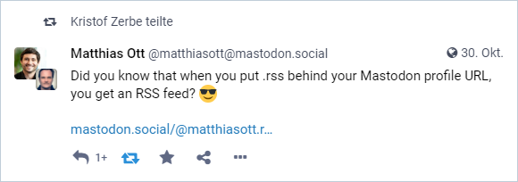
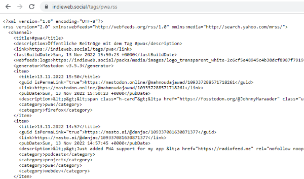
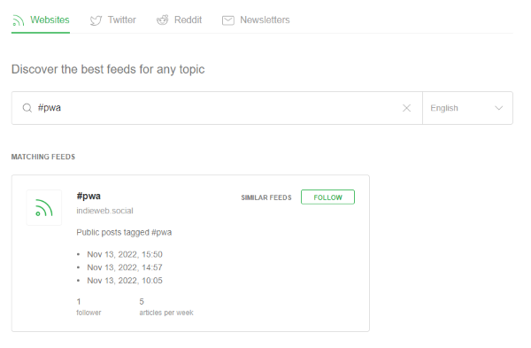

Ok, I admit it: I read RSS feeds. Quite old school you might think, but I'm mostly off Social Media and the most news sites quite a while ago, with a few exceptions. I just want to read selective stuff, especially in the direction of technology, and not interrupted by items, the news provider think I have to read. My favorite tool for my feed collection is [Feedly](https://feedly.com), which I open up almost every morning.

Today, Max Böck gave me the momentum with his article [The IndieWeb for Everyone](https://mxb.dev/blog/the-indieweb-for-everyone/) to try another type of social media I know for quite a long time, but never give it a chance: [Mastodon](https://de.wikipedia.org/wiki/Mastodon_(Software)). I'm now part of it on [indieweb.social](https://indieweb.social/web/@kiko).

<!-- more -->

And as you just do ... you surf around a bit on it and read a few things until a post by [Matthias Ott](https://indieweb.social/web/@matthiasott@mastodon.social) caught my attention:

[](https://indieweb.social/web/@matthiasott@mastodon.social/109258009575261184)

Ok, nice ... but does this work for other Mastadon things also, like hashtags? I have to say that I am currently very interested in creating PWAs and the techniques behind them, and I'm always looking for new resources to read. So it didn't take me 5 minutes to start reading posts in Mastodon with the hashtag [#pwa](https://indieweb.social/web/tags/pwa) almost automatically.

What can I say? It works...

**Step 1**  
Search for an hash tag, f.e. ``#pwa``. It will lead to an Url like this, depending on your Mastodon server:

```https://indieweb.social/web/tags/pwa```

**Step 2**  
Cut out ``/web``

**Step 3**  
Add ``.rss``

... and you got your feed on a special topic ...



... you can add to your favorite feed reader.


Happy Reading...