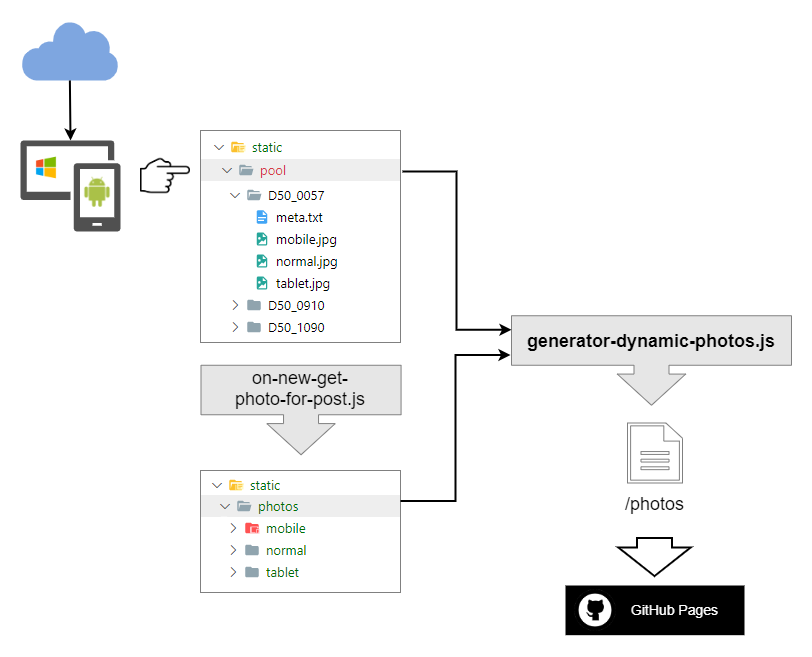
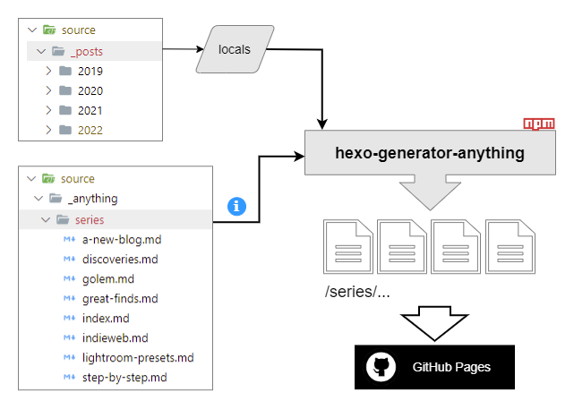
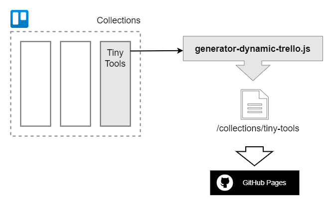
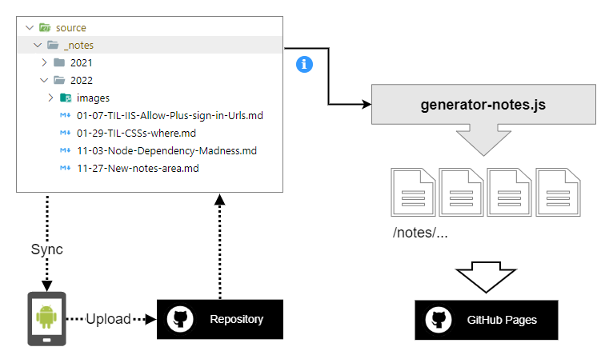
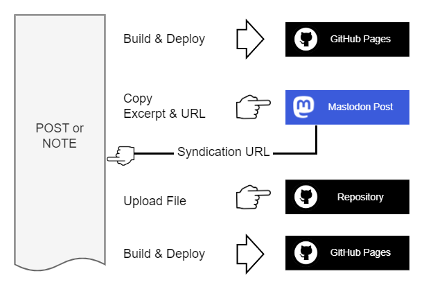

I've started this blog in 2019 with  primarily because I needed an area to record things learned for myself, with the side effect that others can benefit from it if they want.

Why my choice fell on the static site generator [Hexo](https://hexo.io), I no longer know, but I have now become accustomed (even to the shortcomings) and so far I have been able to implement all my ideas in it ... and I had a few of them.

In this post I would like to share a few experiences I have had with Hexo, regarding the main functionality and the things I've customized and describe my workflow behind the individual features of my blog. The latter is not as straightforward as I would like it to be, especially because I have different devices in use that require different approaches. The main purpose of this post is to simply write down for me, how things currently work on kiko.io and to have one or the other idea how to do it better while writing. Doing this publicly is in the hope that you might read this and have a terrific idea that I haven't come up with yet and leave a comment or webmention ... :)

<!-- more -->

---

## Hexo ...

I don't have experience with other SSGs like Hugo or others, so I can't make comparisons, but I can share a few things about Hexo that have kept me engaged in my work with Hexo. I won't go into the general functionality of Hexo here, but the ones that interest me most for my particular needs. A more or less good start into the tool is [https://hexo.io](https://hexo.io) with its DOCS and API.

One of the first commands you get to know is ``generate``, which generates the static HTML pages from the MD files stored in the ``source/_posts`` folder. You can add your own [generators](https://hexo.io/api/generator), which can generate any other custom pages, to this process and put them under ``themes/<your-theme/scripts`` for automatic execution. Every generator has a ``locals`` argument, which holds all site variables, including a list of all posts.

Unfortunately, the documentation at [hexo.io/api](https://hexo.io/api/) is rather poor and so only after a while I realized, that a custom generator is called relatively late in the process, when the MD files have long since been preprocessed. So you can process any MD files in a generator, but you have to do without the automatic processing of the powerful [Tag Plugins](https://hexo.io/docs/tag-plugins) or syntax highlighting, because this takes place in an upstream [processor](https://hexo.io/api/processor), which deals with [boxes](https://hexo.io/api/box).

I don't understand Hexo's concept at this point. For me it is not particularly catchy and straightforward. Unfortunately a few help-, discussion- and example pages are written in Chinese, since the creator Tommy Chen is from Taiwan, as I guess, but my Chinese really sucks... ;)

The best thing about Hexo in general is, that you can get your first results quickly after the basic installation, so you are able to concentrate on writing and prettying things up for a while. Only when the requirements increase is it necessary to take a closer look at the insufficiently documented substructure. A challenge even for experienced web developers, but unfortunately absolutely impossible for beginners...

---

## Posts

Hexo is based on a structure of posts and pages, where posts can be aggregated in various ways, whether in the time-based archive or via tags and categories. Posts has to have a specific structure, regarding the Frontmatter in the MD file and teh storage of attached images. Hexo offers the user a separate command for this: ``hexo new``, which works with template files in the folder ``scaffolds``.

For the presentation of my posts, I decided to incorporate my passion of photography by assigning a unique header image to each post (and most pages). How I implemented this, I have described in the article . The main point is, when I create a new post, I automatically and randomly pick a photo (in the three media-dependent versions *normal*, *tablet* and *mobile*) from a pool, copy the images to the appropriate delivery folder and bind it to the new post via frontmatter. For this I've written the Hexo event hook ``on-new-get-photo-for-post.js``, which runs on the command ``hexo new post "<title-of-new-post>"``.

Works great, except for the fact that I'm often on the go and using a Node.JS-powered command towards an SSG project hosted on GitHub definitely doesn't work on an Android smartphone. So, how do I get it to create a new post remotely?

First part of the answer, regarding access to all project files, was to store the project in a folder that is synchronized with one of the usual suspects: Dropbox, OneDrive, GoogleDrive. With this, I have access to the entire project at all times on all devices that can sync the files. In the case of Android with the help of one of the [Autosync apps from metactrl](https://play.google.com/store/search?q=metactrl+%22autosync%22&c=apps).

The second part of the answer, regarding execution of the new post command, was a bit more difficult, but part of my solution was to use my little home server, where the project also syncs and which is always switched on. Problem here: This tiny box is not publicly available on the web and never will be. Therefore the only communication channel I had, was file synchronization and the solution was to use a simple text file to hold the commands I want to be executed. For this purpose, I have written a small command line tool that runs and processes a modified command file when it is received. For file monitoring I have [SyncBackPro](https://www.2brightsparks.com/syncback/sbpro.html) in use, which has the incredibly useful feature of being able to execute commands before and after a synchronization takes place, in this case my tool, which I have named **HexoCommander** and whose source code is [available on GitHub](https://github.com/kristofzerbe/HexoCommander).


Before you think "*What the hell is he doing? That's what* [fill in the Linux tool of your choice] *is for*" ... I'm more of a Windows guy. Linux means something to me, but I've never worked with it and never had to ... and yessss, there is a career in IT also with Windows ;)


The advantage of synchronizing the whole GitHub project via cloud storage service is that I also host **kiko.io** on [Github Pages](https://pages.github.com/) and that a commit to the repository on GitHub automatically triggers a deployment, which I don't always want right away. So, because of my changes to the post process, I don't use Hexo's built-in drafts, but write on a new post until I'm done and then release by committing to GitHub.


I admit that on an Android smartphone, it's a bit fiddly to write a special command to a text file and then wait 2 or 3 minutes for the file to sync, the new line to be read and executed, and the new post files to sync back to the smartphone, but it works. But I would rather have a smartphone capable interface, where I can enter my data and the whole thing runs at the push of a button.

Currently I have no idea how to achieve this in a static site environment. Do you have one?


---

## [Photos](/photos)

As I speak from photos ... to provide header images for my new posts (or pages), I have prepared a pool of photos that I display on a special filterable page. This page is not one that comes with Hexo, but is based on a dynamic page generator I've created for this purpose. I wrote about it in 2021: .

But how do I fill this pool with new photos, especially because I need three variants of a new photo for the standard device classes Desktop (normal), Tablet and Mobile?

I have a very specific workflow in Lightroom to edit my photos and convert them from RAW to JPEG while exporting, to add them to [my 500px collection](https://500px.com/p/kikon) for example. The destination of these export is again my cloud storage.

From time to time I pick some images from these export folders that I want to use on the blog. I do this mostly on my Android smartphone in a quiet minute and these are the steps and Android apps I need, to turn a high resolution 10MB photo into one that can be used on the web:

1. [Solid Explorer](https://play.google.com/store/apps/details?id=pl.solidexplorer2): Creating a new folder in the projects pool folder with the name of the image.
2. [Solid Explorer](https://play.google.com/store/apps/details?id=pl.solidexplorer2): Copy the original photo into the new pool folder.
3. [Solid Explorer](https://play.google.com/store/apps/details?id=pl.solidexplorer2): Create `meta.txt` to hold the name and the 500px Url of the photo in the new pool folder.
4. [ImageSize](https://play.google.com/store/apps/details?id=de.vsmedia.imagesize): Create normal (1280px), tablet (768px) and mobile (480px) versions of the photo as web images.
5. [Solid Explorer](https://play.google.com/store/apps/details?id=pl.solidexplorer2): Copy web images to new pool folder and delete original.

I have a similar workflow working on my Windows machine, but both workflows are manual ones.




Fiddling around with images on the smartphone like this almost has a medidative effect on me, but it's not really effective. Better would be to throw the original image into a folder and let Hexo do the work of resizing by utilizing [Sharp](https://sharp.pixelplumbing.com/) and [imagemin](https://github.com/imagemin/imagemin).


---

## [Series](\series) & [Projects](\projects)

Relatively soon it was clear to me, that I want to aggregate posts to series and I didn't want to use the integrated categories or tags for it. It should be working with a new frontmatter attribute called ``series`` with the value of a slug of a referencing MD file, which provides some text to describe the series. *Projects* is basically a index like series, but merely works with a different Frontmatter attribute.

The whole thing was made possible by **Levi Wheatcroft**'s work on his plugin *hexo-index-anything*. Unfortunately Levi stopped working on it a long time ago and so I forked it under the new name [hexo-generator-anything](/projects/hexo-generator-anything/). The generator is controlled by a section in Hexo's configuration file, which defines the EJS layout file to render the main index page respectively the index pages of each series, beside a mapping list for the appropriate Frontmatter variable and the output path:

```yaml _config.yaml
anything:
  layout_index: anything-index
  layout_posts: anything-posts
  index_mappings:
    - variable: series
      path: series
    - variable: project
      path: projects
```




Tag Plugins and syntax highlighting for code blocks in the reference MD files are not resolved actually, because it is a generator only (see first section 'Hexo...').


---

## [Tiny-Tools](/collections/tiny-tools)

Since this blog is primarily a memory aid for me and my future self (how often do I have stumbled across my own posts during web search), it was logical to place a special bookmark collection here, because it happened to me more often that I found and used an online tool and some time later wonder what the thing was called when I have the same requirement again. 

That's why I started to collect these URL's in a public Trello board (see ) and provide them with keywords and a screenshot. But Trello is a Kanban tool and not designed for such special requirements as the display of bookmarks and so I use it only as a data source for my page TINY-TOOLS.

Generating a static page out of Trello cards was again a job for my dynamic pages, I had introduced for the photos page. It takes advantage of the fact that any Trello board can be retrieved as machine-readable data by extending the url with `.json`. The [Dynamic Trello Generator](https://github.com/kristofzerbe/kiko.io/blob/26ccfa18b8abff279a05b1f12363992a278c130c/themes/landscape/scripts/generator-dynamic-trello.js) is really straight forward.

With this script it is only a matter of configuration to generate a page from a given list of a board (URL ist shortended):

```yaml
trello:
  boards: 
  - name: Collections
    url: https://trello.com/.../collections.json?fields=all&cards=all&card_fields=all&card_attachments=true&lists=all&list_fields=all
    pages: 
    - name: tiny-tools
      list: TinyTools
```




Can't imagine one. Do You?


---

## [Notes](/notes)

The Notes section is the latest and with it I want to follow the POSSE principle, i.e. "Publish (on your) Own Site, Syndicate Elsewhere", which is a vital part of the IndieWeb movement. So when something comes to mind that I want to post on Mastodon for example, I want it to end up in a new Note MD file that is then posted, preferably automatically.

For me, notes differ from normal posts. From the beginning I wanted to present them chronologically connected on one page per year, like a diary, and not to mix them with the articles (posts). So a standard treatment as a Hexo post was out of the question and I had to come up with something of my own. Another reason not to work with the standard structures of Hexo was, that I did not want to create a subfolder with the name of the post for images as usual in Hexo, but one folder for all images of a year.

Since I am familiar with Hexo generators, I built a new one called ``generator-notes`` that iterates through the entire ``source/_notes`` folder and generates an index file for all the notes in a year, as well as the notes file itself, and copies the images to the source path.

This approach also freed me from using my HexoCommander, because there is no need of executing a ``new xxx`` command. I can now create new Notes from the smartphone quite easily:

1. [Autosync App](https://play.google.com/store/search?q=metactrl+%22autosync%22&c=apps): Synchronization of the source/notes folder
2. [Markor](https://play.google.com/store/apps/details?id=net.gsantner.markor): Edit or create new Note MD file via snippet.
3. [GitHub PWA](https://github.com): Upload MD file to the appropriate folder of the repository

The upload will automatically trigger the build and deployment to GitHub. Done.




Using a generator directly means, that I can't use tag plugins in my Notes and code blocks won't be prettied up, as I mentioned earlier.

Also the Notes are not included in the Hexo ``Locals`` and are therefore not available later on for RSS feeds or other stuff to create. So I will probably extend my approach with a custom [Hexo processor](https://hexo.io/api/processor.html), that will allow me to do this.


---

## Deployment

As I mentioned earlier, kiko.io is hosted at GitHub Pages. Due to a bug in Hexo regarding the treatment of non markdown files in post folders ([Fix #1490](https://github.com/hexojs/hexo/pull/4781)), I had to process all files locally and transfer the output folder to the repository as well. I would have liked to use a GitHub action for the entire deployment, including the generation of the output files, but for a long time there was no NPM package with a working Hexo version that would have allowed this.

I recently checked again to see if the current Hexo release 6.0.3. had fixed my bug and the subsequent bugs .... and yes. With one or two workarounds, my Hexo installation now runs completely on NPM packages, without any manual adjustments!  
So I could finally switch the deployment and automate it with its own [build action](https://github.com/kristofzerbe/kiko.io/blob/master/.github/workflows/hexo-build.yml). This enables me to write a text on the go, commit the file via github.com and the build and deployment starts. Woohoo ... \o/


Nope. The only drawback I see is that this approach always generates the entire site and not just the newly added posts, as is the case locally. It's a bit of a waste of time and computing resources.


---

## Syndication

As I'm a fan of the [Indieweb](https://indieweb.org/), I started early with [Webmentions](https://indieweb.org/Webmention) on my blog. The idea behind it is to mention an article from blog A in a post on Blog B or social media like Mastodon and blog A gets an automated message like "_Hey, I've mentioned you here_". The operator of Blog A can now also automatically display this message under the article mentioned.

### Receiving Webmentions

kiko.io is a static site, therefore, there are no active components on the web server that could react to an incoming webmention. But that's not a problem, because there are services like [webmention.io](https://webmention.io) that can serve as recipients and from where you can then pick up the messages. Some bloggers do this by fetching and inserting them into the articles while generating the static pages, but for me this can take too long. My approach is, to load the mentions from webmention.io via JavaScript dynamically into the page, as described in my post .


I don't think so...


### Sending Webmentions

Unfortunately a I can't integrate sending Webmentions for the mentioned Url's in a particular (new) post into the generation process while building the static files for the blog, because the target Url's not yet exist at this point of time. I have to wait until it is deployed and thus publicly available. So this step is currently still a manual one.

My current solution is based on Remy Sharp's NPM package [@remy/webmention](https://www.npmjs.com/package/@remy/webmention), which he himself also uses for his web service  [webmention.app](https://webmention.app/). I integrate it into a Hexo console command called "console-webmention" which I call via ``hexo webmention``. Without parameters, the last post is searched for outgoing url's and their webmention endpoints respectively. See the [project page](/projects/hexo-console-webmention/) for more details.


This works so far, but depending on a console application means once again having to use my HexoCommander and write commands to a text file when I'm on the road. Then I can also send the webmentions for a post directly manually via the **[Telegraph](https://telegraph.p3k.io/)** service.

One possibility would be a cron job in a Github Action, but this would require creating a new container with all dependencies every time the build has just run and Github has deployed the created files, just to run a console command that might not even return any results since there is nothing to mention in the last post. Unsatisfactory.

Another possibility would be to utilize my Atom feed by setting up a Zapier, IFTT or Make/Integromat task, which picks the last added entry and run the [Telegraph API](https://telegraph.p3k.io/api) against it.

Any ideas?


### Publish on Mastodon

I'm relatively new to Mastodon (Nov 22), but in the past I have syndicated some of my posts manually on Twitter. Now, that I've said goodbye to the greedy bird site, I'm thinking about how I'm going to automate publishing the notes in particular, but also at least an excerpt from a post, on Mastodon.

What I do in the meantime? After the site is successfully deployed, I open up my Mastodon client and copy the complete content of a note or write an excerpt of a post manually into a new toot and append the permalink. After hitting SEND, I copy the newly created Mastodon post URL into a Frontmatter attribute called `syndication` of the note or post and commit the file to GitHub. Build and deployment runs again and the syndication link will be visible on kiko.io.





The Mastodon API is really simple and there are many examples written in Python, JS and other languages out there that are easy to adapt. But here I have the same problem as when sending webmentions: the target url is not yet available at the time of generating the page, when some code is running to do something. It must be a downstream task as well. I need some kind of service running on a server, where I only have a static site. Independent GitHub Action or Azure Function, triggered by a webhook after deployment is finished, which processes all notes and posts without the `syndication` Frontmatter? Or extending HexoCommander again, but how to trigger this buddy automatically, as he depends on file synchronization?



---

## Summary

Hexo is a good SSG system with which you can achieve good results in a short time and which leaves enough room for your own creative ideas. The documentation needs a lot of improvement, especially regarding the details in depth and enriched with examples. I'm not surprised that Hexo seems to lag behind other systems like Hugo or 11ty. Maybe this also have something to do with communication. It's not as much of a conversation in the Western space as others. In the future, I have planed to be more involved in matters of documentation and communication, even though I have not yet understood the full complexity of the substructure.

However, I enjoy working with Hexo despite or because of the shortcomings. Coding without a challenge is like driving on a highway ... boring :)

My workflows are currently not really straightforward, especially with regard to connectivity. However, this is also due to the fact that there are no reactive components working on "my" web server.

It's all still way too much tinkering, but it will be fun over the next few months to edit all the remarks in the "IS THERE AN EASIER WAY?" blocks above and continue to develop the blog.
