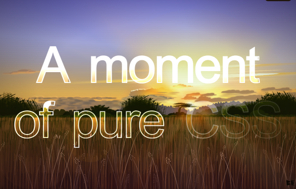

Every year CodePen publishes a list of the 100 most "liked" pens on their site: [The Most Hearted of 2022](https://codepen.io/2022/popular/). It's always exciting to scroll through the list and marvel at the incredibly good work of CSS artists. 

My favorite in terms of CSS coding art this year is the work [A moment of pure CSS](https://codepen.io/ivorjetski/pen/yLjeqgb) by Ben Evans. Absolutely amazing what he does with pure CSS:

From all these works you can take a lot of know-how for yourself, but many of these pens have no practical use at first, i.e. you can't really use them directly on your own website. They are art. Some of them impressed me not only because of their creativity, but I saved them on my own Trello list to try them out in one of the next projects. Partly they are clever approaches regarding usability, partly more or less standard functions were implemented in a visually impressive way. Some of them need some JS to work, sime of them not. Let yourself be inspired ...

<!-- more -->

 

## 1. iOS Notifications by Yoav Kadosh



 
 

## 2. Lotsa Notifications by Jon Kantner



 
 

## 3. Animated Star Rating by Jon Kantner



 
 

## 4. Changing Face Rating by Jon Kantner



 
 

## 5. CSS Minimal Dark Mode Toggle Button by Greg Vissing



 
 

## 6. Menu micro-interaction with CSS by Mert Cukuren



 
 

## 7. Animated BottomBar Experiment by Chris Bautista



 
 

## 8. Progress Button by Taylon, Chan



 
 

## 9. Gradient background with waves by Bárbara Rodríguez



 
 

## 10. Cascading CSS Text Effects by Jhey


