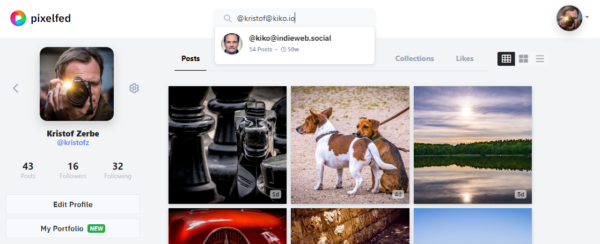

Recently I read the [blog post "Mastodon on your own domain without hosting a server"](https://blog.maartenballiauw.be/post/2022/11/05/mastodon-own-donain-without-hosting-server.html) by [Maarten Balliauw](https://mastodon.online/@maartenballiauw), which dealt with how to become more visible in the Fediverse, more precisely in Mastodon, with **your own domain**, because in contrast to the **Indieweb** approach, the **Fediverse** relies on Actors (``@USER@INSTANCE``) of the respective instance/platform and can only include your own domain, if it becomes a Fediverse endpoint itself.

In my case, the latter is not possible because this blog is a static site, generated via [Hexo](https://hexo.io) and hosted on GitHub. It simply lacks a modifiable active server component.

However, Maarten has found a trick to at least make it findable in Mastadon via his own domain. First, he explains how Fediverse platforms work in general:

> -- Mastodon (and others) use ActivityPub as their protocol to communicate between "actors".
> -- Actors are discovered using WebFinger, a way to attach information to an email address, or other online resource.
> -- WebFinger lives on /.well-known/webfinger on a server.

His idea was to simply copy the WebFinger file to his server and make it available in the same way, to allow the Fediverse server to find the correct actor, so search for ``@me@mydomain.xxx`` and find ``@me@my-fediverse-instance.xxx``.

Copy a file and deliver it via Hexo over ``.wellknown/webfinger``? What can be so difficult about that...

<!-- more -->

---

## Download the WebFinger file

As Maarten describes, the WebFinger file (JSON) can always be found on a URL according to the following pattern:  
``https://<your mastodon server>/.well-known/webfinger?resource=acct:<your account>@<your mastodon server>``.

I have my Mastodon account 'kiko' at indieweb.social and the path to the download was accordingly: [https://indieweb.social/.well-known/webfinger?resource=acct:kiko@indieweb.social](https://indieweb.social/.well-known/webfinger?resource=acct:kiko@indieweb.social).

---

## Solution 1 - Copy and provide as static file

First of all, Hexo knows nothing about static files. You have to teach it, for example, using the [**hexo-generator-copy** plugin](https://github.com/niahoo/hexo-generator-copy), which I did a long time ago because I deliver a lot of such files, like images, photos, manifests and so on.

Including the WebFinger file in the .wellknown folder in the generation was therefore an obvious choice ... but did not work, as the plugin ignores all files and folders that begin with a dot or underscore. This doesn't matter on Windows, but it probably does on other platforms, so I wanted to leave the plugin's code untouched and wrote another generator that then generates the file separately into the output:

```js generator-wellknown-webfinger.js
const log = require('hexo-log')({ debug: false, silent: false });
const path = require('path');
const fs = require('hexo-fs');

hexo.extend.generator.register("wellknown-webfinger", async function() {

  log.info("Processing .well-known/webfinger ...");

  const _rootPath = hexo.base_dir;
  const _path = ".well-known/webfinger";

  let content = "";

  let filePath = path.join(_rootPath, this.config.static_dir, _path);
  if (fs.existsSync(filePath)) { 
    json = JSON.parse(fs.readFileSync(filePath)); 
    content = JSON.stringify(json); // flatten JSON
  }

  let result = {
    data: content,
    path: _path
  };

  return result;
});
```

The whole thing is not magic, because it simply reads the local file from ``/static/.wellknown/webfinger`` and returns the output path and the flattened content to be rendered as the result.

But somehow it didn't feel right to first download a file manually and then bypass a generator with another generator in order to deliver the file.

---

## Solution 2 - Download and deliver during generation

A short time later, I deleted the local file again and rewrote the generator, because the first solution didn't make sense to me. Generating my blog now takes less than a minute anyway, so it doesn't matter whether I fetch the WebFinger file directly from the server and write it straight to the output via ``hexo.route.set``:

```js generator-wellknown-webfinger.js
const log = require('hexo-log')({ debug: false, silent: false });
const axios = require("axios");

hexo.extend.generator.register("wellknown-webfinger", async function() {

  log.info("Processing .well-known/webfinger ...");

  const url = 
    `https://${this.config.mastodon.server}/.well-known/webfinger?resource=acct:${this.config.mastodon.user}@${this.config.mastodon.server}`;

  const _path = ".well-known/webfinger";

  axios.get(url).then(response => {
    let json = response.data;
    hexo.route.set(_path, json);
  });

});
```

---

## The Result

After deploying to GitHub I was able to search on a Fediverse platform for ``@kristof@kiko.io`` and the result is the corresponding account of my Mastodon instance. :)


However, this currently only works with one instance and the user specification is arbitrary (as Maarten also notes). For example, if I search on Pixelfed, my Mastodon account is also displayed, but not my Pixelfed account, which is also available there, because I have not integrated Pixelfeds WebFinger file.



As mentioned above, the Fediverse works a little differently than the Indieweb. My wish would be to find something that identifies me with my domain everywhere.

---

## More Info

