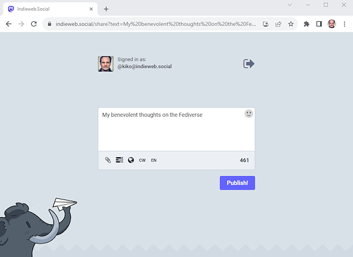
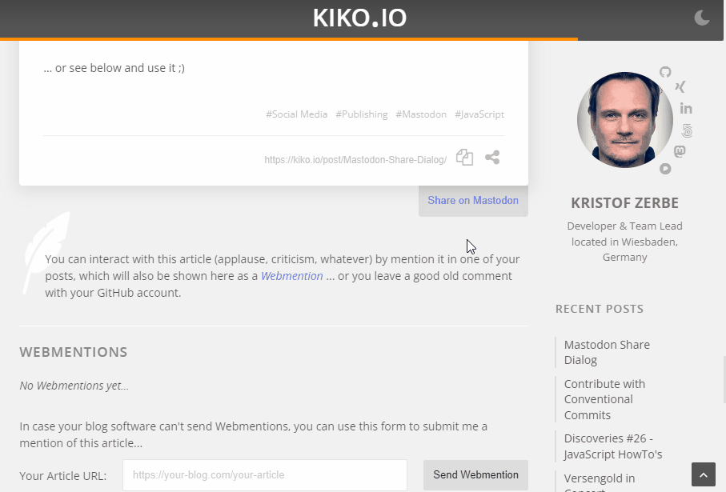

Social media thrives on sharing. Thoughts, experiences, self-dramatizations or even texts or posts from other people. This is especially true for microblogging on (formerly) Twitter and (today) Mastodon. To make this easy, the platforms often offer a SHARE endpoint (URL), such as the famous

```http://www.twitter.com/share?text=My impossible thoughts on X```

... or any dirt buttons to collect user data.

A few months after the groundbreaking of Mastodon 2016, such a feature was also [discussed and implemented](https://github.com/mastodon/mastodon/issues/442) on GitHub and out came: 

```https://<your-instance>/share&text=My benevolent thoughts on the Fediverse```

But ... where Twitter had it easy due to its central structure (twitter.com ... period.), we Mastodon users all fidget around on **different instances**, i.e. each instance has its own ``/SHARE`` endpoint and so it's a bit harder to stick a share button on your own blog, because you have to ask the user where he lives.

Of course, online services like [toot.kytta.dev](https://toot.kytta.dev/), [s2f.kytta.dev](https://s2f.kytta.dev/), [mastodonshare.com](https://mastodonshare.com/) sprouted immediately, but also the button providers expanded their portfolio or new ones were launched, like [shareon.js.org](https://shareon.js.org/), [share-on-mastodon.social](https://share-on-mastodon.social/), [shareaholic.com](https://www.shareaholic.com/website-tools/social-share-buttons/mastodon/).

But seriously ... does it take an external service to ask the user for an instance name and redirect him to an URL (and run the risk of falling victim to data collection mania)? Because that's all it is. All of the above do it exactly that way.



So we come to the ready-made developer solutions e.g. How-To tutorials. Here, too, there are a lot of hits after a search: [Mastodon-share-button (WebComponent)](https://github.com/codesyntax/mastodon-share-button), [Mastodon-share-button (JS)](https://github.com/Aly-ve/Mastodon-share-button), [Adding a Share On Mastodon button to a website](https://www.bentasker.co.uk/posts/documentation/general/adding-a-share-on-mastodon-button-to-a-website.html), [Adding a “share to mastodon” link to any web site – and here](https://christianheilmann.com/2023/08/18/adding-a-share-to-mastodon-link-to-any-web-site-and-here/), []() ... and I'll join them here for my Hexo-driven blog.

<!-- more -->

---

## My Mastodon Share Variant

It's really not hard to develop an appealing looking and working JavaScript solution to the "problem". Where [Christian Heilmann](https://toot.cafe/@codepo8) (last link in the list above) relies on a simple ``window.prompt``, I recently introduced my Bottom Sheet dialogs in this blog ( and ), which are perfectly suited for this.

Each shareable post should get a SHARE button that lets a bottom sheet pop out where the user can enter their instance name, which is then remembered for next time, and already contains suggested text (title, description, and url of the post) for the Mastodon toot.

### The Button

In every post the interaction section is rendered and there is now a new button, which calls a new dialog method, described later on:

```js themes\landscape\layout\_partial\post\interaction.ejs
...
<button onclick="dialog.shareOnMastodon();" class="share mastodon">Share on Mastodon</button>
...
```

### Adding a dialog template to the DOM

For my dialog I first needed a UI, preferably a template in the DOM to avoid having to fiddle with HTML in the JS code:

```html themes\landscape\layout\_partial\templates\mastodon-share-dialog.ejs
<template id="mastodon-share-dialog">
  <div class="mastodon-share-content">
    <section>
      <p id="mastodon-share-intro">
        
        There are many Mastodon instances out there. 
        Tell me yours and I will redirect you to the share dialog of your server:
      </p>
      <label for="mastodon-instance">Your Mastodon Instance</label>
      <div id="mastodon-instance-wrapper">
        <span>https://</span>
        <input id="mastodon-instance" name="intance" required />
      </div>
      <label for="mastodon-text">Text to share ...</label>
      <textarea id="mastodon-text" name="text" rows="8"></textarea>
      <button id="mastodon-share">Share</button>
    </section>
  </div>
</template>
```

The template is embedded in ``layout.ejs`` near the closing HTML tag. It contains mainly an INPUT for the instance name, a TEXTAREA for the suggested text and a button for the action. I'll leave out the styles here, because if you adopt my implementation, the CSS (or Stylus) will be completely different.

### Extending the dialog script

Ok ... let's extend the **dialog.js** code, I first described , with a new method as used at the button:

```js themes\landscape\source\js\dialog.js
var dpDialog = { 
  'base': { ... },
  'init': function(options) { ... },
  'show': function(callback) { ... }

  'shareOnMastodon': function() { 
     dpDialog.base.init({
      headerText: "Share on Mastodon",
      urlHash: "share", // show hash in url
      minContentHeight: 400, // limit height of dialog
      width: "min(600px, 100%)" // center dialog with max width 600px
    });
  }

  // Grab the template and make it a jQuery object
  let content = document.getElementById("mastodon-share-dialog").content.cloneNode(true);
  let jContent = $(content);

  // Read the cookie if the user has already used the dialog ...
  let instance = getCookie("mastodon-instance");
  if (instance) {
    // ... and enter it in the INPUT
    jContent.find("#mastodon-instance").val(instance);
  }

  // Create a suggestion text from the page metadata
  const title = document.querySelector('meta[name="title"]').content;
  const description = document.querySelector('meta[name="description"]').content;
  const permalink = document.querySelector('link[rel="canonical"]').href;
  jContent.find("#mastodon-text").val(title + "\n\n" + description + "\n\n" + permalink);

  // Set the BUTTON action ...
  jContent.find("#mastodon-share").click(function(e) { 
    const eInstance = document.getElementById("mastodon-instance");
    const eText = document.getElementById("mastodon-text");
    
    // Let the browser validate the input attribute REQUIRED
    const isValid = eInstance.reportValidity();
    if (isValid) {
      // Save the entered instance name to a cookie
      setCookie("mastodon-instance", eInstance.value);

      // Generate the share URL for the instance
      let shareUrl = `https://${eInstance.value}/share?text=${encodeURIComponent(eText.value)}`;

      // Open the share URL in a new window and close the dialog
      window.open(shareUrl, '_blank');
      dpDialog.base.element.downupPopup("close");
    }
  });

  // Add the dialog to the DOM
  jContent.appendTo(dpDialog.base.content);

  // Open the dialog and set the focus in the INPUT
  dpDialog.base.show(function() {
    document.getElementById("mastodon-instance").focus();
  });

}
```

### The Result

This is it ... and here you can see the result of my implementation:



... or look at the button in the bottom right corner and use it ;)

As I said, it's just a tool to make it easier for the user to share your content via a URL of their instance to their audience. There is no external stuff, data collection or influence on what is shared. Just JavaScript, HTML running in the browser and one cookie for convenience.

You can find all files as usual on the GitHub repo of this blog at [https://github.com/kristofzerbe/kiko.io](https://github.com/kristofzerbe/kiko.io)