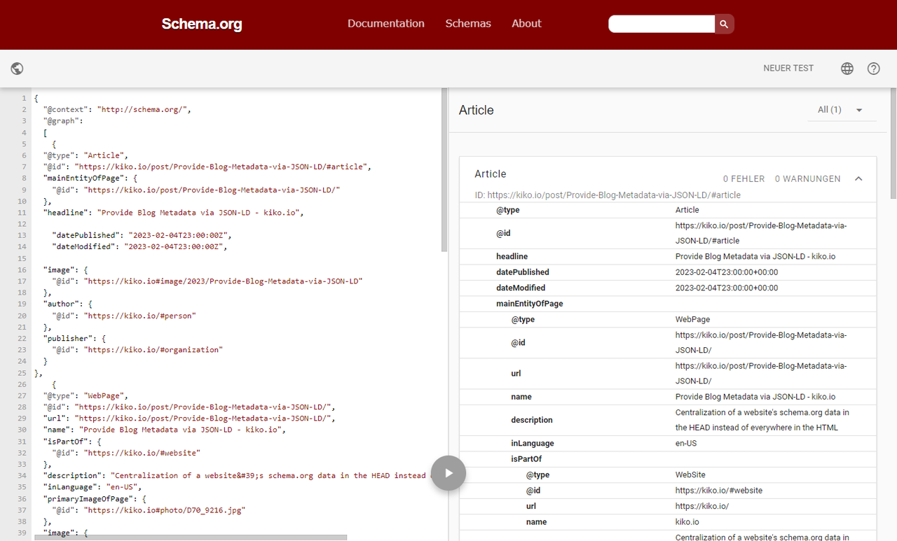

Chris Coyier's post "[Open Graph Blues](https://chriscoyier.net/2023/01/28/open-graph-blues/)" got me thinking that my blog's metadata, which are used by Google among others to index my pages, aren't really at the cutting edge anymore. I took the markup of the individual elements of the pages via [schema.org](https://schema.org) Microdata attributes from the standard Hexo template years ago and always adjusted it by value, but never questioned that there are more modern variants to provide the metadata.

It's Ok for Google to use Microdata attributes, but the HTML code of my templates is getting more and more opaque, because next to these stick to the tags also those for the Indieweb, classes for CSS and last but not least those for the own indexing via Pagefind. There becomes from a simple

```html
<article>
  <h1>Title of my latest blog post</h1>
  <p> ... </p>
</article>
```

quickly becomes a ...

```html
<article class="article-type-post h-entry" 
        data-pagefind-body="" data-pagefind-meta="type:Article" itemscope itemprop="blogPost">
  <h1 class="article-title p-name" 
      itemprop="name">Title of my latest blog post</h1>
  <p> ... </p>
</article>
```

Lots of textual overhead and the hardest part is maintaining it over the long term. Better would be a complete search engine description in the header of a page, where also the other meta information is available. In one place and not spread all over the HTML code. **JSON-LD to the rescue**...

<!-- more -->

---

## Structured Meta Data

Google has published tons of information in its [Search Central](https://developers.google.com/search/docs/appearance/structured-data/intro-structured-data) on how to place metadata on your page to be found more easily in the index. You can also see that they are maintained by the update date of individual pages, for example "*Last updated 2023-01-26 UTC*". End of last week. That's up to date, fine.

Of course, they also show how to use Microdata, but recommended is the use of [JSON-LD](https://json-ld.org/), a structured and centralized inclusion of the required information via a SCRIPT tag in the header of the page. Thereby information about the **website** in general, the **author**, the **organization** behind it and the actual **article** page can be combined separately in one piece of JSON-LD code.


Google's solution is based on schema.org, but they have picked only what is necessary for them, which means: they deal only with a subset of the schema.org types.


Since it is somewhat cumbersome to write correct JSON-LD by hand, there are of course online editors for it, e.g. within the [web code tools](https://webcode.tools/generators/structured-data) or [Merkle](https://technicalseo.com/tools/schema-markup-generator/). But these generators unfortunately do not map all the possibilities and useful entries, so they can only generate general templates to be elaborated. Moreover, you can use the JSON-LD code from this article as a basis for your solution, because it covers the most important aspects.

In the following I first describe the general content of the individual JSON-LD blocks and then how to assemble them, so that it makes sense for the search engine.

### Author

First of all, this code is about me myself and I...

```json
{
  "@type": "Person",
  "@id": "https://kiko.io/#person",
  "name": "Kristof Zerbe",
  "url": "https://kiko.io/about",
  "image": "https://kiko.io/images/kristof-zerbe.png",
  "sameAs": [
    "https://indieweb.social/@kiko",
    "https://github.com/kristofzerbe",
    "https://500px.com/p/kikon"
  ]  
}
```


It is advisable to include so called **Node Identifiers** (``@id``) in order to reuse certain information later on as a reference and prevent repeating data. These [identifiers](https://schema.org/docs/datamodel.html#identifierBg) are canonical URL/URI representations.


### Organization

Most blogs are run by individuals and not necessarily by organizations, so you might think this area would not be interesting, but it is for a reason: only here you can deposit the link to a logo of your blog, which can then be displayed in the search.

```json
{
  "@type": "Organization",
  "@id": "https://kiko.io/#organization",
  "name": "kiko.io",
  "url": "https://kiko.io",
  "logo": "https://kiko.io/images/apple-touch-icon.png"
}
```

### Website

The JSON-LD block related to this website itself looks like this:

```json
{
  "@type": "WebSite",
  "@id": "https://kiko.io/#website",
  "url": "https://kiko.io",
  "name": "kiko.io",
  "description": "Blog about memorable tech stuff by Kristof Zerbe",
  "inLanguage": "en-US",
  "publisher": {
      "@id": "https://kiko.io/#organization"
  },
  "potentialAction": {
    "@type": "SearchAction",
    "target": {
        "@type": "EntryPoint",
        "urlTemplate": "https://kiko.io/search/?q={searchTerm}"
    },
    "query-input": "required name=searchTerm"
  }
}
```

Remarkable in this block is the ``potentialAction``, which specifies the possibility to let the search engine (Google, whatelse) integrate a Sitelinks Search Box, a search box inside the result list, as described [here](https://developers.google.com/search/docs/appearance/structured-data/sitelinks-searchbox). There is a shorthand format for this and some generators like Merkle are using it, but it is not recommended, because it's non-standard.

### (Page) Images

I use my own photographs on every page as header images and to provide some additional information on these, there is a JSON-LD block for the image I use.

```json
{
  "@type": "ImageObject",
  "@id": "https://kiko.io#photo/D70_9216",
  "caption": "Broken Onion",
  "url": "https://kiko.io/photos/normal/D70_9216.jpg",
  "contentUrl": "https://kiko.io/photos/normal/D70_9216.jpg",
  "license": "https://creativecommons.org/licenses/by-sa/4.0/",
  "acquireLicensePage": "https://kiko.io/photos",
  "creditText": "Kristof Zerbe",
  "copyrightNotice": "Kristof Zerbe (CC BY-SA 4.0)",
  "creator": {
    "@id": "https://kiko.io/#person"
  }
}
```

For better recognition of my posts (currently articles only), I generate a special image for each post for the social media platforms. It is based on the  photo associated with the post and includes it's title and subtitle in addition to the logo. How I generate these things can be read in my post . For this image, there is a second JSON-LD block that I can reference later on:

```json
{
  "@type": "ImageObject",
  "@id": "https://kiko.io#image/Provide-Blog-Metadata-via-JSON-LD",
  "url": "https://kiko.io/images/social-media/Provide-Blog-Metadata-via-JSON-LD.png",
  "contentUrl": "https://kiko.io/images/social-media/Provide-Blog-Metadata-via-JSON-LD.png",
  "creator": {
    "@id": "https://kiko.io/#person"
  }
}
```


### Webpage

The previously described JSON-LD blocks are basically just a preparation for the description of the individual pages that will be indexed by the search engine. The following block now describes a page itself and includes the previously described blocks by referencing the ``@id``:

```json
{
  "@type": "WebPage",
  "@id": "https://kiko.io/post/Provide-Blog-Metadata-via-JSON-LD",
  "url": "https://kiko.io/post/Provide-Blog-Metadata-via-JSON-LD",
  "name": "Provide Blog Metadata via JSON-LD",
  "isPartOf": {
    "@id": "https://kiko.io/#website"
  },
  "description": "Centralization of a website's schema.org data in the HEAD instead of everywhere in the HTML",
  "inLanguage": "en-US",
  "primaryImageOfPage": {
    "@id": "https://kiko.io#photo/D70_9216"
  },
  "image": {
    "@id": "https://kiko.io#photo/D70_9216"
  }
}
```

### Article

In addition to the previous description of a web page, the following block is a more detailed description of the page as an article or blog post.

```json
{
  "@type": "Article",
  "@id": "https://kiko.io/post/Provide-Blog-Metadata-via-JSON-LD#article",
  "mainEntityOfPage": {
    "@id": "https://kiko.io/post/Provide-Blog-Metadata-via-JSON-LD"
  },
  "headline": "Provide Blog Metadata via JSON-LD",
  "datePublished": "2023-02-02T12:00:00+00:00",
  "dateModified": "2023-02-02T12:00:00+00:00",
  "image": {
    "@id": "https://kiko.io#image/Provide-Blog-Metadata-via-JSON-LD"
  },
  "author": {
    "@id": "https://kiko.io/#person"
  },
  "publisher": {
    "@id": "https://kiko.io/#organization"
  }
}
```

As described earlier, the identifiers defined in the other blocks are used for referencing the ``author`` and the ``publisher``, as I did it in the block ``website``. At first glance, this information appears to be duplicated and I am currently not sure if it is really needed.  
``mainEntityOfPage`` makes clear, that this article is the main entity for that web page.  
The image of the article will be the social media image defined in the second ``ImageObject`` block.

---

## Assembling the blocks

Generally, JSON-LD data is included in a page via a ``script`` tag. You can either output each individual block separately or together within a so called **graph**. In both cases, the leading specification of the **context** is necessary.

**Separate**

```html
<script type="application/ld+json">
  {
    "@context": "http://schema.org/",
    ... rest of the block
  }
</script>
<script type="application/ld+json"> ... </script>
...
```

**Together**

```html
<script type="application/ld+json">
  {
    "@context": "http://schema.org/",
    "@graph": 
    [
      ... all needed blocks in hierarchy
    ]
  }
</script>
```

Since this is probably the most common and also the most space-saving way, I have chosen the graph.

When arranging the blocks it is useful to keep the **hierarchy, from specific to general**. Here is a schematic example of an **article**:

```html
<script type="application/ld+json">
  {
    "@context": "http://schema.org/",
    "@graph": 
    [
      { ... Article },
      { ... WebPage },
      { ... ImageObject (Social Media Image) },
      { ... ImageObject (Photo) },
      { ... WebSite },
      { ... Organization },
      { ... Person }
    ]
  }
</script>
```

On all pages that are not an article, of course, the *Article* and the *ImageObject (Social Media Image)* blocks are not necessary. Here is the sample for an ordinary **page**:

```html
<script type="application/ld+json">
  {
    "@context": "http://schema.org/",
    "@graph": 
    [
      { ... WebPage },
      { ... ImageObject (Photo) },
      { ... WebSite },
      { ... Organization },
      { ... Person }
    ]
  }
</script>
```

---

## Generation

Since my blog is based on SSG [Hexo](https://hexo.io), I have all the data and capabilities to have the JSON-LD data of a page automatically generated. I don`t want to go into too much depth here about how I implemented this, but in general there is an EJS file for each block that renders the required JSON-LD code via the available configuration and page data stored and passed in a META object. Through various wrappers, these are then included in the ``head.ejs``. I have currently three of them:

* ``json-ld-page.ejs`` ... for all pages, except the other two below
* ``json-ld-article.ejs`` ... for articles (normal [kiko.io Posts](/archives))
* ``json-ld-blogposting.ejs`` ... for notes (see [kiko.io Notes](/notes))

```js json-ld-article.ejs
{
  "@context": "http://schema.org/",
  "@graph": 
  [
    <%- partial('_partial/meta/_article') %>,
    <%- partial('_partial/meta/_webpage') %>,
    <%- partial('_partial/meta/_image') %>,
    <%- partial('_partial/meta/_photo') %>,
    <%- partial('_partial/meta/_website') %>,
    <%- partial('_partial/meta/_organization') %>,
    <%- partial('_partial/meta/_author') %>
  ]
}
```

```js head.ejs
<%#!-- JSON-LD (schema.org) for Google --%>
<%
  let jsonPartial = "json-ld-" + meta.type;  
  let jsonLD = partial('_partial/meta/' + jsonPartial, { meta: meta });
  jsonLD = JSON.stringify(JSON.parse(jsonLD));
%>

<script type="application/ld+json"><%- jsonLD %></script>
```

The last line in the JavaScript ensures, that the produced JSON is compacted to one single line ... easy, by converting the string into an object and back to a string.

---

## Test the JSON-LD

When you have everything together, it is advisable to test the resulting code. Schema.org offers such a tool at **[https://validator.schema.org/](https://validator.schema.org/)**. In addition, there is the [Google Rich Results Test](https://search.google.com/test/rich-results), which validates your code against the partially specific implementation for their own search engine.



---

## Conclusion

It may be a few bytes more that are delivered to the user in the browser or the search engine bot, but the advantage is, that all the information describing the page is stored in one place in the header of the page and nothing is scattered all over the HTML anymore. Maintenance of both the code and the meta data is made much easier as a result.

---

## More Information

{% moreinfo '{ "list": [
  [ "Google Search Central", "Introduction to structured data markup in Google Search",
  "https://developers.google.com/search/docs/appearance/structured-data/intro-structured-data" ],
  [ "Patrick Coombe and Craig Mount", "Steal Our JSON-LD",
  "https://jsonld.com/" ],
  [ "Andrew Welch", "Annotated JSON-LD Structured Data Examples",
  "https://nystudio107.com/blog/annotated-json-ld-structured-data-examples" ],
  [ "Alberto Carniel", "Schema markup and structured data ultimate guide (JSON-LD)",
  "https://www.albertocarniel.com/post/schema-markup" ],
  [ "Brian Gorman", "An SEO’s Guide to Writing Structured Data (JSON-LD)",
  "https://moz.com/blog/writing-structured-data-guide" ],
  [ "Merkle", "Schema Markup Generator (JSON-LD)",
  "https://technicalseo.com/tools/schema-markup-generator/" ],
  [ "webcode.tools", "Generators > Structured Data",
  "https://webcode.tools/generators/structured-data" ]
]}' %}
