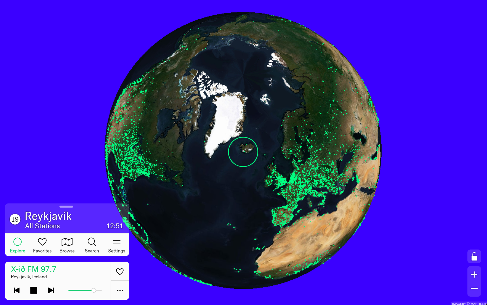

In the age of streaming services, radio may seem out of date, but it still surrounds us constantly, even if we often hardly notice it - in the car, on the public transport, at work or simply at home in the kitchen. One strength of the old medium is that it presents us with music we haven't heard before, away from our playlists on Spotify or iTunes.

The easiest way to rediscover new artists or entire genres of music is to pick a radio station at random. It's precisely this lack of control, the being at the mercy, the sometimes unpredictable that makes the medium so appealing to many - and with digital streaming, many of the world's stations are just a tap away.

As is so often the case in the modern world, it's the oversupply that leaves some confused and frustrated. You first have to be able to pick out what you might like from the gigantic haystack of options. For this purpose, there are little helpers that more or less independently suggest what you might listen to. One of them stands out from the crowd because, on the one hand, it does not pursue commercial interests and, on the other hand, it approaches the station search very intuitively: **[Radio Garden (https://radio.garden)](https://radio.garden/)**.

<!-- more -->

## Indische Esoterik, estnischer Metal

The tool, which works very well in any modern browser, but is also available as an Android or iOS app, initially shows nothing more than an interactive globe on which tens of thousands of green dots whiz by under a round target cursor when you move the map back and forth or zoom into the world. If you set your sights on one of the green dots, the station for that city is loaded and played. If there are several stations in one place, the dot appears larger and you are also offered a station list.

This is so intuitive that it instantly awakens the spirit of discovery and in a few minutes you can listen to Japanese, Australian or Peruvian radio stations and decide whether to add them to your list of favorites. Using the search function, you can find not only your local, familiar stations (if they offer an Internet stream), but also thematic stations. The directory even includes some US police stations that stream their radio traffic on the Internet.

Radio Garden grew out of a scholarly project by the Netherland Institute for Sound and Vision in Hilversum, the Netherlands, which between 2013 and 2016 studied what radio sounds like in other parts of the world and what borders, different cultural identities, and encounters do to the medium.

The British [**Jonathan Puckey** and his studio](http://puckey.studio/) played a key role in the project and its technical implementation. In several iteration stages, this resulted in the web app radio.garden, which Puckey is still in charge of today. Instead of maps, the team from Amsterdam used satellite images from the beginning to illustrate that radio signals have always had the power to cross borders.

Radio Garden is free, and you don't need to register, log in, or even provide an email address. Nothing. Open up, select a station, listen to the radio.



Unfortunately, there are a few regions in the world that have limited access to the radio.garden website or apps. For example, in the replies to a Mastodon post on the topic, there were some comments from people in the UK who could not access a station outside their island.

This problem seems to have a licensing background and thus be a Brexit impact, but there are unfortunately no official statements on this. Similarly in Turkey, where the service was discontinued after the Radio and Television Supreme Council there ordered the operator to make license payments, according to Wikipedia. The only way around these restrictions is to use a VPN in another country.

It's a lot of fun to roam around the globe and try to follow an Indonesian news broadcast, guess which products the advertisements of a Greek station are trying to sell, let yourself be carried away to other worlds by the spherical sounds of an Indian esoteric station, or really shake your hair to the beat of the hard metal sounds of an Estonian rock station. Radio Garden is a very exciting project, wonderfully presented.
