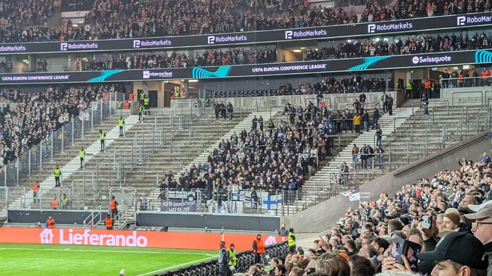



My newly awakened love for German soccer reached a small peak last Thursday when my colleague Uli asked me, if I would like to go to the evening match of his favorite club [**Eintracht Frankfurt**](https://en.wikipedia.org/wiki/Eintracht_Frankfurt) against [**HJK Helsinki**](https://en.wikipedia.org/wiki/Helsingin_Jalkapalloklubi) as part of the preliminary round of the [Europa Conference League](https://en.wikipedia.org/wiki/UEFA_Europa_Conference_League). He had come by a happy coincidence to two tickets. Of course! Let's go!

Now I'm not an Eintracht fan, by any means. In the Rhine-Main area, the Frankfurt club is either hated or loved by the people, because its fan base is a bit more aggressive, i.e. they are disreputable and with them the club. But I've never been to the [Waldstadion](https://de.wikipedia.org/wiki/Waldstadion) (as it used to be called) or the "Deutsche Bank Park" (as it's called if you put money on the table), one of the big soccer arenas in Germany, where international matches and other big events are also held regularly.

<!-- more -->

Getting to the stadium was an ordeal, because we had left our cars at the office and taken the cab, but the 55,500 spectators all seemed to want to park right in front of the arena so the traffic jam was immense. The last kilometer through the forest to the stadium and the Jürgen Grabowski grandstand to our seats were tough, at least for Uli, because his knee was hurting as usual. But the anticipation, a beer and an Äppler made up for everything.

What I found amazing, as a Waldstadion newbie, was that we entered the building at ground level, but came out in row 30. The whole thing thus reminded of a nicely designed giant pit. The lighting of this massive area was perfect and the volume of the fans was loud, but not deafening. An architectural masterpiece. The wall of fans in the home curve with the many oversized flags that were waved throughout was impressive, even if I wondered the whole time, how the fans behind these giant flags would have noticed anything of the game for even a minute. But I think it was not about free view of the people there at all. Only about the atmosphere. I was in any case happy about my seat in row 9 pretty directly on the center line of the field and had to ask the people in the row of seats in front of me once in a while to sit down again so that I could see the game comfortably.

... vs ... (cute)

---

## The Game

The first 10 minutes of the game were unspectacular. They felt each other out and the Finns played diligently and should have been in the lead after 5 minutes, but got in the 9th minute after some guesswork from the referee with VAR support a penalty against them. 





After this 1:0 for Eintracht, the Frankfurt boys whirled themselves into a kind of frenzy of play. More and more fluidly and casually it went in the direction of the Finnish goal and Helsinki could only with effort hold against it. So it was after 30 minutes already 3:0 and at halftime 4:0. The goal to make it 3-0 was a really spectacular one: Omar Marmoush gets the ball in the penalty area and takes a shot, but the ball bounces off an opponent's legs and comes back to him. He pulls off again and again the ball bounces off the legs of another player back to him. His third attempt was then a fine shot with the outside of his foot past all the players into the goal.

In the break, the coach of the Finns seems to have been a little louder, because his guys played a little stronger and more determined, only to get another one in the 55th minute.

With 10 minutes to go, things got emotional in the stadium: the coach substituted Timothy Chandler, a Frankfurt veteran who has been with the club for almost 10 years and his first appearance this season. The tens of thousands of fans were completely out of their minds, screaming "Tiiiimmmyyy" as soon as he got to the ball. It was crazy. How must it feel to be showered with so much fan love! Things almost got out of hand when Chandler sprinted forward on the right flank in the 89th minute and made a wonderful pass into the middle and Dina Ebimbe just had to slot it in for 6:0.



&#x21FE;&nbsp;[Match report on kicker.de](https://www.kicker.de/frankfurt-gegen-hjk-helsinki-2023-europa-conference-league-4890631/spielbericht)

---

## Conclusion

It was really an experience to see this game in this arena and even if I would have enjoyed Helsinki sending Frankfurt home 4:0 (my funny tip to Uli before the game), it was nice that he could be happy about the victory.
