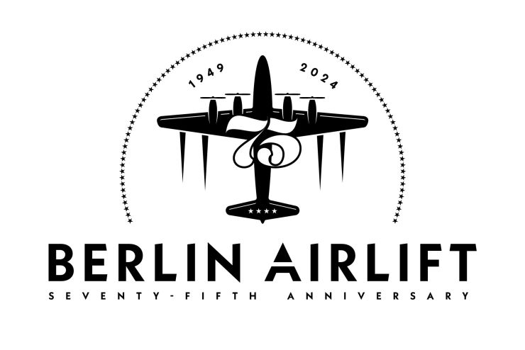

On 12 May 1949, the blockade of Berlin ended and with it the airlift organised by the Americans, which had supplied the city with the most necessary goods in over 200,000 flights since 24 June 1948. One of the airports from which the so-called "Rosinenbomber" took off was the former Air Force Base in Wiesbaden-Erbenheim. At this site, which is now home to the U.S. Army Garrison Wiesbaden, a commemoration service was held this weekend with all kinds of supporting programmes.

A great event, with lots of old aircraft, a wonderful flying programme and more beer benches than I have ever seen. Here are a few photographic impressions ...

<!-- more -->
..
{% photo_masonry
  "D50_9220_2406"
  "D50_9228_2406"
  "D50_9236_2406"
  "D50_9238_2406"
  "D50_9241_2406"
  "D50_9243_2406"
  "D50_9251_2406"
  "D50_9266_2406"
  "D50_9288_2406"
  "D50_9297_2406"
  "D50_9309_2406"
  "D50_9325_2406"
  "D50_9348_2406"
  "D50_9355_2406"
  "D50_9387_2406"
  "D50_9395_2406"
  "D50_9402_2406"
  "D50_9404_2406"
  "D50_9411_2406"
  "D50_9412_2406"
  "D50_9413_2406"
  "D50_9417_2406"
  "D50_9418_2406"
  "D50_9421_2406"
  "D50_9423_2406"
  "D50_9424_2406"
  "D50_9429_2406"
  "D50_9431_2406"
  "D50_9437_2406"
  "D50_9440_2406"
  "D50_9462_2406"
  "D50_9464_2406"
  "D50_9465_2406"
  "D50_9467_2406"
  "D50_9468_2406"
  "D50_9469_2406"
  "D50_9489_2406"
  "D50_9494_2406"
  "D50_9496_2406"
  "D50_9500_2406"
  "D50_9503_2406"
  "D50_9504_2406"
  "D50_9506_2406"
  "D50_9507_2406"
  "D50_9510_2406"
  "D50_9511_2406"
  "D50_9513_2406"
  "D50_9523_2406"
  "D50_9526_2406"
  "D50_9527_2406"
%}
