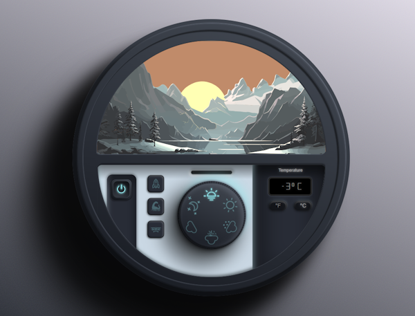

I've been collecting imaginative and technologically tricky Codepens on a Trello list for quite a while, primarily to learn and perhaps implement them in a project at some point. A good source for high-quality pens is the recently published list of the [Top 100 Pens of 2023 on codepen.io](https://codepen.io/2023/popular/pens/). I have already noticed some of the works over the course of the year, but some have slipped through my fingers and so I am glad that I have this list, the order of which is calculated from the hearts (likes) given and their level.

Here are my 10 favourite pens from 2023 ... and, like last year, an 11th jaw-droppingly good pen to start with.

What **[Rafa](https://codepen.io/RAFA3L)** has conjured up with his pen [**ClimaCode**](https://codepen.io/RAFA3L/pen/ZEmBzEv) is truly breathtaking and is spread over 3,658 lines of HTML (including SVG objects), 904 lines of CSS and "only" 138 lines of JavaScript. It's fun to try out all the controls of this climate dashboard and enjoy the soft parallax effects. My favourite button is of course Nessy.

(Also try out his coffee generator ["For The Love Of Coffee"](https://codepen.io/RAFA3L/pen/QWJOmrL), which is indispensable for IT professionals ;))

<!-- more -->

---

## 1. The aurora (only CSS)




---

## 2. ...CSS-only fluid slider...




---

## 3. Futuristic Dial Button




---

## 4. Gooey Toggle Switch




(Don't miss his [Squishy Switch](https://codepen.io/nicolasjesenberger/pen/bGQwBYo) either)

---

## 5. Gorgeous animated gradient borders... 




---

## 6. Fancy hover effect on avatar




---

## 7. 3D Cards




---

## 8. Stripe Sessions style Flex Carousel




---

## 9. Carousel with drag and wheel




---

## 10. Background Slider | Swiper




