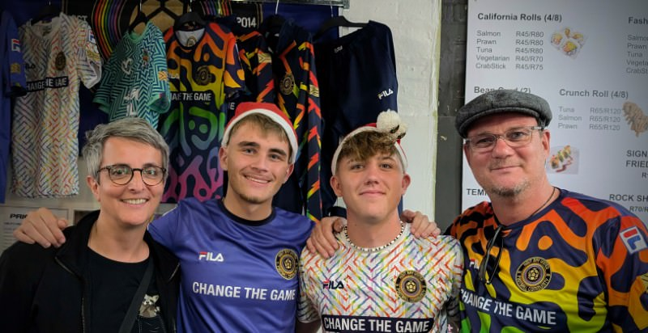

Anyone who has been following this blog for a while knows that I am over 50 and have only recently developed an interest in football. Of course, I primarily follow my home team, SV Wehen Wiesbaden, but I also follow other teams, especially those underdogs who tend to lose out in the big business, but who have exactly the heart that makes football what it is or should be.

Today, I stumbled across one completely unexpectedly: in **Hout Bay, South Africa** at an arts/crafts/food market by the harbour. I was looking for something interesting to eat and my eye fell on a stand with colourful shirts with two young guys behind it who were selling Lebkuchen (Gingerbread) and Stollen (no translation possible). LEBKUCHEN and STOLLEN!? As a German, I know that you can hardly escape this stuff during the Christmas season (my belly speaks volumes), but with my trip I tried exactly that and I obviously failed ;)

<!-- more -->

I had to tease the two guys, James and Max from Munich, a little about the pastries, of course, but only briefly, because they told me what they were doing here, so far from home, and that not only earned me the greatest respect, but also gave me hope that today's youth is not as dumb and socially jaded as everyone always says. They are volunteers, working here in Hout Bay for a few months at the football club Hout Bay United, founded in 2014. Max coaches the 8-year-olds and James takes care of marketing and other administrative matters. Great guys, I'll buy the sticker...

Max then pointed out to me what is special about this club, whose motto is:

> Community is our soul. Football is the spark that brings us together. The magic is our journey that brings friendship, love, support, understanding, growth & opportunity. Football is just the beginning… We are #morethanateam #morethanagame

It doesn't matter what kind of human being you are, only your love for football and for the community. The latter is not really well developed in South Africa and I still remember the words of the former inmate of Robben Island from two days ago, who said that one form of apartheid may be over, but that the country is now suffering from another. South Africa is divided by skin colour and, above all, economic inequality. In contrast, the German east/west problem is a walk in the park. This is for all the stupid AfD voters.

The wonderful thing about the club is that they don't see themselves as a club at all, but as a community, and they don't measure their success in trophies. The name can also be explained from this understanding: **Hout Bay United Football Community** (HBUFC). It is a charity project, an NGO that even counts Jürgen Klopp among its supporters. The ties to Germany are close. There is a support association, the HBUFC e.V., which, among other things, organises volunteer work. This is probably how Max and James came to Hout Bay.

I love such hopeful projects and of course I now wear an HBUFC jersey, even if it's not the chic blue one, but the colourful home jersey, because that's all the guys had in XL ... which brings us back to the gingerbread again :D

I think Max and James' commitment is really amazing and I wish them all the best for their future. These two boys strengthen my optimism in these turbulent times, that there is good in people and it thrives.

More information about the club can be found at [www.hbufc.co.za](https://www.hbufc.co.za/) ...
