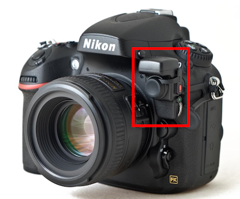
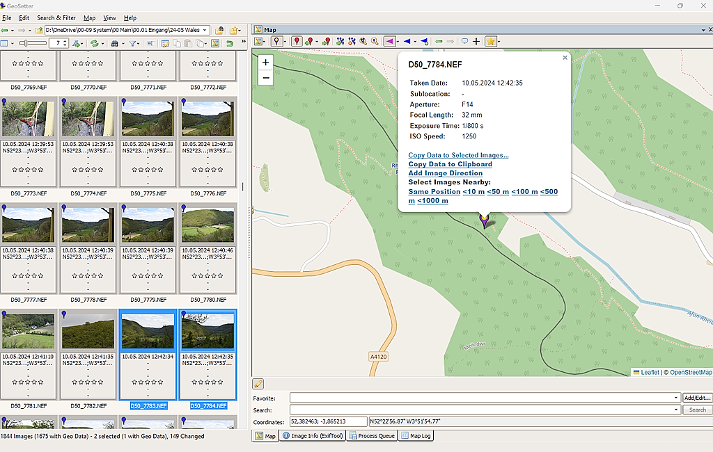
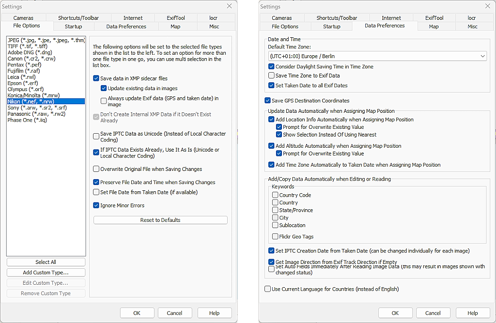
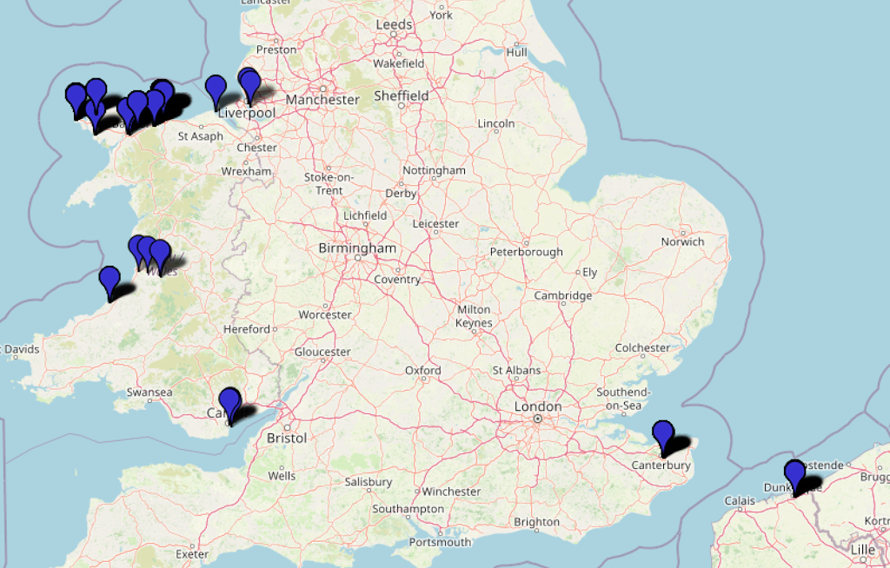

Recently, it has become increasingly difficult to properly geotag the pictures I take with my SLR camera using my photo editing tool of choice, Lightroom (Classic), because the map functionality was either not available or simply too buggy to enter the correct data in the metadata. They weren't very accurate anyway because I usually only placed the photos roughly on the map. In some cases, however, I wanted to record the exact location of the photo for the future, and this turned into hours of puzzle work. A different, preferably automatic solution had to be found. One that would do the work for me during the shoot and require as little reworking as possible, according to the motto: Technology do your job and leave me alone.

<!-- more -->

---

## The Gadget

Since my Nikon D500 does not have a built-in GPS receiver, as is the case with many mirrorless cameras these days, I looked around the market for suitable accessories and almost exclusively came across the **[di-GPS Geotagger Eco ProFessional 2 from Dawntech](https://www.dawntech.co.uk/shop/index.php?route=product/product&product_id=67)** in the UK. This small gadget, which weighs just 18 grams but is quite expensive at just under 200 euros, is screwed directly onto the 10-pin socket of the camera and therefore does not require an additional cable, whereby the plug is fed through so that other equipment can be used on the 10-pin connector. Unfortunately, the locking screw is very stiff, so it is advisable to use the supplied safety strap to prevent the gadget from falling off if the screw loosens while carrying the camera around. This happened to me and I was glad of the safety strap ...

The device does not interfere with the camera at all. Even lenses with a wide diameter like my Tamron 18-400 or my new 150-600 don't get in or get pushed out of the way. I quickly forget that it's there.

As soon as you switch on the camera, the device starts to search for a GPS signal and uses the last known position from the memory until it can determine the current position. The GPS data is written directly into the EXIF data of the photo files, so you can also check it directly on the camera display if you wish. The gadget can also be switched to continuous operation via a small red illuminated switch, in which case it continues to update the position even when the camera is switched off. The additional power required for this puts a strain on the battery, but not excessively. You just have to remember this and have an extra battery to hand on longer trips.

In my experience, GPS tracking can take up to a minute, even if Dawntech talks about "extremely fast fix", but I think that depends on where you are. Sometimes it doesn't find a signal at all or loses the fix and writes nonsense in the EXIF data. But this is relatively rare.

---

## The Tool

On my last trip, I subjected the device to its first real performance test and realised that I had switched off the camera and GPS tracker quite often, which meant that subsequent images were initially provided with the position from the memory, even though there were sometimes many miles between the locations. About 5% of the images had no GPS data at all (sometimes within a photo series) and another 5% had a kind of default value ``N90°0'0.00" E0°0'0.00"``. However, the other data was very accurate and usable. However, reworking was still necessary and I then looked for a tool that could make this work easier for me. I didn't want to rely on Lightroom here because, as I said, the map module is anything but bug-free and it is and remains an image editing tool and is not specialised in such tasks.

After a short search, I stumbled across the Windows application **[GeoSetter](https://geosetter.de/en/main-en/)**, which was probably written by Friedemann Schmidt for the same reason that I now needed support. In any case, it immediately felt like that because the tool offered me exactly what I was looking for, even though the programme itself seemed to be a few years old (last update to version 3.53 in 2019). A list with the photos, single or multiple selectable on the left side and a large map on the right, where the positions can be displayed and edited. However, Friedemann's application does not write the modified GPS information into the EXIF data of the files itself, but uses the ultimate in the industry: [ExifTool by Phil Harvey](https://exiftool.org/).

Using GeoSetter takes a little practice, firstly because it has so many features and secondly because some things happen automatically. If, for example, you want to place a photo with incorrect GPS data on the same photo as a previous one, you first select the photo to be edited and then the one with the data to be copied, because the latter is now displayed as a pin on the map and clicking on the pin opens a small overlay with the option "Copy data to selected images". 

When starting the application, it is important to first set all the options as you need them. In my case, the tool should process NEF files, save the modified data in an XMP sidecar file, but also update the EXIF data, but leave the existing IPTC data and the file date untouched ... and so on. My settings dialogue looks like this after the adjustments:

With these settings, it was easy to search about 1800 photos in the left file list for photos with no or incorrect GPS data and correct them within an hour. The filters that can be activated in the toolbar are also useful here.

After the correction, all I had to do was import the photos (and the sidecar files) into Lightroom Classic, which went without a hitch, and I could start classifying and editing the images.

This is what my recently completed trip through Wales looks like in GeoSetter: 

By the way: If, like me, you've never been to Wales before, then you should definitely make up for it! It's a magnificent country ...
