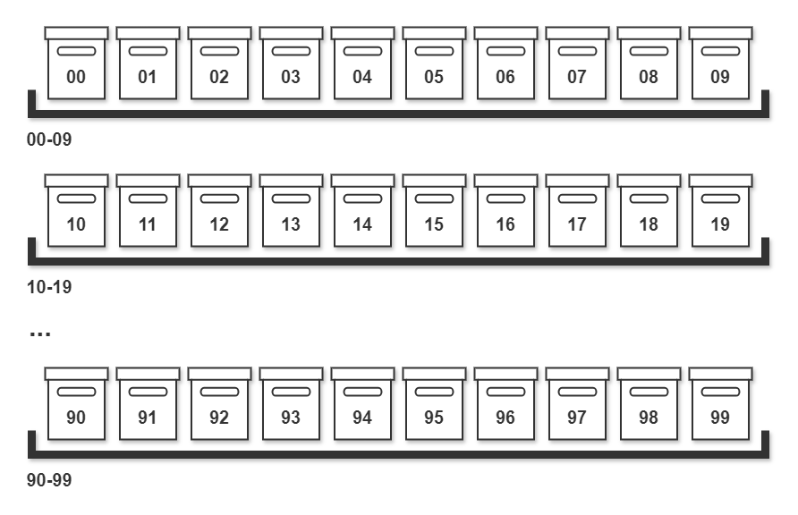
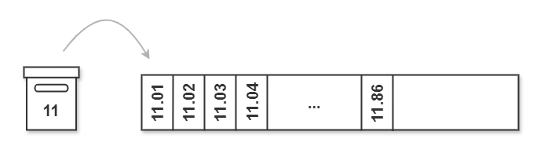

Everyone collects a lot of things over time. This applies to the basement at home, where old coffee machines in their original packaging (they're still good and I might need them again), 3 generations of old laptops, boxes of cables (power, CAT, HDMI, USB, VGA, you name it) and the like pile up in a corner or even cover an entire area. Honestly, when was the last time you tidied up there? 

But this also applies in particular to the digital legacy that we produce every day, especially if you work in IT. It's no coincidence that the Windows Explorer, macOS Finder or Konqueror under Linux are often used to start our daily digital work, and it's also no surprise that there are so many different file managers available on the market.

But many people don't give much thought to the organization of the files themselves. IT professionals often have a similar situation on their hard disk to the florist who only has half an hour in the evening to transfer a few smartphone pictures to the computer until the children have to be looked after. Everyone has a rough, self-made system, but all too often we simply throw a few vacation pictures into the *Documents* folder because the booking confirmation is also lying around there and we don't have the time to sort everything out. *"I'll do it tomorrow/on the weekend/on vacation. "* ... has really never worked.

I am a fairly structured person, which means that disorder is nothing for me, or, as the main protagonist of a cult American TV series in Germany likes to say: I am **Monk** in this regard. The very first thing I do is repartition all my machines and create a D:\ drive for *"Data "*, into which I move the standard Windows folders Documents, Pictures, etc. Within folders with time-related content, for example "Photos", I create subfolders with a date in front, such as "23-12 Adventure Vacation on Mars" or "24-03 Diving in the Himalayas".
In *"Documents "*, on the other hand, I usually use the context of the organization to which the files are to be assigned for the subfolders, such as "Insurance Without Luck" or "Money-Away-Bank", or the content type of the file, such as *"Receipts "* or *"Manuals "* If it is only a single file, I like to do it without subfolders. There are not many ;)
To have certain subfolders in view more quickly, I often use a prefix such as the hash or underscore character, i.e. something like *"#MyCompany "* or *"\_Screenshots "*. I also like to double them if there are too many underscore folders and a certain folder is very, very, very important.

You will have already noticed ... "structured" my ass!  
I keep reaching the limits of what is reasonable with my "system" and it has happened to me more than once, that when I copied an old disk to a new machine I had I had duplicate and triplicate data, in different subfolders or completely different structures, because I had been working with both machines for a while or for other reasons.  
And ... I'm ONLY talking about files here all the time. A look at my online mailbox reveals similarly frightening and, above all, untraceable data, not to mention data from online services of all kinds!

<!-- more -->

---

## New Paths with Johnny

I really appreciate the posts by [Robb Knight](https://rknight.me/). There's always something interesting in there that's worth thinking about and implementing. With his following post, which I read a few weeks ago, he triggered an avalanche of work for me, because I realized how inadequate my own filing system actually is and he awakened in me the desire to try something new, not to say to change everything completely.


url: https://rknight.me/blog/using-the-johnny-decimal-system/
title: "Using the Johnny Decimal System"
description: "I finally found some time to dig into the Johnny Decimal system and reorganise all my files"
host: rknight.me
favicon: https://rknight.me/assets/icons/favicon-32x32.png
image: https://rknight.me/assets/ogi/blogusing-the-johnny-decimal-system.png


Robb vividly describes his journey into a digital structuring system called **[Johnny.Decimal](https://johnnydecimal.com/)**, which was developed and documented in 2010 by Australian [Johnny Noble](https://hachyderm.io/@johnnydecimal), based on the widely used library classification system [DDC](https://en.wikipedia.org/wiki/Dewey_Decimal_Classification) by Melvil Dewey from 1876. Basically, the idea is to use decimal numbers and descriptive text to bring order to any system, the origins of which go back to the philosopher and mathematician Gottfried Wilhelm Leibniz at the end of the 17th century.

### Shelves (Areas) and Boxes (Categories)

The basis of Johnny's system are 10 fixed **[Areas](https://johnnydecimal.com/10-19-concepts/11-core/11.02-areas-and-categories/)**, comparable to 10 shelves screwed to the wall in the basement. Each of these shelves holds exactly 10 boxes (**Categories**) in which you can store your stuff. Each box in these shelves is now given a **unique two-digit number** from 00 to 99. As a maximum of 100 entries fit into this number range, this explains why there can only be 10 shelves with 10 boxes each and the counting starts at 0.

The boxes with the numbers 00 to 09 go on the first shelf, the second shelf 10 to 19, and so on. With this basic structure, you can now think about what to put in the boxes and thus on the shelves. It is important that each box is given a unique name and that similar items are stored in it and that boxes with similar items are placed on each shelf, as these are also given a unique name.

Example from the basement:

The shelf on the far left is called ``00-09 TECHNICS`` and the first box on this shelf is called ``00 CABLES``, the second box next to it ``01 LAPTOPS`` and so on until ``09 COFFEE MACHINES``.
The 10 boxes on the second shelf contain clothing, so the shelf is called ``10-19 CLOTHING`` and the boxes are labeled ``10 COATS``, ``11 SHOES``, etc.

### Compartments (ID's)

But now we don't just throw all the cables into the box ``00 CABLES``, because then we would only have shifted the disorder down one level, but each box can in turn be divided into 100 compartments and each of the existing compartments also has a unique number as the number range 00 to 99 and also a descriptive text. Johnny calls these compartments **[ID's](https://johnnydecimal.com/10-19-concepts/11-core/11.03-ids/)** and in contrast to the Areas (shelves) and the Categories (boxes), these do not all have to be present from the start for the sake of structure, but are filled up as required. Johnny also dispenses with the number 0 in his concept and starts with 1. The first compartment in a crate is therefore given the ID 01. If another one is needed at some point, it is given the next highest free ID, i.e. 02, and so on.

The example above is now somewhat unrealistic, but let's stick with it:

The USB cables go in the first compartment in the box and the **complete name of the compartment** is ``00.01 USB cables`` because it is also prefixed with the number of the box separated by a dot. The HDMI cables are located in ``00.02 HDMI Ribbon Cable``, etc. So if my wife wanted to ask me to get her white and blue striped winter shoes out of the cellar and she had previously labeled each shoe box according to this system, she would only have to tell me the number, e.g. ``11.86`` and I would go to the second shelf, take out box 11 and reach into "compartment" 86. Clear instructions make life easier ... ;)


One of Johnny's rules is that NO files or other data are stored directly in the folders that define the Areas and Categories, but are only used for structuring. These are only stored from level 3 in the ID folders. Another is that there should be no level below this, i.e. subfolders under the IDs.


---

## Different Domains

Let's turn off the light in the basement and look at the monitor. Finding a system for all the different data takes time and is highly individual. Johnny has dedicated a separate page to this topic on his website, which is based on his own system: [14.01 Build your system - introduction](https://johnnydecimal.com/10-19-concepts/14-build-your-system/14.01-introduction/). The most important aspect here is that you should take your time for the basic breakdown into Areas and Categories, because you only have 100 of them and the allocation, also with regard to later quick findability, needs to be well considered. My own system took me several weeks and several improvement cycles ... also because I really wanted to summarize EVERYTHING, i.e. across all **information domains** and systems:

- Local files
- Cloud files
- Mails in Gmail and Outlook
- and the many other data in the online services I use such as Trello, Notion, OneNote or Google Keep

For the last one, I first needed a bracket, not to say a suitable migration target, which, in the sense of Johnny-Decimal, is based on folders that can be given the above-mentioned names and supports at least three levels for Area (shelf), Category (box) and ID (compartment). I found it in **Obsidian**:


url: https://kiko.io/post/My-Switch-to-Obsidian/
title: "My Switch to Obsidian - kiko.io"
description: "One To Replace Them All"
host: kiko.io
favicon: https://kiko.io/favicon.ico
image: https://kiko.io/images/social-media/My-Switch-to-Obsidian.png


Each of my current 5 information domains should not necessarily have all Areas, Categories and IDs, because it made no sense for me, for example in Outlook, which I only use infrequently, to create and update hundreds of folders in the full system when I only need 3 or 4 there. This means that an overview of the entire system can only be created across all information domains and makes centralized and persistent maintenance necessary. However, this also allows me to quickly introduce additional data sources into the system, simply by creating the required Areas, Categories and IDs and storing the data beneath them.

---

## The Index as the Source of Truth

In Obsidian, in the ``00.00 Index`` compartment, is the most important file for my system, because **an organization system is only as good as the inventory register**. In this **[Index](https://johnnydecimal.com/10-19-concepts/11-core/11.05-the-index/)** I not only list the entire folder structure, but also the domain in which I already use it. It is important that every new ID or the first use of an existing ID in another domain is FIRST recorded in the index before the new folder is created in the target system in order to avoid ID duplication.

The Markdown file is set up in the form of a simple tree and after each category and ID, the domain in which I hold data is listed in brackets with placeholders, whereby I have assigned a single character to each domain:

| Domain   | Abbrevation | Remark       |
| -------- | ----------- | -------------|
| Obsidian | ``o``           |              |
| Local    | ``l``           |              |
| OneDrive | ``d``           |              |
| GMail    | ``m``           |              |
| Outlook  | ``k``           | only if used |

For example, if a line says: ``12.01 Screenshots (--d-)``, I know that it is an ID under ``12 images`` and that I am currently using it only in OneDrive.

This may all seem like annoying extra work at first, but it not only has the advantage of maintaining the integrity of the system structure, but also, in my case, of anchoring Obsidian as the central access point for my data in my head. Just go into Obsidian first and see what you already have there...

---

## My Johnny.Decimal system

Here is the breakdown of my data into the 10 superior Areas:

- 00-09 System
- 10-19 Media
- 20-29 Projects
- 30-39 Develop
- 40-49 Resources
- 50-59 Work
- 60-69 Home
- 70-79 Travel & Events
- 80-89 \<unoccupied>
- 90-99 Misc

### Area "00-09 System"

 ``00-09 System`` is a kind of principal area in which the most important data is stored, such as ``00 Main``, which not only contains the index, but also my inbox, where all new data that has not yet been classified is stored, such as the Daily Notes in Obsidian or downloaded file attachments. In ``02 Checklists`` is my main ToDo list, but also links and summaries to or from other task lists in other areas. In ``03 Bookmarks`` I collect links in many subfolders that serve as Read-It-Later, Research, Try or other purposes. ``04`` and ``05`` are currently still unoccupied, but ``06 Security`` continues with data that is used in some way to secure other data, such as password safes, certificates, TOTP codes, and so on. This data is usually stored locally and/or in crypto containers. The names of the next two folders already explain well what is inside: ``07 Templates`` and ``08 Backup & Settings`` and the last folder of this area called ``09 Archive`` is reserved for things that I no longer need but don`t want to throw away yet. This results in the following (shortened) picture for this area:

- **00 Main** `(o---)`
	- 00.00 Index `(o---)`
	- 00.01 Inbox `(o---)`
- **01 Notes** `(o---)`
	- 01.00 Misc `(o---)`
	- 01.01 Clippings `(o---)`
- **02 Checklists** `(o---)`
	- 02.01 ToDo's `(o---)`
	- 02.02 Further Checklists `(o---)`
- **03 Bookmarks** `(o---)`
	- 03.01 Exports `(--d-)`
	- 03.02 Try `(o---)`
	- 03.03 Read-Later `(o---)`
	- 03.04 Search `(o---)`
- **04 \<unoccupied>**
- **05 \<unoccupied>**
- **06 Security** `(--dm)`
	- 06.00 Misc `(----)`
	- 06.01 Password Vault`(--d-)`
	- 06.02 Container `(--d-)`
	- 06.03 Certificates `(--dm)`
- **07 Templates** `(--d-)`
	- 07.01 Word `(--d-)`
	- 07.02 Obsidian `(o---)`
- **08 Backup & Settings** `(--d-)`
	- 08.00 Misc `(--d-)`
	- 08.01 Android `(--d-)`
		- *... App*
	- 08.02 Windows `(--d-)`
- **09 Archive** `(--d-)`

There are a few special features that I have made my own or that deviate from the Johnny Decimal rules:

1. The name of the category or ID is always followed by the domain in which data already exists, as described above
2. For a very small amount of data, such as individual mails or files, I always use an ID according to the pattern "xx.00 Misc" as a collective folder
3. In folders such as ``08 Backup & Settings/08.01 Android`` I do not use IDs, as the names of the apps can be searched alphabetically more quickly.

### Area "10-19 Media"

Point 3 also applies to all the data that previously had an alphabetical structure, such as the photos from my example at the beginning, but only for those that I took event-related (mostly) with my SLR camera. All others are stored in a second category called ``More Photos`` according to the Johnny.Decimal scheme. Among other things, I also have the ID ``11.02 DCIM`` in **OneDrive**, to which my smartphone automatically synchronizes using [OneSync](https://play.google.com/store/apps/details?id=com.ttxapps.onesyncv2).

The category ``12 images``, on the other hand, is for all other types of images that I do not classify as photos or that are not from myself. So ``12.01 Screenshots`` is the storage and synchronization destination for screenshots from all my devices and platforms.

- **10 Photos** `(--d-)`
	- 23-12 Adventure Vacation on Mars `(--d-)`
	- 24-03 Diving in the Himalayas `(--d-)`
- **11 More Photos** `(--d-)`
	- 11.00 Misc `(--d-)`
	- 11.01 DCIM `(--d-)`
- **12 Pictures** `(--d-)`
	- 12.00 Misc `(--d-)`
	- 12.01 Screenshots `(--d-)`
	- 12.02 Backgrounds `(--d-)`
- **13 Music**
- **14 Audio**
- **15 Video**
- **16 Books**

### Area "20-29 Projects"

``20-29 Projects`` is also special, because I have reserved the first categories for my main projects such as this blog here. Thus, under ``21 kiko.io/21.01 Blog`` in **OneDrive** is the entire code of the SSG project, including all node modules and the like, whose changes are committed to the GitHub repo whenever necessary and from whatever machine. In **Obsidian**, I store not only the ToDo's for my blog in the <u>same ID</u>, but also one or two ideas as notes and links to other sources that can help me improve the project.

The subfolders for *Drafts*, *Posts* and *Notes* contained in the blog project are copied via a central mechanism into the separate ID folders ``21.02 Notes``, ``21.03 Drafts`` and ``21.04 Posts`` of the Obsidian information domain and kept synchronized, to enable me to write posts on my smartphone.

In the ``21.05 Solutions`` folder, I also store all projects alphabetically in subfolders that are directly related to my Hexo-driven blog, either as samples or plugins.

I'm currently writing this post here in the ``21.10 ToBlog`` folder in Obsidian in German on my smartphone so that when it's finished, I can convert it into an existing draft in English on my desktop and then publish it as a post.

- **21 kiko.io** `(o-dm)`
	- 21.01 Blog `(o-dm)`
	- 21.02 Notes `(o---)`
		- *... yyyy*
	- 21.03 Drafts `(o---)`
		- *... Slug*
	- 21.04 Posts `(o---)`
		- *... yyyy*
	- 21.05 Solutions `(--d-)`
		- *...Project Name*
	- 21.10 ToBlog `(o---)`
	- 21.11 ToNote `(o---)`

Side projects have their own Category called ``23 Other`` and the data can be found in corresponding ID folders. Just like Forks from other projects to which I contribute, or prototypes, as well as Ideas & Concepts. Things that I don't continue to work on, end up in their own project archive.

- **20-29 Projects**
	- 21 kiko.io `(o-dm)`
	- 23 Other `(--dm)`
	- 24 Forks `(--dm)`
	- 27 Prototypes `(o-d-)`
	- 28 Ideas & concepts `(o---)`
	- 29 Archive `(-dmk)`

### Area "30-39 Develop"

Everything that doesn't really have to do with a project, but is related to software development in the widest sense, is placed in "30-39 Develop". This includes samples, contributions on other platforms and a lot of GitHub projects that I have downloaded for the sake of interest, either to learn or to contribute to them at some point and only then do they change areas.

### Area "40-49 Resources"

This area is dominated by the information domains **Local** and **OneDrive**, because this is where I mainly store files that I need, have needed or will need:

- **41 Hardware** `(--dm)`
	*... Manuals, Warranty Certificates, etc.*.
- **42 Software** `(--dm)`
    *... Downloads, Licenses, HowTo's, etc.*
- **43 Fonts** `(--d-)`
- **44 Icons** `(--d-)`
- **45 Images** `(--d-)`
	... *Textures, Mockups, etc.*

### Area "50-59 Work"

My entire Johnny.Decimal system, which I showcase here, is private and personal. Professionally, I have to use other tools and structures. I manage the connections such as application documents, employment contracts, pay slips and the like in this area.

### Area "60-69 Home"

While the first 5 areas are dominated by my hobbies of photography and software development, this area reflects daily life itself.

- **60 Misc** `(--dm)`
- **61 Shopping** `(--dmk)`
	- 61.01 Merchants `(---mk)`
		- *... Name*
	- 61.03 eBay `(--dm)`
	- 61.04 Amazon `(--dm)`
- 62 Online** `(--dmk)`
	- 62.01 Platforms `(---m)`
		- *... Name*
	- 62.04 Telekom `(o--m)`
	- 62.06 Microsoft `(--mk)`
- **63 Finance** `(--dm)`
- **64 Insurance** `(--dm)`
- **65 Transportation** `(--dm)`
	- *... Vehicles, Public Transportation, etc.*
- **66 Health** `(o-dm)`
	- *... Doctors, Prescriptions, etc.*
- **67 Housing** `(--dm)`
- **69 Archive** `(--d-)`

Under ``61 Shopping`` and ``62 Online``, the merchants or providers of platforms that I deal with on a regular basis have their own ID, usually in the **GMail** or **Outlook** information domain. For all others, I have a collective ID with alphabetical subfolders based on the company names. In all other categories in this area, I work strictly with IDs.

### Area "70-79 Travel & Events"

Here comes the fun part. I like to travel, go to rock concerts and have a season ticket for my favorite club . All of these activities usually require a bit of planning and this results in a lot of mail traffic, which is sorted into these compartments.

- **71 Tickets** `(--dm)`
	- 71.00 Misc `(---m)`
	- 71.01 SVWW `(--dm)`
	- 71.02 Concerts `(--dm)`
	- 71.03 UEFA Euro 2024 `(--dm)`
- **72 Travel** `(o-dm)`
	- 72.01 Current `(o-dm)`
		- *... yyyy-mm Location*
	- 72.02 Archive `(o-dm)`
		- *... yyyy-mm Location*
	- 72.03 Ideas `(o--m)`
- **73 Events** `(---m)`
- **74 Seminars** `(o-dm)`

Under ``72 Travel`` I am again using an alphabetical system with the year and month in front so that I always have a time reference and can quickly answer questions such as *"When were we in Copenhagen again?"* However, this also has the disadvantage that the current trips would always be at the bottom of the already quite long list and I would always have to scroll over the past trips. That's why I have two categories for this: ``72.01 Current`` and ``72.02 Archive``.

### Area "90-99 Misc"

Although I still have the ``80-89`` section free, I have created ``90-99 Misc``, a section for miscellaneous items which contains all those things which have not found a useful place in the previous areas.

- **90 Shared** `(--d-)`
- **91 Friends & Family** `(--dm)`
- **92 Engagement** `(--dm)`

In ``90 Shared``, for example, there are **OneDrive** subfolders that I share with other people and that I do not want to drag into my new organization system, at least not by name. In ``92 Engagement`` I collect everything related to my social or political engagement.

---

## Conclusion

Johnny.Decimal has definitely helped me to get my stuff **in order** and I was able to rethink and adapt one or two suboptimal workflows during the conversion work, which took me a few weeks. So it was worth it and I am grateful for Robb's impetus and Johnny's good documentation of his system.

It is important that everyone finds their own suitable system along the defined guidelines and is not afraid to change one or two things later on, because the system has to live and change in order to make sense and be a helpful tool at the end of the day.