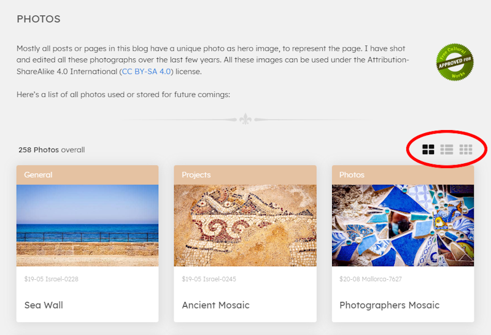

The [**photo section**](/photos) on my blog, the main page of which I have now named COLLECTION, initially only served as an overview of the available or already used hero images for the various pages of the blog, such as posts and others. In the meantime, detailed pages for the individual photos and a world map have been added, in order to follow the IndieWeb idea that I want to publish my photos on my own site with all the information first and then syndicate them on other platforms.

At some point I implemented three different view modes for the photos, more out of a desire to play around than out of necessity: **Grid**, **List** and lastly **Masonry**. Depending on the device class, one mode or the other has its advantages in terms of overview.



What was still missing, however, was the option to filter and/or sort the amount of photos according to their use, as over time there are more rather than fewer and it becomes increasingly difficult to find the image you are looking for. I had already placed 3 icon buttons at the top right-hand corner for the various view modes and was faced with the decision of how to implement further control elements such as drop-down lists or similar. But I didn't want the interface to look like "Your Company's App" at some point, plastered with controls that distract the eye from the photos. Ideas such as folding and unfolding control panels, i.e. hiding the functionality, were also out of the question at second glance. That would only have shifted the problem.

<!-- more -->

---

## Why not a sentence in natural language?

After thinking about it for a while, I realised that I had converted the display of the number of photos as a numeral with text at the top left-hand corner, for instance "289 photos". **Why not take this idea one step further and make a complete sentence out of it** ... like

> 289 photos overall displayed as list sorted by date created descending

or, now with the important information marked ...

> <u>127</u>&nbsp;&nbsp;photos&nbsp;&nbsp;<u>unused</u>&nbsp;&nbsp;displayed as&nbsp;&nbsp;<u>grid</u>&nbsp;&nbsp;sorted by&nbsp;&nbsp;<u style="white-space: nowrap;">date created</u>&nbsp;&nbsp;<u>ascending</u>

or ...

> <u>139</u>&nbsp;&nbsp;photos&nbsp;&nbsp;<u>used</u>&nbsp;&nbsp;<u style="white-space: nowrap;">for posts</u>&nbsp;&nbsp;displayed as&nbsp;&nbsp;<u>masonry</u>&nbsp;&nbsp;sorted by <u style="white-space: nowrap;">file name</u>&nbsp;&nbsp;<u>ascending</u>

Although this sentence is not grammatically correct, it contains all the information that describes the list and that could be adapted dynamically. If you break it down into its components, you get placeholders that can be filled variably:

```txt
[COUNT] photos [FILTER-STATUS] [FILTER-TYPE] displayed as [PRESENTATION] and sorted by [SORT-FIELD] [SORT-ORDER]
```

These placeholders could now not only be used to place a variable value, but some could also be used as direct trigger points for changing the view.

Here a list of all the necessary placeholders with the values they should be able to assume:

- **COUNT** - display only
  Number of filtered photos

- **FILTER-STATUS** - trigger
  Possible values ``overall``, ``unused`` and ``used``

- **FILTER-TYPE** - trigger
  *(only necessary when FILTER-STATUS is set to ``used``)*
  Possible values: ``overall``, ``for posts``, ``for drafts``, ``for notes``, ``for default pages``, ``for dynamic pages``, ``for anything pages`` or ``at start page``

- **PRESENTATION** - trigger
  Possible values: ``list``, ``grid`` or ``masonry``

- **SORT-FIELD**  - trigger
  Possible values: ``file name``, ``title`` or ``date created``

- **SORT-ORDER**  - trigger
  Possible values: ``ascending`` or ``descending``

To make clear that some of the placeholder elements in this sentence are not just for display, but also have a function, I have given them the ``MARK`` tag, which has the nice side effect that the browser takes care of the colour highlighting without any intervention.

These thoughts result in the following HTML framework for the sentence, within a wrapper named ``view-bar``:

```html
<div class="view-bar">
  <span id="view-count">[COUNT]</span> 
  <span>photos</span>
  <span id="view-filter-status">
    <mark>[FILTER-STATUS]</mark>  
  </span>
  <span id="view-filter-type">
    <mark>[FILTER-TYPE]</mark>
  </span>
  <span>displayed as</span>
  <span id="view-presentation">
    <mark>[PRESENTATION]</mark>
  </span>
  <span>sorted by</span>
  <span id="view-sort-field">
    <mark>[SORT-FIELD]</mark>
  </span>
  <span id="view-sort-order">
    <mark>[SORT-ORDER]</mark>
  </span>
</div>
```

**Example:**
<p>
<div class="view-bar">
  <span id="view-count">[COUNT]</span>
  <span>photos</span>
  <span id="view-filter-status">
    <mark>[FILTER-STATUS]</mark>  
  </span>
  <span id="view-filter-type">
    <mark>[FILTER-TYPE]</mark>
  </span>
  <span>displayed as</span>
  <span id="view-presentation">
    <mark>[PRESENTATION]</mark>
  </span>
  <span>sorted by</span>
  <span id="view-sort-field">
    <mark>[SORT-FIELD]</mark>
  </span>
  <span id="view-sort-order">
    <mark>[SORT-ORDER]</mark>
  </span>
</div>
</p>

---

## How to implement the triggers?

The standard control element for selecting from two values in HTML is the checkbox ... ON and OFF, and a matching text label. If there are more, radio buttons or drop-down lists are usually used in forms. But it should not look like a form, so it was out of the question to display one of the above-mentioned control elements in the sentence when clicking or tapping on one of the trigger points. 

It felt most natural to me if the user simply clicked or tapped on the selected placeholder and the next possible value would be selected, displayed and the view of the photos immediately changed accordingly. In other words, a **multi-toggle element**.

It was clear to me that the user would have to interact with elements with more than two options several times to achieve the desired result, but on the one hand this made up for the simplicity of the interaction and on the other hand the selected value should be saved in the browser so that, for example, the favoured presentation could be directly preset when the page is loaded. 

Furthermore, simple toggles in HTML and CSS could also be implemented without JavaScript, but this would not work for multi-Toogle elements with a defined sequence, but I needed JS to save the current value anyway.

---

## First Trigger: Presentation

The following HTML code shows the implementation of the first trigger for the presentation mode, which enables the user to switch between three options: ``list``, ``grid`` and ``masonry``.

```html
<div class="view-bar">
  ...
  <span>displayed as</span>
  <span id="view-presentation">
    
    <input type="radio" checked
           name="view-presentation" 
           id="presentation-grid" 
           data-presentation="grid"
           data-next-presentation="list">
      <label for="presentation-grid" 
             title="Display as list">
        <mark>grid</mark>
      </label>
      <input type="radio" 
             name="view-presentation" 
             id="presentation-list"
             data-presentation="list"
             data-next-presentation="masonry">
      <label for="presentation-list" 
             title="Display as masonry">
        <mark>list</mark>
      </label>
      <input type="radio" 
             name="view-presentation" 
             id="presentation-masonry"
             data-presentation="masonry"
             data-next-presentation="grid">
      <label for="presentation-masonry" 
             title="Display as grid">
        <mark>masonry</mark>
      </label>
  </span>
  ...
</div>
```

The set value is held by a radio element and a toggle group is formed for all radio elements with the same value for the ``name`` attribute. The ``data`` attributes define the current and next value, which is later set via JavaScript by clicking or tapping. The label element linked to the radio holds the text to be displayed in the mark element.

The following CSS code ensures that only the actual text is visible and all auxiliary elements are hidden.

```css
.view-bar input[type=radio] {
  display: none;
}
.view-bar input[name="view-presentation"] + label {
  cursor: pointer;
  display: none;  
}
.view-bar input[name="view-presentation"]:checked + label {
  display: inline-block;
}
```

In the HTML, one of the radio elements of a group is provided with the ``checked`` attribute in order to have a necessary value when loading for the first time. In the script, the selection is later on saved in a cookie, which is read again when the page is reloaded and saved in a global variable called ``currentPresentation``. The trigger for this selection is also bound to the respective click events in the script, whereby the next value to be set is taken from the NEXT data attribute defined in the HTML for the respective element, in this case ``data-next-presentation```.

```js
<script>
  // helper
  function getCookie(name) {
    var v = document.cookie.match('(^|;) ?' + name + '=([^;]*)(;|$)');
    return v ? v[2] : null;
  }
  function setCookie(name, value, days) {
    var d = new Date;
    d.setTime(d.getTime() + 24*60*60*1000*days);
    document.cookie = name + "=" + value + ";path=/;expires=" + d.toGMTString();
  }

  ...

  // preset last value of PRESENTATION from cookie or take the default checked radio from DOM
  let currentPresentation = getCookie("photos-presentation");
  if (!currentPresentation) {
    currentPresentation = 
      document.querySelector("input[name=view-presentation]:checked").getAttribute("data-presentation");
  }

  // Bind click event to PRESENTATION radios
  document.querySelectorAll("input[name=view-presentation]").forEach(element => {
    element.addEventListener("click", (event) => {
      setPresentation(element);
    });
  });

  // method for switching PRESENTATION mode
  function setPresentation(ePresentation) {
    currentPresentation = ePresentation.getAttribute("data-next-presentation");
    setCookie("photos-presentation", currentPresentation, 365);

    setView();
  }

  // general method for setting view
  function setView() {
    
    //... code for changing the view

    // show current PRESENTATION
    document.querySelector("#presentation-" + currentPresentation).checked = true;

  }

  // initial call on load to set view
  setView();

</script>
```

The ``setView`` method is a global function that is called each time one of the triggers involved changes, as in the presentation mode example. Only this function actually changes the view and must therefore also be called when the page is loaded after the triggers have been set and the cookies have been read.

The following codepen interactively shows how this first example with the same code works. I have not included the implementation of the photo list here, as it does not play an important role here.


<p>&nbsp;</p>

---

## Further Triggers: Sort Field and Sort Order

The two other placeholders **SORT-FIELD** and **SORT-ORDER** work in a similar way, so I will omit the illustration of the additional HTML, CSS and JS code here and only provide the extended CodePen. The difference is here that both values are handled in one global variable called ``currentSorting``, because they are mutually dependent, in the sense of: *Tell me which field I should sort in which direction*.


<p>&nbsp;</p>

---

## Final Triggers: Filter Status and Filter Type

Last but not least, **FILTER-STATUS** and **FILTER-TYPE** are not only dependent on each other, but are also nested, as FILTER-TYPE is only required if FILTER-STATUS is set to ``USED``, because it should only be possible to differentiate between the types of used photos in this status.

Another difference between these two and the others is that only these triggers manipulate the length of the list and therefore the COUNT ... and the selected value is not stored in a cookie for later use, but the default is always OVERALL.

The HTML and CSS code to be added in this last step is structured similarly to that for the previous triggers and can be viewed in the final CodePen:



The additional JavaScript code is somewhat more interesting and I will only show the added code here in the listing, otherwise it will be too long:

```js
<script>

  ...

  // preset value for STATUS and TYPE from default checked radio
  let currentStatus =
    document.querySelector("input[name=view-filter-status]:checked").getAttribute("data-status");
  let currentType = 
    document.querySelector("input[name=view-filter-type]:checked").getAttribute("data-type");

  ...

  // Bind click event to STATUS and TYPE radios
  document.querySelectorAll("input[name=view-filter-status]").forEach(element => {
    element.addEventListener("click", (event) => {
      setFilterStatus(element);
    });
  });
  document.querySelectorAll("input[name=view-filter-type]").forEach(element => {
    element.addEventListener("click", (event) => {
      setFilterType(element);
    });
  });

  ...

  // method for switching FILTER STATUS
  function setFilterStatus(eStatus) {
    currentStatus = eStatus.getAttribute("data-next-status");
    if (currentStatus === "all") { // reset TYPE
      currentType = "all";
    }

    setView();
  }

  // method for switching FILTER TYPE
  function setFilterType(eType) {
    currentType = eType.getAttribute("data-next-type");

    setView();
  }

  function setView() {

    //... code for filtering list and changing view

    // show current STATUS + TYPE
    document.querySelector("#filter-status-" + currentStatus).checked = true;
    document.querySelector("#filter-type-" + currentType).checked = true;

    // show or hide the TYPE trigger
    document.getElementById("view-filter-type")
      .style.display = (currentStatus === "used") ? "inline-block" : "none";

    ...
  }  

</script>
```

In addition to the initialisation of the global variables and the click bindings, including the new ``set...`` methods for them, the ``setView()`` method has been extended to display the applied filter and to show or hide the TYPE trigger, which may or may not be necessary depending on the STATUS. In addition, the implementation of the real filter and the fresh of the COUNT must now also be integrated here.

---

## Conclusion

It's a lot of code and I had to refactor it a few times, but I find the result easy to use and visually convincing. However, I'm still not completely satisfied because the UX is suboptimal, especially when clicking through the many FILTER TYPES. Showing a dropdown with all the options would be faster and more pleasant. On my [tools](/tools/tiny-tools) page, I have built [LC-select](https://github.com/LCweb-ita/LC-select) into a trigger, because a multi-selection is necessary there, but the result doesn't really convince me yet and I have to revise it again.

I briefly thought about wrapping the whole thing in a configurable script, as a plugin or even as a web component, but decided against it, because I have everything I need with HTML, CSS and JS and it is easy to maintain and extend. An additional abstraction layer would not make it better, but rather more complicated and less transparent. It would be like so often: The attempt to make the use of a feature easier for yourself and others is paid for at some point with complexity that can hardly be resolved and hours of troubleshooting not on the actual feature but on the tools required for it.

Happy Coding ... :)