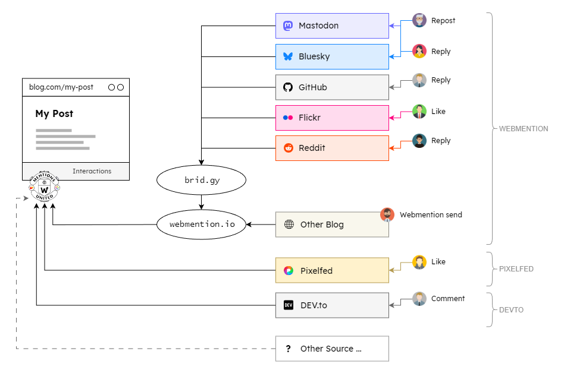

## Perspective


Blogging means putting your own opinion on public display, and of course you hope for reactions to it, otherwise you would rather write your thoughts in a small notebook and hide it in your bedside table. Blog posts are therefore always only the first half of a conversation with fellow human beings, readers, and web users. The other half is made up of reactions or, better yet, interactions. Likes, comments, or links from other bloggers who take up the opinion in their own blog post in order to spread it further or discuss it. A story emerges from these two halves.

<!-- more -->

It seems that blogging is becoming more popular again. After many years of being fenced in by large “opinion corporations”, which made it easy to share information, many people have realized that this simplicity comes at a price, because the opinion itself or even the person was never the focus of interest. The content at the center of the closed networks is monetized or used to manipulate others. Today, blogging is also an expression of the desire for freedom and independence and emancipation from the large social media platforms.

However, this freedom also means that you have to have a fair amount of technical understanding and that linking content is not as easy as on the big platforms, where you just have to be able to use a keyboard. Blogging platforms like Wordpress are certainly a help at this point, but at the end of the day you just have a blog in which you can write down and publish your thoughts in the form of posts, but not automatically a conversation. The most important building block for a real conversation via a blog is the hyperlink, the central element of the World Wide Web. And in contrast to the 2000s, the early days of blogging, today there are a number of ways to communicate via a link and thus to engage in an interaction that goes beyond simply commenting on a blog post.

---

## Interactions

An example: Alice writes a post on her blog...

1. Bob reads it and writes about the topic in his blog, mentioning Alice's post via its URL.
2. Alice posts the URL to her post including the headline on a social web platform like Mastodon. Chris reads the post and puts a Like
3. Daniel replies to and reposts the Mastodon post at the same time
4. Alice syndicates the complete post, including the URL to the original, on a developer platform such as DEV and Eric comments on this post

All of the above interactions originate on Alice's blog, but they take place outside of her system and are not reflected in the original post. Bob would certainly find Eric's comment or Daniel's reply interesting, but he is just as unaware of them as Alice is of Bob's mention on his blog. A list of all interactions from the web is missing at the original post.

The techniques to accomplish all this already exist. They just need to be put into practice:

*on 1:* Bob sends a [webmention](https://en.wikipedia.org/wiki/Webmention) to the endpoint linked by Alice on the post page (e.g. [webmention.io](https://webmention.io/)) and Alice retrieves it there via the API
*on 2 and 3:* Alice has previously set up [brid.gy](https://brid.gy) to also deliver Mastodon interactions to the Webmention endpoint
*on 4:* Alice retrieves the DEV comments via the dedicated API

The interactions from the social web aka [Fediverse](https://en.wikipedia.org/wiki/Fediverse) can already be seen on various blog posts today. They are usually pulled directly from Mastodon's API onto the page. However, this usually neglects one important aspect: the **linking of the self-performed syndication on the original post**, in order to give readers the opportunity to land on an interaction option with just one click!

But how does Alice get the interactions on her page without having to familiarize herself with the respective API's?

She simply uses the client scripts of the **[Mentions United](https://github.com/kristofzerbe/Mentions-United)** project ...

---

## Impetus

Three years ago, I not only introduced Webmentions on this blog and wrote about them [here](https://kiko.io/post/Hexo-and-the-IndieWeb-Receiving-Webmentions/) and [here](https://kiko.io/post/Hexo-and-the-IndieWeb-Sending-Webmentions/), but I also started systematically recording my manual syndications on other platforms and displaying them under the post.
I syndicate text posts on Mastodon and, if the content is suitable, on DEV and photos on Pixelfed, Flickr and a few other (unfortunately) closed platforms. I collected all Webmentions and interactions from Mastodon and Flickr using a combination of Aaron Parecki's [webmention.io](https://webmention.io/) and Ryan Barrett's [brid.gy](https://brid.gy) and brought them to the post page using a client-side JavaScript.

But what was always missing were interactions from other platforms. brid.gy could, in principle, collect likes and comments from Pixelfed, the largest photo platform on the social web, but a few [bugs](https://github.com/snarfed/bridgy/issues/927) that have been known about for four years on the platform prevent this.

Now, I'm not the most patient person, and since there was no response even after repeated inquiries in the Pixelfed issue, and it would only have solved one problem for me anyway, I thought to myself: then I'll just build something myself that is able to pick up interactions from all possible APIs and insert them into my post pages.

---

## Project &laquo;Mentions United&raquo;

As Robb Knight said about his [EchoFeed](https://echofeed.app/):

> Naming things is hard, leave me alone.

The functionality and structure of the solution were easier to define. On the one hand, it was to be a **pure client JavaScript application** that runs in the browser on the page to ensure that the data is always up to date and that withdrawn interactions are not taken into account. On the other hand, a **plugin system** should only ever execute the scripts that are needed.

The project therefore consists of a main script of only 7 KB and two types of plug-in scripts:

- **Provider plugins** to retrieve person-related interaction data and put it into a common form

- **Renderer plugins** to transform the collected data into HTML and insert it into the page

The **main script** (``mentions-united.js``) implements following relevant methods:

- **register(plugin)** - Registers a plugin script for execution 
- **load()** - Executes the ``retrieve()`` method in all registered provider plugins, which collects the data from the respective APIs
- **show()** - Executes the ``render(interactions)`` method in all registered renderer plugins, which converts the merged data into HTML and inserts it

Further explanations of how the solution is structured can be found in the README of the [GitHub repo](https://github.com/kristofzerbe/Mentions-United).

### Available plugins

The initially developed plugins naturally cover my needs for this blog, but it would be great if over time more from the developer community would be added. I will contribute native provider plugins for Mastodon and Flickr in the next few weeks to reduce the current dependence on brid.gy, where it is no longer necessary.

- Provider-Plugin **Webmentions** (``mentions-united-provider_webmentions.js``)
  Get all interactions from the webmention.io API via the URL of the blog post (target), be they real webmentions or interactions from the platforms Mastodon, Bluesky, GitHub, Flickr and others that have been integrated via brid.gy

- Provider-Plugin **Pixelfed** (``mentions-united-provider_pixelfed.js``)
  Get all interactions from the API of a Pixelfed instance via the syndication URL (source). In the passed options, you can also specify an API proxy URL to prevent the key necessary for the retrieval from being publicly available.

- Provider-Plugin **DEV.to** (``mentions-united-provider_devto.js``)
  Get all comments from the DEV API via the syndication URL



Once all the interactions have been collected, the renderer plugins can integrate them into the page in different ways. It is important to note that the solution outputs **pure HTML without any styles**, because these are very individual after all.

- Renderer-Plugin **List** (``mentions-united-renderer_list.js``)
  Generates a descending sorted list of all interactions

- Renderer-Plugin **Avatars by Type** (``mentions-united-renderer_avatars-by-type.js``)
  Generates an inline list of avatars for all interactions of a given type, for example Likes

- Renderer-Plugin **Total Number** (``mentions-united-renderer_total-number.js``)
  Creates an anchor with the number of interactions

Additional information about the plugins, the options and many more details can be found on the [GitHub repository](https://github.com/kristofzerbe/Mentions-United) for the project.

### Usage on this site

This is what the somewhat slimmed-down implementation on kiko.io, which is based on the SSG [Hexo](https://hexo.io/), looks like...

Hexo uses [Markdown](https://en.wikipedia.org/wiki/Markdown) files with metadata in [Front Matter](https://hexo.io/docs/front-matter) format for the posts. In addition to the classics such as ``title`` und ``date`` and others, this includes a list called ``syndication`` containing all URLs with hostnames on which the post has been manually syndicated, for example:

```yaml
---
title: "Batman Comics with pure CSS"
date: 2024-07-11
syndication:
  - host: Mastodon
    url: https://indieweb.social/@kiko/112767128980027149
  - host: DevTo
    url: https://dev.to/kristofzerbe/batman-comics-with-pure-css-5ggk
---
```

The transformation of Markdown into HTML of the posts is based on [EJS](https://ejs.co/). Each post type has its own template file, but all include a common EJS file for the interactions. This file processes the syndication data of the post and uses the Mentions United scripts to determine and display the corresponding interactions from the API targets.

First, it is determined whether other Provider scripts are required for this post in addition to the default "Webmention", which we be loaded for all posts:

```js
<%
  let syndications = post.syndication?.filter(s => s.url?.length > 0 && s.host?.length > 0);

  let synDevTo = syndications?.find(s => s.host.toLowerCase() === "devto");
  let synPixelfed = syndications?.find(s => s.host.toLowerCase() === "pixelfed");
%>
```

In an HTML block, the placeholders to be replaced by the Renderer plugins are defined and the **Mentions United** scripts are loaded on the spot, but some provider plugins only if this is necessary due to the syndication data:

```ejs
<div id="interactions" class="article-interactions">
  <h2>Interactions</h2>
  
  <div class="message loading">Loading</div>

  <div id="interactions-likes-placeholder"></div>
  <div id="interactions-reposts-placeholder"></div>
  <div id="interactions-list-placeholder"></div>

  <%- js('js/mentions-united.js') %>

  <%- js('js/mentions-united-provider_webmentions.js') %>
  <% if (synDevTo) { %><%- js('js/mentions-united-provider_devto.js'); %><% } %>
  <% if (synPixelfed) { %><%- js('js/mentions-united-provider_pixelfed.js'); %><% } %>

  <%- js('js/mentions-united-renderer_avatars-by-type.js') %>
  <%- js('js/mentions-united-renderer_list.js') %>
<div>  
```

In the following script block, the main script of **Mentions United** is initialized with the settings and an array of those plugins that are to be registered right away. Afterwards, the plugins that are additionally required for this article are registered individually. Finally, the main method ``load`` is called up first and then ``show``, which inserts the fetched interactions into the page. At the end, the loading message on the page is adjusted or deleted depending on the result.

```html
<script>
window.addEventListener('load', function () {

  // initialize main script with settings and some plugins needed anyway
  const mentionsUnited = new MentionsUnited({
    ownerName: "<%- config.author %>"
  },
  [
    new MentionsUnitedProvider_Webmentions({
      targetUrl: "<%- post.permalink %>",
      tryResolveTitle: true
    }),  
    new MentionsUnitedRenderer_AvatarsByType({
      placeholderId: "interactions-likes-placeholder",
      typeVerb: "like"
    }),
    new MentionsUnitedRenderer_AvatarsByType({
      placeholderId: "interactions-reposts-placeholder",
      typeVerb: "repost"
    }),
    new MentionsUnitedRenderer_List({
      placeholderId: "interactions-list-placeholder",
      skipTypes: "like,repost"
    })
  ]);

  // register plugins individually, if necessary for this post
  <% if (synDevTo) { %>
  mentionsUnited.register(new MentionsUnitedProvider_DevTo({
    sourceUrl: "<%- synDevTo.url %>"
  }));
  <% } %>

  <% if (synPixelfed) { %>
  mentionsUnited.register(new MentionsUnitedProvider_Pixelfed({
    sourceUrl: "<%- synPixelfed.url %>",
    apiBaseUrl: "<%- config.api-proxy-base-url %>/pixelfed"
  }));
  <% } %>

  // retrieve and insert Interactions and change message afterwards
  mentionsUnited.load()
    .then(() => {
      return mentionsUnited.show();
    })
    .then((count) => {
      let msg = document.querySelector(".article-interactions .message");
      if (count === 0) {
        msg.classList.remove("loading");
        msg.innerHTML = "No interactions yet";
      } else {
        msg.remove();
      }
    });
    
});
</script>
```

If this post has already resulted in an interaction, an example can be seen directly under this article ...

--- 


url: https://github.com/kristofzerbe/Mentions-United
title: "GitHub - Mentions-United"
description: "Client-side retrieving and rendering of interactions from the web"
host: github.com
favicon: https://github.githubassets.com/favicons/favicon.svg
image: https://opengraph.githubassets.com/0fe9e95a6f88c32b45c88b5975b2c30fae6804c682e40d432d1bc3762d7bf293/kristofzerbe/Mentions-United


<br>