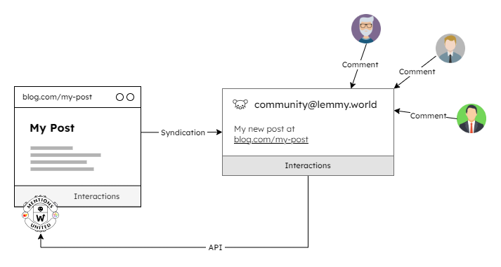
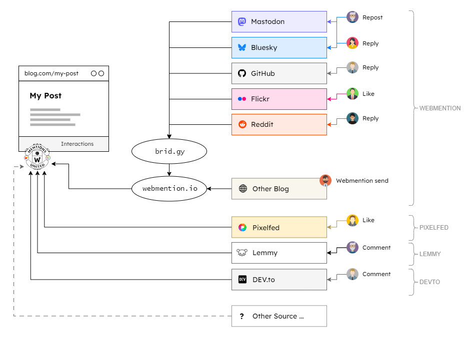

After I recently [dived into the Lemmy world](/post/Diving-Into-the-World-of-Lemmy/) and found out which API route I needed for a Lemmy integration as a [Mentions United Provider Plugin](https://github.com/kristofzerbe/Mentions-United?tab=readme-ov-file#provider-plugins), the rest was no longer particularly difficult, because the data is very heavy due to many redundancies, but easy to process. So my new plugin is ready and running on this blog to display Lemmy interactions ...

<!-- more -->

I decided not to use the thread view as Lemmy has done, as you can quickly reach the limits of readability with very convoluted comments, especially on a smartphone. I rely on a chronological display of comments, which in my opinion is just as clear and catchy. However, where I saw problems was in the mix of different interaction origins. If there are several syndications for a post, for example one on Mastodon and two in different Lemmy communities, and the comments and replies to them happen at different times, the overview is ruined again because it's not clear which comment was replied to in a purely chronological order. For this reason, there is also a new renderer plugin called “Grouplist by Origin”, which is able to group the interactions according to the actual syndications. But more on that later.


If you don't know what this is all about, I recommend the article [**Mentions United ... 3, 2, 1, Go**](/post/Mentions-United-3-2-1-go/), in which I describe what Mentions United actually is and what you can use it for.


---

## Provider: Lemmy



The new provider plugin for Lemmy largely corresponds to the [Provider Sample](https://github.com/kristofzerbe/Mentions-United/blob/main/mentions-united-provider_SAMPLE.js), except for the fact that an incoming option is called ``syndicationCommunity`` instead of ``syndicationTitle`` to make it clear what belongs here, but it is then stored again in the new syndication title (see below).

The usage here on kiko.io is a little bit different than described in my initial post, because I expect to syndicate posts to multiple Lemmy communities. That's why my frontmatter looks like this, for example:

```yaml
---
title: "Diving-Into-the-World-of-Lemmy"
date: 2024-10-26
syndication:
  - host: Mastodon
    url: https://indieweb.social/@kiko/113378863170909812
  - host: Lemmy
    title: Lemmy
    url: https://programming.dev/post/21031156
  - host: Lemmy
    title: Programming.dev Meta
    url: https://programming.dev/post/21031933
---
```

The title of the Lemmy syndication contains the name of the community so that the two can be distinguished later.

In the calling code, I therefore do not search for a Lemmy entry in the syndication list, but I filter:

```js
let synLemmy = syndications?.filter(s => s.host.toLowerCase() === "lemmy");
```

With the array provided, I decide whether the plugin should be loaded...

```ejs
  <% if (synLemmy?.length > 0) { %>
    <%- js('js/mentions-united-provider_lemmy.js'); %>
  <% } %>
```

... and register it once for each entry:

```ejs
<script>
window.addEventListener('load', function () {

  const mentionsUnited = new MentionsUnited({ ... });

  <% synLemmy?.forEach(syn => { %>
  mentionsUnited.register(new MentionsUnitedProvider_Lemmy({ 
    syndicationUrl: "<%- syn.url %>",
    syndicationCommunity: "<%- syn.title %>"
  }));
  <% }); %>
}
```


You can find the full code on how I integrated Mentions United here on my Hexo-powered blog on GitHub in the template file 
[**interactions.ejs**](https://github.com/kristofzerbe/kiko.io/blob/master/themes/landscape/layout/_partial/post/interaction.ejs)


---

## Renderer: Grouplist by Origin

The new renderer plugin is 80% based on the already existing **List** plugin, the only difference is that it divides the interactions according to their origin of the syndication. The generated HTML of the individual interactions is identical, except that there is not just one list but several and an ``H3`` heading has been added as the first element within the list. The new renderer is now also the standard for displaying interactions here on kiko.io, so I do not need to provide an example here.

The grouping of interactions is done in the plugin itself and is based on the origin of the interaction (``source.origin``) and on the title of the syndication (``syndication.title``), if there is one. The latter has been introduced in the latest versions of the plugins and is set to the name of the community in the new Lemmy plugin. In addition to the title, the original syndication url is now also available for display in the new ``syndication`` object if needed.

---

## Conclusion and things to come

Now that I have the Lemmy comments in my posts, I want to write a native Mastodon plugin, because currently these interactions, like some others, come indirectly via brid.gy. The goal is to have a native Mentions United plugin for all brid.gy providers to minimize dependencies. The graphical overview is now as follows:



Does anyone want to connect more providers?
