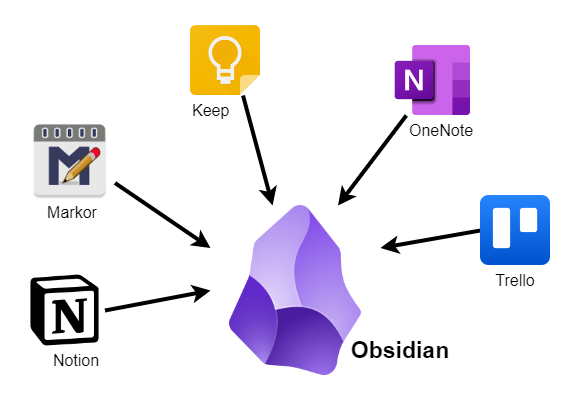

The best ideas always come to you at the most inopportune moments and places. Whereas you used to grab a piece of paper and try to capture the idea in illegible handwriting, today it is often a mobile app or a desktop application into which you hammer the most important key points. This change has advantages, as not a single tree needs to be chopped down for the many ideas that are produced every day and the digital scraps of ideas can later be changed, refined, formatted and processed in other ways very easily. But it also has disadvantages, because the range of digital helpers is so large that you always have the feeling you've backed the wrong horse. One app can do this, but not that, while another can do that, but is only available in the cloud, where you don't know who is reading what, and the third can do all that, but is only available with an expensive subscription. There's always something. Paper, on the other hand, is always paper...

Even though I still do a lot of handwriting on paper, simply because it is often much quicker, I have acquired an amazing zoo of different digital helpers in recent years (I work in IT anyway), all of which have a specific purpose but are more or less not interoperable with each other. This is on the one hand because a suitable tool for me is not available for a different device class or operating system and on the other, because the objectives of the tools differ, as you not only have ideas that you want to capture in text, but also have to deal with tasks, collections of links, research texts, code snippets and the like.

<!-- more -->

One of my central tools so far has been **Trello**, in which I have collected and managed links and tasks on dozens of boards. For example, some columns of my [COLLECTION board](https://trello.com/b/D6zIhLus/collections) are used for the automated creation of my tools section and for the recurring [Discovery posts](https://kiko.io/series/discoveries/) here on kiko.io. While some to-do's could still be managed in Trello, this was rather inconvenient for simple tasks and so I tended to use **Google Keep** for such things, because I could also share individual task notes with other people there.

For bookmarking in Trello, I had created bookmarklet shortcuts, which worked well for individual links, but quickly turned into a clicking orgy for several dozen. Enriching the links with descriptions and images was also a diligent work that I put up with, but it was still annoying.

As it was not possible to map larger research projects or ideas with Trello, I initially used **OneNote** and later **Notion**, as these tools have very good simplified text editors and it is possible to write in a structured way. I had a lot of fun with Notion in particular for a while, until I tried to use it as an editor for the drafts and articles of my blog. In contrast to my Hexo-driven blog, Notion is not file-based but cloud-based and offers hardly any options for integrating a third-party Markdown structure. However, a blog based on an SSG is based on a lot of individual Markdown files that need to be edited.

I didn't need to look for a solution for my Windows machines because I have my favourite IDE **Visual Studio Code**, which is of course also excellent for writing Markdown. On my smartphone and tablet running Android, however, it was a challenge to find the right one. It's really amazing how rare good editors are on Android! The most suitable solution for writing my articles there was the app [**Markor**](https://play.google.com/store/apps/details?id=net.gsantner.markor). As all of my blog's sources are stored on **OneDrive** anyway and are therefore always available on all machines, I used [**OneSync**](https://play.google.com/store/apps/details?id=com.ttxapps.onesyncv2) on Android to synchronise at least the posts and drafts, which I could then edit with Markor. To create new articles, I also synchronised the Hexo Scaffolds and integrated them into Markor as templates. Unfortunately, the app takes some getting used to and so does its developer, who doesn't feel like interacting with his users in a sensible way, but the whole thing worked reasonably well.

---

## The Eureka Moment

I stumbled across the Notion alternative **Obsidian** at some point, but didn't pay any further attention to it, assuming it was just another one of the cloud-based note-taking tools that were sprouting up like mushrooms on every corner for a while. Notion, Confluence ... all the same, only the corporations and the subscription models behind them are different. I didn't get beyond the start page with the marketing slogans back then.

However, this changed when I read an article by Rob Knight about his approach to giving his digital life a new structure. The idea fascinated me (but more about that in a later post...) and I started to do some research. Many sources on the subject mentioned Obsidian and I started to look more closely at the tool and its possibilities.

One eye-opener was that Obsidian is by no means one of the above-mentioned cloud tools with login and synchronisation on computers I didn't know, but works with a **local file structure** that can be synchronised with on-board tools, but not necessarily. A so-called Obsidian Vault is nothing more than a folder on the hard drive in which everything else is stored. In my case, this meant that I could also create such a folder under my OneDrive folder and everything would be synchronised to all machines as usual!


"*Microsoft OneDrive ... uuhhh*", some people may think, and they could even be right, but in order to be able to work in a distributed way, you have to, as they say, die a death. So far, I haven't regretted my [switch from Dropbox to OneDrive](https://kiko.io/post/Thanks-Dropbox-but-I-m-off/), because Microsoft is doing everything right for Windows users in terms of functionality and stability.


## Replacement of Markor

Thanks to the local Vault and the tool's really good Markdown editor, which works excellently both on the desktop under Windows and on mobile under Android, it was really easy for me to get rid of my Markor workaround. The posts and drafts of my blog project are immediately synchronised within the OneDrive folder structure to the Vault and back on one of my stationary machines using [**SyncBackPro**](https://www.2brightsparks.com/syncback/sbpro.html) when changes are made. It seemed pointless to include the entire project with all node modules and JavaScript files in the Vault, because I only want to have in Obsidian what I need for writing. 

As it is possible to work with templates in Obsidian, I was able to reuse Hexo's Scaffolds directly. The only difference now is, that I first create an empty file in the appropriate folder in Obsidian and then apply the template to this file.

---

## Transfer of Notion data

The two note-taking apps Obsidian and Notion are of course similar in their objectives, but have different concepts. In Obsidian, for example, a folder is just a folder. If you are used to a folder also being a note in Notion or Confluence, you need to adjust a little ... or you can use the community plugin **Folder Note** to get back the familiar behaviour. The most practical option here is to set the plugin options to ``Folder Name Inside``, which means that when you click on a folder in Obsidian Explorer, an MD file with the same name inside the folder is displayed.


url: https://github.com/xpgo/obsidian-folder-note-plugin
host: github.com
title: "GitHub - xpgo/obsidian-folder-note-plugin"
description: "Plugin to add description note to a folder for Obsidian. - xpgo/obsidian-folder-note-plugin"
favicon: https://github.githubassets.com/favicons/favicon.svg
image: https://opengraph.githubassets.com/5e0f517b4ff09bac8ca606e448e3a7dab3baba9a3928e9e6c1e2ec6a21e8619f/xpgo/obsidian-folder-note-plugin


The **Note Folder Autorename** plugin is also a very valuable aid in this context, ensuring that a folder is automatically renamed as soon as the title of the Folder Note changes in order to keep both synchronised.


url: https://github.com/pjeby/note-folder-autorename
title: "GitHub - pjeby/note-folder-autorename"
description: "Obsidian plugin to support folder-overview notes by keeping their folder in sync - pjeby/note-folder-autorename"
host: github.com
favicon: https://github.githubassets.com/favicons/favicon.svg
image: https://repository-images.githubusercontent.com/335475050/077f0300-659c-11eb-85b8-a2e26539c9ab


Transferring my Notion data was not a big deal, because on the one hand it wasn't much and on the other hand there is a plugin called **Importer** that is able to process Notion export files, among other formats. With a little rework and the help of **Folder Note**, the look and feel is now almost the same for me in Obsidian.


url: https://github.com/obsidianmd/obsidian-importer
title: "GitHub - obsidianmd/obsidian-importer"
description: "Obsidian Importer lets you import notes from other apps and file formats into your Obsidian vault. - obsidianmd/obsidian-importer"
host: github.com
favicon: https://github.githubassets.com/favicons/favicon.svg
image: https://repository-images.githubusercontent.com/665163927/d617698b-1fc2-4353-81f8-9e346134853e


As I have used almost no databases in Notion, I can't say much about importing them, but I have become aware of two plugins that offer similar functionality in Obsidian: [Database Folder](https://github.com/RafaelGB/obsidian-db-folder) and [DataLoom](https://github.com/trey-wallis/obsidian-dataloom). Will have to give them a try ...

---

