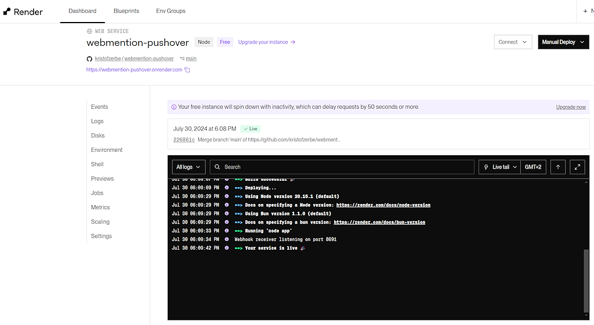

If you offer [Webmentions](https://indieweb.org/Webmention) on your website, i.e. the option of being notified via a link on another website, it is advisable to keep an eye on the incoming mentions. Otherwise, it is all too easy for a page to become a spam sling if you [automatically display](https://kiko.io/post/Hexo-and-the-IndieWeb-Receiving-Webmentions/) the incoming messages under an article, as I do using JavaScript.

Such a moderation is not quite simple with static pages, because you cannot receive the mentions yourself, due to the lack of a reactive component on the web server, but need a service such as **[webmention.io](https://webmention.io)** to do this. There, on the dashboard, you can view the list of mentions, delete unwelcome ones and also block entire domains for the future.

The only problem is: How do you get **notified promptly** that a mention has been received? Checking the dashboard every few days or going through your own posts regularly is not really an option. But we all carry our **smartphone** with us all the time and it constantly notifies us of new emails, signal messages and the like. Perfect ...

<!-- more -->

---

## The Trigger

When developing webmention.io, [Aaron Parecki](https://aaronparecki.com/) kindly thought of implementing a **[Webhook](https://en.m.wikipedia.org/wiki/Webhook)** that posts every incoming mention as JSON to a configurable URL for the site. Here is his example JSON, grabbed from https://webmention.io/settings/webhooks:

```json
{
  "secret": "1234abcd",
  "source": "http://rhiaro.co.uk/2015/11/1446953889",
  "target": "http://aaronparecki.com/notes/2015/11/07/4/indiewebcamp",
  "post": {
    "type": "entry",
    "author": {
      "name": "Amy Guy",
      "photo": "http://webmention.io/avatar/rhiaro.co.uk/829d3f6e7083d7ee8bd7b20363da84d88ce5b4ce094f78fd1b27d8d3dc42560e.png",
      "url": "http://rhiaro.co.uk/about#me"
    },
    "url": "http://rhiaro.co.uk/2015/11/1446953889",
    "published": "2015-11-08T03:38:09+00:00",
    "name": "repost of http://aaronparecki.com/notes/2015/11/07/4/indiewebcamp",
    "repost-of": "http://aaronparecki.com/notes/2015/11/07/4/indiewebcamp",
    "wm-property": "repost-of"
  }
}
```

For this webhook, all you need is a permanently available recipient who transforms the JSON of the mention into a message for the smartphone.

---

## The Receiver

Classic webhook targets are tools such as IFTTT or Zapier, in which the received data can be converted into any other action as a trigger. However, I have been using a different solution for many years, partly because the former have become too complex and expensive for me ... [**Pushover**](https://pushover.net). 

However, this app for Android and iOS is designed solely for sending **push notifications** to smartphones. You can connect the above-mentioned services (the [list of integrations](https://pushover.net/apps) is quite long), use the built-in mail service or create something yourself using the API, which in the case of the webmention.io hook is both necessary and fairly simple.

Pushover requires registration and a fee for the app, but this is only a one-time charge of $5 USD per device class (e.g. Android) and is well invested. The standard plan allows you to send 10,000 messages per month, which should be sufficient in most cases.

After registering, you can create applications in the dashboard for which you can obtain the necessary API key and which are independent of the devices on which you want to receive the push messages afterwards.


---

## The Transformer

The aim of the custom development is to build a small **Web Service** that listens for a webhook (POST request) on a dedicated URL, transforms the incoming data into a Pushover message and sends it to the Pushover API in order to trigger a notification on the smartphone.

The choice of the environment was easy: **Node JS**. I'm a JavaScript aficionado. The basic framework of the web service is pretty straightforward and can be found in many [beginner's tutorial](https://reintech.io/blog/how-to-use-node-js-to-create-a-webhook-receiver):

```js app.js
const express = require('express');

const app = express();
const PORT = process.env.PORT || 3000;

app.use(express.json()); //transform payload into JSON

app.post('/webhook', (req, res) => {

  //do something with data in req.body

  res.status(200).send('OK'); //confirm receipt
});

app.listen(PORT, () => {
  console.log(`Webhook receiver listening on port ${PORT}`);
});
```

The ``webhook`` endpoint listens for incoming POST requests, processes the JSON data and sends a confirmation back to the sender. I will skip the complete implementation here, as I have made it **available as a project on GitHub**:



url: https://github.com/kristofzerbe/webmention-pushover
title: "GitHub - kristofzerbe/webmention-pushover"
description: "Contribute to kristofzerbe/webmention-pushover development by creating an account on GitHub."
host: github.com
favicon: https://github.githubassets.com/favicons/favicon.svg
image: https://opengraph.githubassets.com/de281d90ea17441cff4185f795fb1f139193861a673c654cc3e8695ae29adfb0/kristofzerbe/webmention-pushover


In the following I describe how you can easily get the service up and running from GitHub, so it is recommended to **fork** the project, because you will need to make a few adjustments to make it work for your website.

### Adjustments

All user-defined parameters are stored in an environment file called ``.env``. This includes the **webhook secret**, an arbitrary character string that must be entered in webmention.io and is cross-checked in the code, and the **Pushover User Key** and the **Pushover API Key** (Token), so that the service knows who is currently sending a message for which registered application and that you get from Pushover:

```txt .env
PORT=1234
WEBHOOK_SECRET=xxx
PUSHOVER_USER=yyy
PUSHOVER_TOKEN=zzz
```

``xxx``, ``yyy`` and ``zzz`` must of course be replaced by your values. You can also specify a different port here under which the service can later be reached internally on the server, but this does not really matter in live operating mode.

### Test

The service is started via the command ``node app`` or ``node app.js``.

As it is an API web service that speaks JSON, basically any REST-capable client such as Postman is suitable for testing. I use the plugin [REST Client](https://marketplace.visualstudio.com/items?itemName=humao.rest-client) from Huachao Mao in my favourite IDE **Visual Studio Code**. I just need a suitable ``.http`` file and can start the test against the running server within the project with a hotkey. Here is the one I use to test the webhook of a deleted mention and whose payload again comes from Aaron's example:

```http test/deleted.http
POST http://localhost:1234/webhook
content-type: application/json

{
  "secret": "8eXANPkiUw4OpVqZRMkSeOn4hipPa7",
  "source": "http://rhiaro.co.uk/2015/11/1446953889",
  "target": "http://aaronparecki.com/notes/2015/11/07/4/indiewebcamp",
  "deleted": true
}
```

Here is the output in the command line... :


... and the result on the smartphone via Pushover app:


---

## The Hosting

The 72 lines of NodeJS code of the webmention-pushover service now need to be installed and hosted in a central location, accessible from anywhere on the Internet. The simplest and cheapest, because it is free, option is **[Render](https://render.com)**. Installation and deployment is foolproof, to say the least, because you simply link your GitHub project, configure the service and Render does the rest, such as automatically deploying new versions. Commit and forget ... 

Yogesh Chavan has written a really helpful guide on freecodecamp.org: [How to Deploy Your Node.js Application for Free with Render](https://www.freecodecamp.org/news/how-to-deploy-nodejs-application-with-render/)

In our case, only two values need to be adjusted in the settings:

| Setting       | Value       |
| ------------- | ----------- |
| Build Command | npm install |
| Start Command | node app    |

When the web service is installed, it is automatically assigned a URL by Render. In my case, this is ``https://webmention-pushover.onrender.com``. If you like, you can also redirect this to your own domain via *Custom Domains* in the settings.

The logs in the dashboard are quite helpful to see what the service is doing:



Free services are spinned off by Render after a certain period of inactivity and with the next incoming request it takes a few seconds until it is back, but this is no problem for webmention.io.

---

## The Linking

The last step is now to link the running webhook transformation service to webmention.io. 

All you have to do is to enter the new service URL, **including the endpoint ``/webhook``**, and the previously created WEBHOOK_SECRET into the Web Hook settings of webmention.io:


---

## Conclusion

The process is very simple in general ...


All you have to do afterwards is remove the one or other webmention that you are notified about and do not want on your site via the webmention.io dashboard and, if necessary, block an entire domain.

If you have any questions, please do not hesitate to ask me. Happy mentioning ;)

---

## More Info


