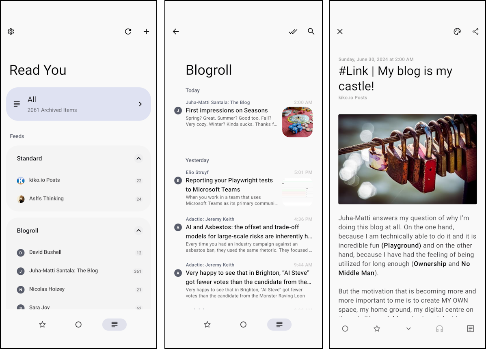

Since the [forced demise](https://killedbygoogle.com/) of [Google Reader](https://en.wikipedia.org/wiki/Google_Reader) in 2013, I have been reading my subscribed feeds in [Feedly](https://feedly.com/). This reader is available as an Android app as well as a web version, but my reading habits are limited exclusively to my Pixel 8 smartphone and I'm actually quite happy with the range of functions and the UI of Feedly, although I notice things in every app that could be done better.

My latest tinkering here on my blog is my [Blogroll](/blogroll), which I recently expanded to include a corresponding OPML file so that everyone can quickly import the feeds of the bloggers presented here into their reader in one go. Of course I did a little research on Google. Where else. About the OPML format itself, best practices, etc. and of course Aunt Google then showed me more content in the news that was about RSS feeds and the like. What else. Three cheers for machine learning and the I-know-What-You-Want-To-Read-Now algorithms.

However, I was quite grateful to see a post from [Caschy](https://stadt-bremerhaven.de/read-you-rss-reader-fuer-android-open-source-kostenlos/) (German tech blog), as it was about a fairly new feed reader called [**Read You**](https://github.com/Ashinch/ReadYou) ... and I took a closer look at the thing.

<!-- more -->

## Simple, Clean & Open Source

The app is only available for Android phones and uses Google's own design pattern [Material You](https://m3.material.io/) ... hence the name ... and therefore fits in wonderfully with the look and feel of my Pixel, for example.

The Open Source project behind the app, which is mainly maintained by GitHub user Ash/Ashinch from Shanghai and hosted there, is currently available in the very small version 0.10.1 (June 2024), but the range of functions is already considerable:

* Subscribe to feed links
* Import from OPML
* Export as OPML
* Article synchronisation
* Notification when an article is updated
* Retrieve entire content
* Filter unread and marked
* Feed groups
* Localisation
* Search for articles

Since **Read You** doesn't seem to be mature enough for the PlayStore yet or Ash wants to save himself the hassle of publishing, you can either download it as an APK from the GitHub release pages or via F-Droid. Of course, as a user, you'll be visibly foregoing the otherwise obligatory security checks of the PlayStore, but at least the source code is available and verifiable.

What is really impressive for such a new product is, that it already supports 25 languages and a further 11 are currently in the process of being added. The roadmap for integrating third-party APIs as data sources is also ambitious and I am of course primarily interested in Feedly, but FreshRSS, for example, is already included.

What I like most is the customisability of the UI in terms of fonts, alignment, borders and the like. The idea of pseudo-endless scrolling in the form of the "Pull to Switch Article" function is also fun and a wonderful shift away from classic left-right swiping.

I think Ash and the notable number of 92 contributors are on the right path with **Read You** and a few more features and I'm considering switching over from Feedly completely.


url: https://github.com/Ashinch/ReadYou
title: "GitHub - Ashinch/ReadYou: An Android RSS reader presented in Material You style."
description: "An Android RSS reader presented in Material You style. - Ashinch/ReadYou"
host: github.com
favicon: https://github.githubassets.com/favicons/favicon.svg
image: https://repository-images.githubusercontent.com/464981831/c42423eb-77b8-4260-8d6f-c916f6c4df99


---

## More Info


