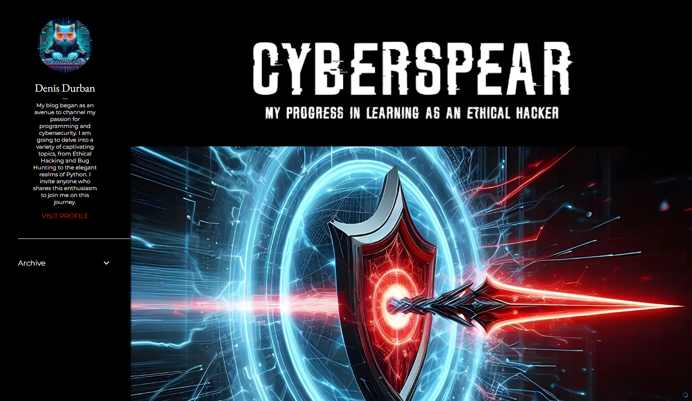

My wife is a childcare worker and looked after a small number of the Wiesbaden-based dwarfs aged 1 to 3 until 2022 with some very nice people, all of whom I had the honour of getting to know. Although almost all the staff from back then (like my wife) have since moved to another workplace, we are still in good contact with some of them. This includes **Denis Durban**, a very interesting man in his mid-thirties with Russian roots, Korean relatives and a big heart, which is probably why he landed in childcare.

In Germany, and probably in many other countries too, it is common practice to give jobs that deal with dead things such as money, machines and the like not only a higher social status but also a significantly higher salary, whereas all jobs that centre around people are given very poor attention. You really have to want to be a nurse, geriatric nurse or child carer and be willing to accept the poor pay and conditions. I don't know why this is the case, but when my wife or Denis talk about their daily struggles with facility management, colleagues, parents and also children and I realise what salary levels they are in, I feel pity and sometimes also anger. So it's no coincidence that in this job not only the sickness rate but also the staff turnover is immensely high. The fact that hardly anyone wants to do this under these circumstances means that you can quit your job at any time as a childcare worker, for example, because you'll have a new one the next day anyway, as ALL organisations are desperately looking for skilled staff. 

However, many turn their backs on the industry out of frustration and look for a new professional field. So I didn't find it surprising that Denis told me at some point that he was fed up and wanted to give his second passion, IT, more room in his life and perhaps turn it into a career. He asked me for advice on the best direction to take, because he knew that I'd already been in IT for decades and hadn't intended to do so from the start. I'm an industrial clerk by background and in the 90s, a time of massive IT growth, I slipped in front of a monitor (still amber-coloured at the time) without much prior knowledge and simply stayed.

<!-- more -->

Whereas 30 years ago IT was just "something to do with computers" and the density of generalists was relatively high, the job profile today is of course much more diversified. Specialisation is the norm and you're lucky if a React developer knows what a Stack or a Heap is. The number of abstraction layers has increased so much in recent decades that it no longer seems necessary for a web front-end developer to know how a CPU works, even if it would often be better. Especially in JS platform development, you can see how little some people know about HTML and I think that's frightening. On the other hand, as an old dog, I can hardly keep up when it comes to AI and other contemporary topics. 

So when I spoke to Denis, I was careful not to give him a "tip" on which direction he should go in IT, but simply told him about my passion for web front-ends (which in retrospect seemed quite manipulative to me) and tried to explain the basic mechanisms to him. In my opinion, success in IT does not depend on the knowledge you already have, but on your willingness to hammer new things into your head as quickly as possible, because the half-life of what you have learnt is pretty damn short. The time intervals in which frameworks or patterns see the light of day, are first hyped by the community and then by the industry, only to disappear from the picture again, can sometimes only be measured in months. It is therefore understandable that traditionally staid teaching institutions such as universities struggle to stay on the ball and it often happens that cheeky students have to show their teachers what's hot and how to deal with it. The drive to learn new things independently, whether through books or try-and-error, is therefore a basic requirement for the profession of an "IT'ler", regardless of specialisation. 

> Success in IT does not depend on the knowledge you already have, but on your willingness to hammer new things into your head as quickly as possible.

And it was precisely this drive that I felt in Denis back then. In the meantime, however, you can hardly call it drive anymore, because he is on fire for what he is currently working on. Interestingly, he didn't follow the path of Web UI's that I described to him so floridly and enthusiastically, but instead found his own niche and dedicated himself to Ethical Hacking. A damn interesting and, in my opinion, promising choice. In the meantime, we meet without the girls, because once we get going and start talking about IT, it quickly becomes boring for others at the table and we have to rein ourselves in. Last time we only had two glasses of Guinness between us and the gleam in his eyes as he talked about hacking the [Hack-The-Box](https://www.hackthebox.com/) practice machines was catching, even though some of it was beyond my technical horizons. At one point I mentioned how useful it would be if he blogged about his experiences and the progress of his online courses and he responded along the lines of " Hold My Beer". A few days later he came around the corner with his blog **[Cyberspear](https://cyberspear.blogspot.com/)** and posts updates every few days. Wow...!

These types of actions and the fact that he is not afraid to ask questions, which I am happy to answer (if I am able to), make me realise that he is not only serious about IT, but that he has exactly the commitment and willingness to learn that is needed in IT today as it was back then. As a team lead, I all too often experience that a dozen experienced senior developers would rather look at their fingernails than get involved in discussions and things are programmed incorrectly because someone either didn't listen or was too polite to ask questions when something wasn't understood straight away. That drives me crazy as a manager! As an employee, you don't always have to be at the forefront (like me, for example - I hate silence and ringing phones), but getting involved is actually a duty, as long as there is a healthy error culture and there are no stupid questions, only stupid answers. 

I'm not worried about Denis and every employer can count themselves lucky if they get an employee like him, who is not yet fully trained, but committed as f***. In our industry, the circumstances are currently similar to those in childcare: Go to the marketplace with a sign around your neck saying "I'm an IT specialist looking for a job" and after 5 minutes the first person will approach you with an offer. Thanks to the shortage of skilled labour in Germany. In my company, I only work with recruiting companies, because when it comes to the classic job advert, you get a profile from Islamabad and one from Kabul. That's it. The market is so empty that some companies, which a few years ago were still pushing around the university doors, have now set up their own academies in order to simply train people who are completely unfamiliar with the subject themselves.

If anyone thinks "*Hey, how can I get hold of this guy? He would be great for us!*", then drop me a line. Denis doesn't currently have a [Mastodon](https://joinmastodon.org/) account or any contact links on his blog ... but I'm sure that will change as soon as he reads this line ;)
