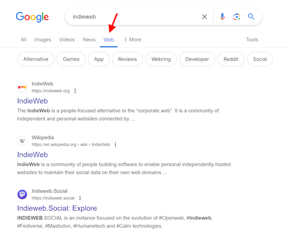

The word 'google' is now firmly burnt into people's brains for "I search the Web ...". However, what the market leader spits out nowadays is by no means just a list of text links, as it was many years ago, but a hodgepodge of different types of search results. And in times of AI hype, it is to be expected that the results will move further and further away from their origins. Google is already preparing for this, as there is no other way to explain why a new results filter called 'Web' was announced at Google I/O 2024, which displays nothing other than text links.



But it is only a filter, which means you have to call it up after the search and you cannot set it as the default view. However, the website [tenbluelinks.org](https://tenbluelinks.org/), shows **how setting 'Web' as default can be achieved for Chrome and Firefox browsers** anyway, by using mechanisms of OpenSearch.

<!-- more -->

The trick used by the creators of TenBlueLinks basically works on any website that has a [search engine description in OpenSearch format](https://developer.mozilla.org/en-US/docs/Web/OpenSearch) linked in the header of a page. In this XML file, the Google search engine is merely defined, but with the parameter ``udm=14`` after the normal Google search url, which ensures that the web filter is displayed directly:

``` html
<html lang="en">
  <head>
    <link href="/opensearch.xml" rel="search" 
          type="application/opensearchdescription+xml" 
          title="Google Web"/>
```

<br>

``` xml opensearch.xml
<OpenSearchDescription xmlns="http://a9.com/-/spec/opensearch/1.1/" 
                       xmlns:moz="http://www.mozilla.org/2006/browser/search/">
  <ShortName>Google Web</ShortName>
  <Description>Google Search with Web filter</Description>
  <InputEncoding>UTF-8</InputEncoding>
  <Image width="16" height="16" type="image/x-icon">https://www.google.com/favicon.ico</Image>
  <Url type="text/html" template="https://www.google.com/search">
    <Param name="q" value="{searchTerms}"></Param>
    <Param name="udm" value="14"></Param>
  </Url>
  <Url type="application/opensearchdescription+xml" rel="self" 
       template="https://tenbluelinks.org/opensearch.xml"></Url>
</OpenSearchDescription>
```

The page contains setting instructions for the two browsers under Android and iOS or Windows and MacOS. The only drawback is that the "new" search engine is labelled ``tenblueblinks.org``, which could give the impression that the search is routed via their site, but this is not the case. As mentioned above, you can also use your own website for this, which then appears in the search engine list as the operator. It's just a small but subtle hack, that doesn't cause any problems and can be quickly reset.

---

## More Info

{% moreinfo '{ "list": [
  [ "TenBlueLinks", "Turn Off Google AI Overview Set “Web“ as Default",
  "https://tenbluelinks.org/" ],
  [ "The Verge", "Google now offers ‘web’ search — and an AI opt-out button",
  "https://www.theverge.com/2024/5/14/24074314/google-now-offers-web-search" ],
  [ "Ars Technica", "Google Search adds a “web” filter, because it is no longer focused on web results",
  "https://arstechnica.com/gadgets/2024/05/google-search-adds-web-filter-as-it-pivots-to-ai-focused-search-results/" ]
]}' %}
